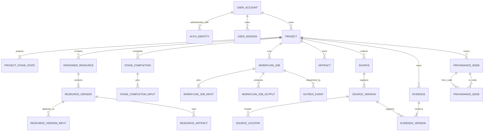
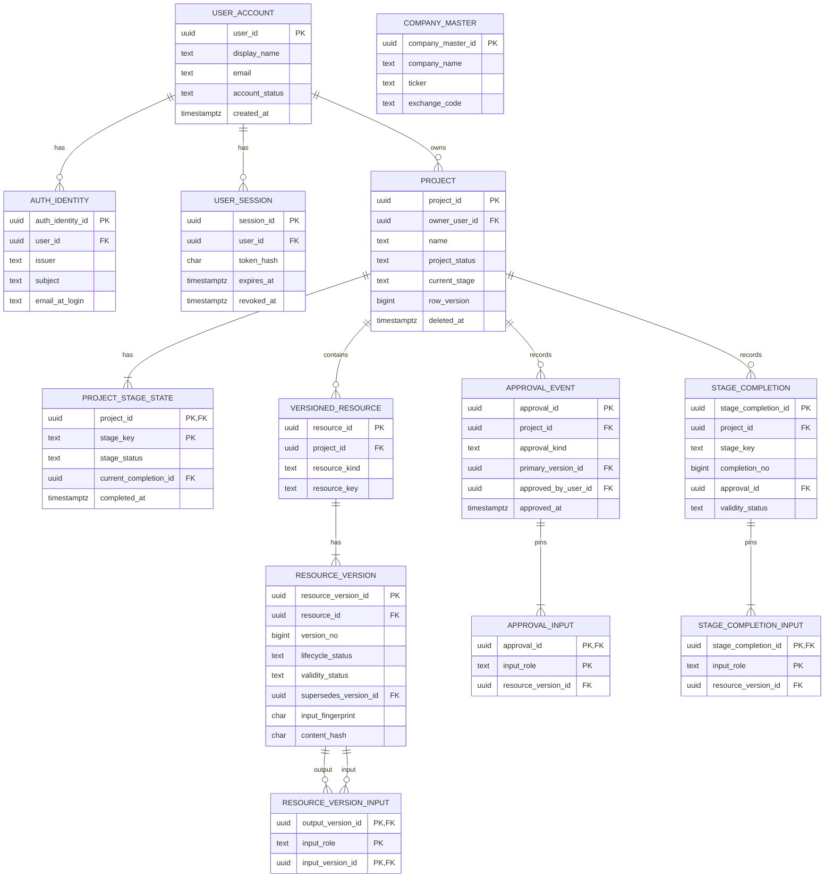
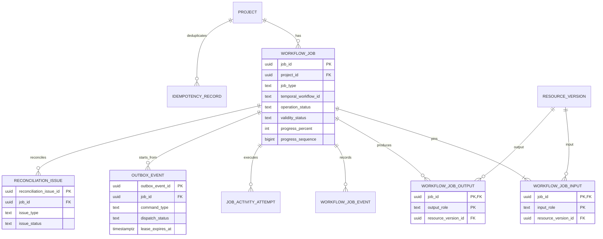
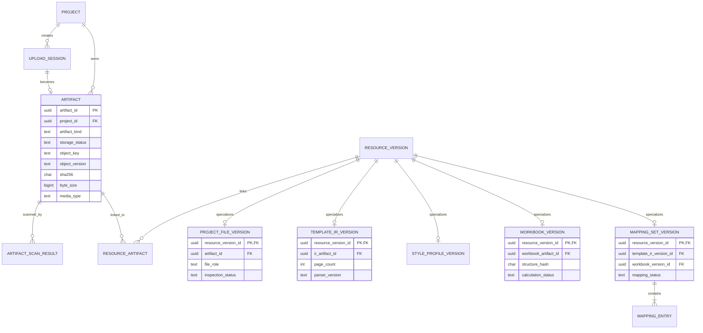
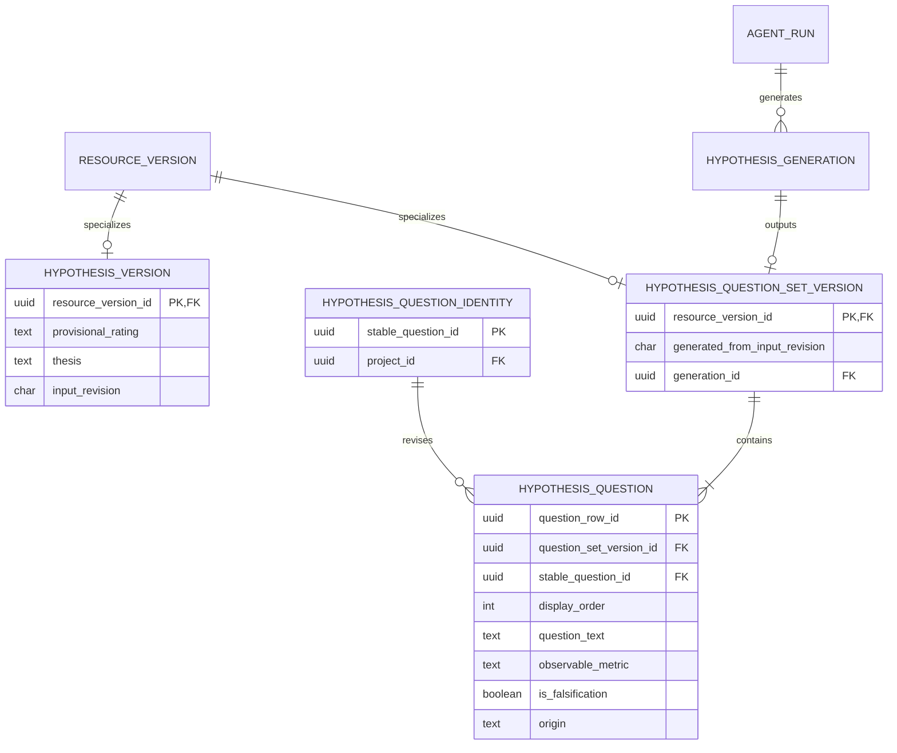
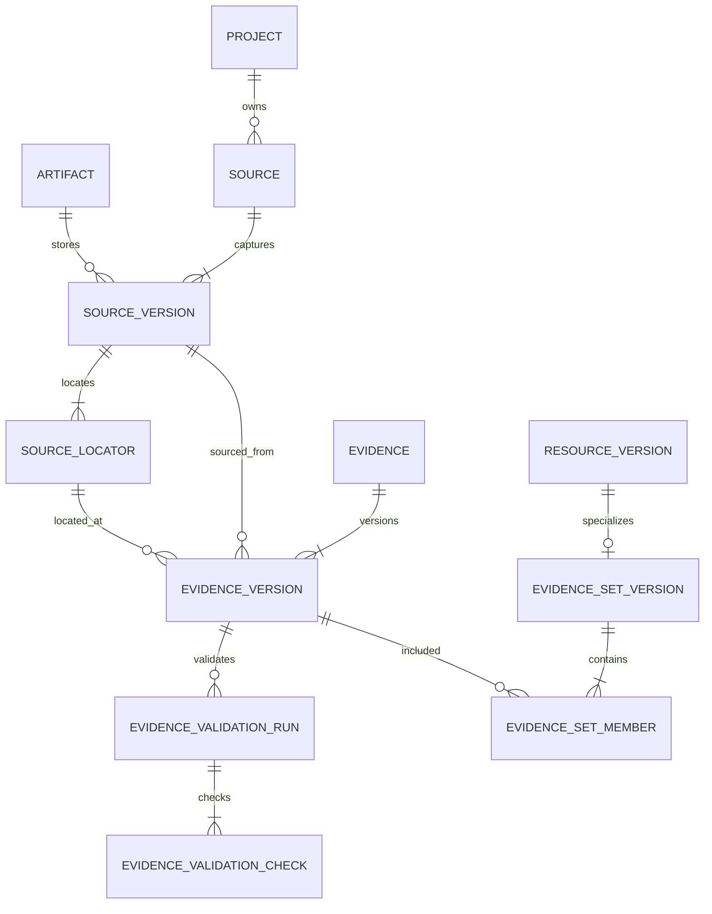
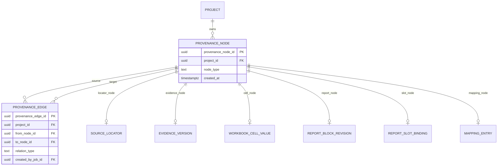
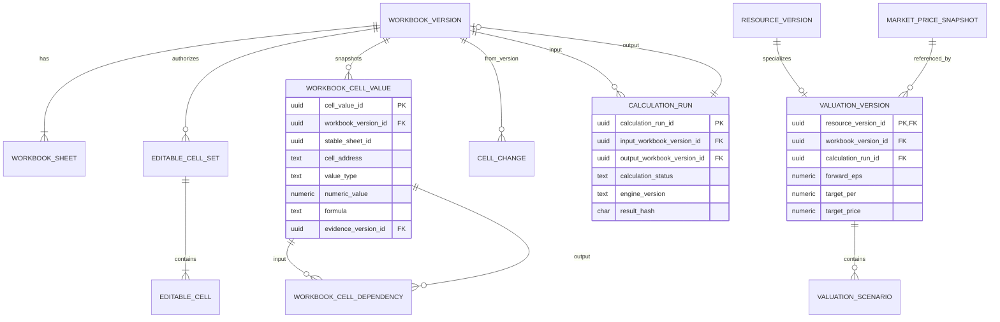
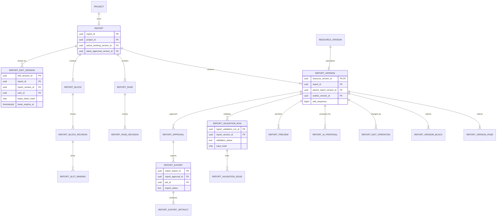

# REFLO ERD v1

**문서 상태:** PostgreSQL 논리·물리 모델 기준선
**작성 기준일:** 2026-07-24
**대상:** 현업 배포용 MVP
**권위 저장소:** PostgreSQL
**관련 문서:**

- [시스템 아키텍처](./REFLO_SYSTEM_ARCHITECTURE_v1.md)
- [URL별 서비스 동작 명세](./REFLO_URL_SERVICE_BEHAVIOR_v1.md)
- [기술 결정 사항](./REFLO_TECHNICAL_DECISIONS_v1.md)
- [API 명세](./REFLO_API_SPEC_v1.md)
- [화면 구현 명세 인덱스](./REFLO_SCREEN_IMPLEMENTATION_SPEC_v1.md)
- [작업 로그](./REFLO_WORKLOG.md)

## 1. 문서 목적과 범위

이 문서는 REFLO의 PostgreSQL schema를 migration으로 옮길 수 있는 수준의 기준선으로 정의한다. 다음을 다룬다.

1. 사용자·인증·프로젝트 소유권
2. 7단계의 불변 resource version과 단계 완료·무효화
3. Temporal job projection, outbox와 reconciliation
4. 업로드, 불변 artifact와 파일 분석 결과
5. Source·Evidence·locator·provenance
6. Excel workbook·계산·밸류에이션
7. 보고서 구성·편집·검증·승인·내보내기
8. Agent 실행 metadata, 감사 기록과 삭제 요청

대형 PDF·XLSX·원문 snapshot·page image·render 결과의 byte는 PostgreSQL에 저장하지 않는다. 이 파일들은 S3 호환 객체 저장소에 두고 PostgreSQL에는 `artifact` metadata와 관계만 저장한다. Temporal event history도 PostgreSQL에 복제하지 않으며 사용자 화면에 필요한 projection만 저장한다.

이 문서는 API endpoint별 request·response schema나 실제 migration SQL을 대신하지 않는다. HTTP 계약은 [API 명세](./REFLO_API_SPEC_v1.md)와 [`contracts/openapi/reflo-v1.yaml`](../contracts/openapi/reflo-v1.yaml), worker artifact 계약은 `contracts/schemas/`에서 정의한다.

## 2. 모델링 원칙

### 2.1 불변 version

- 승인·완료·내보내기에 사용한 version은 `UPDATE`로 내용을 바꾸지 않는다.
- 수정은 새 `resource_version`과 typed detail row를 같은 transaction에서 만든다.
- 상위 version 변경은 하위 결과를 삭제하지 않고 `revalidation_required` 또는 `obsolete`로 전환한다.
- 모든 장시간 job과 승인은 사용한 input version ID를 고정한다.
- 현재 화면 상태는 mutable projection이며 과거 사실의 권위 기록은 append-only row다.

### 2.2 상태 축 분리

서로 다른 의미의 상태를 한 `status` column에 섞지 않는다.

| 상태 축 | 예 | 저장 위치 |
|---|---|---|
| 작업 실행 | `queued`, `running`, `succeeded`, `failed`, `cancelled` | `workflow_job.operation_status` |
| 결과 유효성 | `current`, `revalidation_required`, `obsolete` | `resource_version.validity_status`, `workflow_job.validity_status` |
| 편집·승인 수명주기 | `draft`, `approved`, `superseded`, `archived` | `resource_version.lifecycle_status` |
| 단계 진행 | `not_started`, `in_progress`, `completed`, `revalidation_required`, `blocked` | `project_stage_state.stage_status` |
| 객체 저장 | `quarantined`, `accepted`, `temporary`, `final`, `deleted` | `artifact.storage_status` |

### 2.3 식별자와 시간

- 모든 PK는 PostgreSQL `uuid`다. 애플리케이션에서 시간 정렬 가능한 UUIDv7을 생성한다.
- 외부 API에는 UUID를 그대로 노출해도 되지만 ID를 권한 증명으로 사용하지 않는다.
- event·version 순서는 UUID 정렬에 의존하지 않고 별도 `version_no`, `sequence_no`를 사용한다.
- 시각은 `timestamptz`와 UTC로 저장한다.
- 사용자가 입력한 기준일은 `date`인 `cutoff_date`와 Asia/Seoul 일말로 계산한 `cutoff_at`을 함께 저장한다.
- 금액·배수·비율은 `numeric`을 사용하고 `real`·`double precision`을 사용하지 않는다.

### 2.4 PostgreSQL 타입

- 변경 가능성이 있는 상태값은 PostgreSQL enum이 아니라 `text`와 `CHECK` constraint로 관리한다.
- 핵심 조회·join·제약 대상은 일반 column으로 둔다.
- `jsonb`는 version이 있는 계약 payload, 가변 도구 metadata, typed operation처럼 구조가 실제로 가변인 경우에만 사용한다.
- 원문, workbook 전체 JSON, model 원시 응답과 대형 dependency graph는 `jsonb`에 넣지 않고 artifact로 저장한다.
- hash는 lowercase hexadecimal SHA-256 문자열을 담는 `char(64)` 또는 검증 domain을 사용한다.
- 문자열 code는 application과 DB의 공통 상수로 생성하며 자유 문장을 저장하지 않는다.

### 2.5 소유권

- MVP의 프로젝트는 사용자 한 명이 소유한다.
- 모든 project-scoped row는 직접 또는 FK chain으로 하나의 `project_id`에 도달해야 한다.
- 브라우저가 보낸 `user_id`, `owner_id`, 상태, object key와 승인자를 신뢰하지 않는다.
- 반복적으로 권한 검사하는 최상위 entity에는 `project_id`를 명시적으로 두되, 부모와 project가 일치하는지 composite FK 또는 transaction validation으로 보장한다.

## 3. 전체 domain map



다이어그램은 관계를 읽기 위한 요약이다. column, unique, check와 삭제 규칙은 아래 table 정의가 권위다.

## 4. 인증·프로젝트·공통 version

### 4.1 ERD



### 4.2 인증 table

| table | 핵심 column | constraint·규칙 |
|---|---|---|
| `user_account` | `user_id`, `display_name`, `email`, `avatar_url`, `account_status`, `created_at`, `updated_at` | `account_status IN ('active','suspended','deleted')`; email은 연락·표시 정보이며 외부 identity PK가 아니다. |
| `auth_identity` | `auth_identity_id`, `user_id`, `issuer`, `subject`, `email_at_login`, `claims_updated_at`, `created_at` | `UNIQUE (issuer, subject)`; MVP issuer는 Google OIDC다. |
| `user_session` | `session_id`, `user_id`, `token_hash`, `csrf_secret_hash`, `created_at`, `last_seen_at`, `expires_at`, `revoked_at`, `rotated_from_session_id` | 평문 session token 저장 금지; `UNIQUE (token_hash)`; 만료·폐기 index 필요. |

`project.owner_google_user_id` 같은 화면 명세의 논리 필드는 실제 schema에서 `project.owner_user_id → user_account → auth_identity`로 표현한다. Google subject는 목록 응답과 일반 로그에 노출하지 않는다.

### 4.3 프로젝트와 기업

| table | 핵심 column | constraint·규칙 |
|---|---|---|
| `company_master` | `company_master_id`, `company_name`, `legal_name`, `ticker`, `exchange_code`, `industry_code`, `industry_name`, `active_from`, `active_to` | 동일 거래소의 활성 ticker unique; 외부 master 동기화 source·version은 별도 metadata로 기록한다. |
| `project` | `project_id`, `owner_user_id`, `name`, `project_status`, `current_stage`, `row_version`, `created_at`, `updated_at`, `last_saved_at`, `deleted_at` | 이름 1~60자; `current_stage`는 7개 stage key; `row_version`은 optimistic concurrency; soft-delete 후 일반 query에서 제외한다. |
| `project_stage_state` | `project_id`, `stage_key`, `stage_order`, `stage_status`, `current_completion_id`, `blocker_codes`, `invalidated_at`, `completed_at`, `updated_at` | PK `(project_id, stage_key)`; 프로젝트 생성 시 7개 row 생성; 사용자 화면용 mutable projection이다. |
| `project_invalidation_event` | `invalidation_id`, `project_id`, `trigger_version_id`, `start_stage_key`, `reason_code`, `affected_stage_keys`, `created_at` | append-only; 왜 하위 단계가 재검증 상태가 됐는지 설명한다. |

공식 stage key와 순서는 다음 값만 허용한다.

| 순서 | `stage_key` |
|---:|---|
| 1 | `setup` |
| 2 | `files` |
| 3 | `hypothesis` |
| 4 | `research_plan` |
| 5 | `validation` |
| 6 | `valuation` |
| 7 | `report_outline` |

`report`는 8번째 stage가 아니라 7단계 완료 후 진입하는 작업 공간이다.

### 4.4 공통 resource version

| table | 핵심 column | constraint·규칙 |
|---|---|---|
| `versioned_resource` | `resource_id`, `project_id`, `resource_kind`, `resource_key`, `created_at` | `UNIQUE (project_id, resource_kind, resource_key)`; 논리적으로 같은 version stream의 head다. |
| `resource_version` | `resource_version_id`, `resource_id`, `version_no`, `lifecycle_status`, `validity_status`, `supersedes_version_id`, `schema_version`, `input_fingerprint`, `content_hash`, `created_by_user_id`, `created_by_actor_type`, `created_at` | `UNIQUE (resource_id, version_no)`; 한 resource에 active draft 하나만 허용; typed payload·dependency는 불변이다. |
| `resource_version_input` | `output_version_id`, `input_role`, `input_version_id`, `created_at` | PK `(output_version_id, input_role, input_version_id)`; `output_version_id <> input_version_id`; 역방향 index로 무효화 범위를 찾는다. |
| `approval_event` | `approval_id`, `project_id`, `approval_kind`, `primary_version_id`, `approved_by_user_id`, `approved_at`, `request_id`, `summary_json` | append-only; `UNIQUE (project_id, approval_kind, request_id)`; client가 승인자·시각을 지정하지 않는다. |
| `approval_input` | `approval_id`, `input_role`, `resource_version_id` | approval 당시의 모든 입력 version을 고정한다. |
| `stage_completion` | `stage_completion_id`, `project_id`, `stage_key`, `completion_no`, `approval_id`, `validity_status`, `supersedes_completion_id`, `completed_by_user_id`, `completed_at` | `UNIQUE (project_id, stage_key, completion_no)`; 단계 완료 사실은 append-only다. |
| `stage_completion_input` | `stage_completion_id`, `input_role`, `resource_version_id` | 한 단계가 여러 산출물 version을 함께 완료할 수 있게 한다. |

`resource_kind`의 MVP 허용값은 다음을 기준으로 한다.

```text
project_setup
project_file
template_ir
style_profile
workbook
mapping_set
hypothesis
hypothesis_question_set
research_plan
research_result
evidence_set
validation
valuation
report_outline
report
```

`resource_key`는 같은 kind 안의 stream을 구분한다. 예를 들어 `project_file`은 `previous_report_pdf`, `analysis_workbook`, `user_material:{materialId}`를 사용하고 나머지 단일 stream은 기본값 `main`을 사용한다.

`supersedes_version_id`가 같은 `resource_id`에 속하는지는 `(resource_id, resource_version_id)` composite unique와 composite FK로 강제한다. `resource_version_input`의 cycle은 application transaction에서 recursive query로 거부한다.

불변이라는 말은 version의 typed payload, input dependency, hash와 작성자가 바뀌지 않는다는 뜻이다. `lifecycle_status`와 `validity_status`는 `draft → approved|superseded`, `current → revalidation_required → obsolete`처럼 허용된 전이만 application service가 갱신한다. 승인·완료·결정 사실은 별도 append-only row로 남는다.

`approval_kind`의 MVP 허용값:

```text
setup_complete
files_complete
hypothesis_approve
research_plan_approve
validation_approve
valuation_approve
report_outline_approve
report_final_approve
```

### 4.5 단계 완료가 고정하는 version

| stage | 필수 `stage_completion_input.input_role` |
|---|---|
| `setup` | `setup` |
| `files` | `previous_report_pdf`, `analysis_workbook`, `template_ir`, `style_profile`, `workbook`, `mapping_set` |
| `hypothesis` | `hypothesis`, `question_set` |
| `research_plan` | `research_plan`, `research_result`, `question_set`, `workbook`, `mapping_set` |
| `validation` | `validation`, `research_result`, `evidence_set`, `workbook` |
| `valuation` | `valuation`, `workbook`, `evidence_set` |
| `report_outline` | `report_outline`, `template_ir`, `mapping_set`, `valuation`, `evidence_set` |

`stage_completion` 생성과 `project_stage_state` 갱신은 한 transaction이다. 이전 완료 row는 삭제하지 않고 새 완료 row가 `supersedes_completion_id`로 잇는다.

## 5. 비동기 작업·outbox·reconciliation

### 5.1 ERD



### 5.2 table 정의

| table | 핵심 column | constraint·규칙 |
|---|---|---|
| `workflow_job` | `job_id`, `project_id`, `job_type`, `temporal_workflow_id`, `operation_status`, `validity_status`, `current_phase`, `progress_percent`, `progress_sequence`, `input_fingerprint`, `requested_by_user_id`, `requested_at`, `started_at`, `heartbeat_at`, `finished_at`, `error_code`, `error_summary`, `result_summary_json` | `UNIQUE (temporal_workflow_id)`; workflow ID는 `reflo:{jobId}`; progress sequence는 단조 증가; 원시 stack 저장 금지. |
| `workflow_job_input` | `job_id`, `input_role`, `resource_version_id` | job 시작 전에 고정되며 이후 수정 금지. |
| `workflow_job_output` | `job_id`, `output_role`, `resource_version_id` | result transaction에서 생성; obsolete output도 보존. |
| `workflow_job_event` | `job_event_id`, `job_id`, `sequence_no`, `event_type`, `operation_status`, `phase`, `progress_percent`, `error_code`, `occurred_at`, `received_at`, `metadata_json` | `UNIQUE (job_id, sequence_no)`; 사용자용 상태 전이 감사 기록. Temporal history 전체 복제가 아니다. |
| `job_activity_attempt` | `activity_attempt_id`, `job_id`, `activity_key`, `attempt_no`, `task_queue`, `operation_status`, `heartbeat_at`, `started_at`, `finished_at`, `tool_name`, `tool_version`, `schema_version`, `output_artifact_id`, `error_code` | `UNIQUE (job_id, activity_key, attempt_no)`; 화면 명세의 `inspection_stage_run`을 포함하는 공통 모델. |
| `outbox_event` | `outbox_event_id`, `job_id`, `command_type`, `command_id`, `payload_json`, `schema_version`, `dispatch_status`, `attempt_count`, `next_attempt_at`, `lease_owner`, `lease_expires_at`, `dispatched_at`, `last_error_code`, `created_at` | `UNIQUE (command_id)`; job과 같은 transaction에서 생성; `pending → dispatching → dispatched`, 실패 시 lease 만료 후 재시도. |
| `idempotency_record` | `idempotency_record_id`, `project_id`, `user_id`, `scope`, `idempotency_key`, `request_hash`, `response_status`, `response_ref_type`, `response_ref_id`, `created_at`, `expires_at` | `UNIQUE (user_id, scope, idempotency_key)`; 같은 key와 다른 request hash는 `409`. |
| `reconciliation_issue` | `reconciliation_issue_id`, `job_id`, `issue_type`, `expected_state`, `observed_state`, `issue_status`, `first_seen_at`, `last_seen_at`, `repair_action`, `repaired_at` | PostgreSQL projection과 Temporal execution, output artifact 불일치를 기록한다. |

`workflow_job.operation_status` 허용값:

```text
queued
running
succeeded
failed
cancel_requested
cancelled
```

`workflow_job.validity_status` 허용값:

```text
current
obsolete
```

activity worker는 이 table에 직접 연결하지 않는다. service identity로 Internal Worker API에 progress·result command를 보내고 API가 version·sequence·artifact를 검증한 뒤 transaction을 적용한다.

### 5.3 원자성

비동기 command 생성 transaction:

1. session과 project owner 확인
2. idempotency key와 request hash 확인
3. input `resource_version` 존재·project·validity 확인
4. `workflow_job` 생성
5. `workflow_job_input` 생성
6. `outbox_event` 생성
7. commit

결과 반영 transaction:

1. job·input version·progress sequence 확인
2. temporary object의 hash·size·media type 확인
3. `artifact`와 typed `resource_version` 생성
4. `workflow_job_output` 연결
5. job projection 갱신
6. 현재 input과 달라졌으면 output을 `obsolete`로 표시
7. commit

## 6. 업로드·artifact·파일 분석

### 6.1 ERD



### 6.2 upload와 artifact

| table | 핵심 column | constraint·규칙 |
|---|---|---|
| `upload_session` | `upload_session_id`, `project_id`, `requested_by_user_id`, `upload_role`, `quarantine_object_key`, `expected_media_types`, `max_byte_size`, `client_filename`, `expected_sha256`, `upload_status`, `expires_at`, `completed_at` | key는 서버 생성; 짧은 만료; 한 upload session은 한 object만 허용. |
| `artifact` | `artifact_id`, `project_id`, `artifact_kind`, `storage_status`, `bucket_name`, `object_key`, `object_version`, `sha256`, `byte_size`, `media_type`, `original_filename`, `retention_class`, `created_by_actor_type`, `created_at`, `supersedes_artifact_id`, `deleted_at` | `UNIQUE (bucket_name, object_key, object_version)`; project 내부에서 `(sha256, byte_size)` 조회 index; object byte는 덮어쓰지 않는다. |
| `artifact_scan_result` | `scan_result_id`, `artifact_id`, `job_id`, `scan_status`, `detected_media_type`, `magic_bytes`, `encrypted`, `macro_detected`, `malware_result`, `tool_name`, `tool_version`, `scanned_at`, `details_json` | scan 결과 append-only; accepted 전 최신 필수 scan이 `passed`여야 한다. |
| `resource_artifact` | `resource_version_id`, `artifact_role`, `artifact_id`, `created_at` | PK `(resource_version_id, artifact_role, artifact_id)`; 동일 역할이 하나여야 하는 경우 partial unique. |
| `artifact_download_audit` | `download_audit_id`, `artifact_id`, `project_id`, `user_id`, `purpose`, `requested_at` | presigned URL 자체·credential은 저장하지 않는다. |

`artifact.storage_status`:

```text
quarantined
accepted
temporary
final
superseded
deleted
```

`temporary` artifact는 deterministic key와 TTL을 사용한다. DB에 연결되지 않은 temporary object는 orphan cleanup 대상이다. `final` artifact는 승인된 정확한 resource version과 연결된 경우에만 생성한다.

### 6.3 파일 처리 typed version

| table | 핵심 column | constraint·규칙 |
|---|---|---|
| `project_file_version` | `resource_version_id`, `artifact_id`, `file_role`, `inspection_status`, `detected_filename`, `detected_media_type`, `inspection_job_id` | PK는 `resource_version_id`이자 FK; file role은 resource key와 일치해야 한다. |
| `template_ir_version` | `resource_version_id`, `source_file_version_id`, `ir_artifact_id`, `page_count`, `coordinate_system`, `parser_name`, `parser_version`, `render_profile_version`, `validation_status` | IR JSON artifact hash는 `resource_version.content_hash`와 일치. |
| `style_profile_version` | `resource_version_id`, `source_file_version_id`, `profile_artifact_id`, `agent_run_id`, `font_policy_version`, `validation_status` | model·prompt·schema는 `agent_run`에서 고정. |
| `workbook_version` | `resource_version_id`, `source_file_version_id`, `workbook_artifact_id`, `original_sha256`, `structure_hash`, `calculation_status`, `calculation_engine`, `engine_version`, `compatibility_status` | 원본 artifact 수정 금지; 새 작업 사본은 새 artifact와 version. |
| `mapping_set_version` | `resource_version_id`, `template_ir_version_id`, `workbook_version_id`, `mapping_status`, `mapping_schema_version`, `validation_summary_json` | Template IR·workbook input을 고정. |
| `mapping_entry` | `mapping_entry_id`, `mapping_set_version_id`, `mapping_kind`, `source_sheet_id`, `source_range`, `target_page_id`, `target_block_id`, `target_slot_id`, `transform_json`, `binding_status`, `provenance_node_id` | `mapping_kind IN ('scalar','table','chart')`; target slot unique 정책은 kind별 적용. |

전체 Template IR, workbook와 큰 MappingSet payload는 artifact에 두되 화면 조회·유효성 검사에 필요한 page count, structure hash와 mapping index는 PostgreSQL에 둔다.

## 7. setup·hypothesis·research plan

### 7.1 setup

| table | 핵심 column | constraint·규칙 |
|---|---|---|
| `project_setup_version` | `resource_version_id`, `company_master_id`, `target_year`, `target_quarter`, `cutoff_date`, `cutoff_at`, `report_type`, `company_domain`, `valuation_method`, `completion_status` | PK/FK `resource_version_id`; quarter 1~4; MVP 값은 `EARNINGS_REVIEW`, `IT_MANUFACTURING`, `PER`; `cutoff_at`은 server 계산. |

setup 변경으로 company, period, cutoff가 달라지면 files 이후 영향 범위를 계산해 새 `project_invalidation_event`를 만들고 해당 `project_stage_state`를 갱신한다.

### 7.2 hypothesis



| table | 핵심 column | constraint·규칙 |
|---|---|---|
| `hypothesis_version` | `resource_version_id`, `provisional_rating`, `thesis`, `input_revision`, `updated_from_version_id` | rating은 `BUY`, `HOLD`, `SELL` 또는 null; thesis 길이와 텍스트 규칙은 API schema와 동일. |
| `hypothesis_generation` | `generation_id`, `project_id`, `job_id`, `agent_run_id`, `input_revision`, `generation_status`, `output_question_set_version_id`, `created_at` | 같은 input revision·request의 중복 생성을 idempotency로 막는다. |
| `hypothesis_question_set_version` | `resource_version_id`, `generated_from_input_revision`, `generation_id`, `question_count`, `falsification_count` | 질문 편집·정렬·제외도 새 set version. |
| `hypothesis_question_identity` | `stable_question_id`, `project_id`, `created_at` | 질문의 version 간 identity; 텍스트·순서·포함 상태를 이 table에 두지 않는다. |
| `hypothesis_question` | `question_row_id`, `question_set_version_id`, `stable_question_id`, `display_order`, `question_text`, `observable_metric`, `is_falsification`, `origin`, `included` | stable ID FK; `UNIQUE (question_set_version_id, stable_question_id)`와 `(question_set_version_id, display_order)`; 물리 삭제 대신 새 set에서 `included=false`. |

가설 단계 approval은 `approval_event.primary_version_id = hypothesis_version`으로 만들고 `approval_input`에 `hypothesis`, `question_set`, `setup`, `template_ir`, `workbook`을 고정한다.

### 7.3 research plan

| table | 핵심 column | constraint·규칙 |
|---|---|---|
| `research_plan_version` | `resource_version_id`, `plan_status`, `question_set_version_id`, `workbook_version_id`, `mapping_set_version_id`, `cutoff_at`, `collector_version`, `normalizer_version`, `provider_policy_version` | 승인된 plan은 input version과 collector 정책을 고정. |
| `research_plan_question` | `plan_question_id`, `research_plan_version_id`, `stable_question_id`, `display_order`, `included`, `collection_target`, `expected_result_type` | 승인 시 포함 질문 3~5개와 반증 질문 1개 이상을 server에서 검사. |
| `research_source_binding` | `source_binding_id`, `research_plan_version_id`, `source_type`, `source_role`, `collection_method`, `provider_code`, `authority_rank`, `policy_json` | source role은 `authority`, `comparison`, `context`; FnGuide actual authority 금지 규칙 적용. |
| `research_plan_question_source` | `plan_question_id`, `source_binding_id`, `display_order` | PK `(plan_question_id, source_binding_id)`. |
| `research_plan_excel_target` | `excel_target_id`, `research_plan_version_id`, `workbook_version_id`, `stable_sheet_id`, `cell_address`, `metric_code`, `period_code`, `unit_code`, `scope_code`, `value_kind`, `required`, `included`, `excluded_reason` | 미래 추정치·formula·external link를 자동 입력 target으로 허용하지 않는다. |
| `excel_target_source` | `excel_target_id`, `source_binding_id`, `source_role` | target별 권위·비교 source를 고정. |
| `user_material` | `user_material_id`, `project_id`, `project_file_version_id`, `display_name`, `material_status`, `created_by_user_id`, `created_at` | 검사 통과한 file version만 승인 plan 입력 가능. |
| `research_plan_material` | `research_plan_version_id`, `user_material_id` | plan version이 사용한 사용자 자료 version을 고정. |
| `research_result_version` | `resource_version_id`, `research_plan_version_id`, `job_id`, `candidate_artifact_id`, `source_version_count`, `candidate_count`, `collector_version`, `normalizer_version`, `result_status` | Research workflow의 불변 output; 검증 전 후보를 approved Evidence로 취급하지 않는다. |
| `research_result_source` | `research_result_version_id`, `source_version_id`, `source_binding_id`, `source_role` | 수집 batch가 실제 확보한 source snapshot을 고정한다. |
| `research_candidate` | `research_candidate_id`, `research_result_version_id`, `source_version_id`, `locator_id`, `candidate_type`, `raw_value_text`, `proposed_normalized_value`, `unit_code`, `period_code`, `candidate_status`, `promoted_evidence_version_id`, `schema_version` | candidate status는 `pending_validation`, `rejected`, `promoted`; Validation worker가 독립 검증하기 전 Evidence가 아니다. |

승인과 research job 생성은 하나의 transaction에서 `approval_event`, `workflow_job`, input rows와 `outbox_event`를 만든다. job 성공 시 `research_result_version`, source snapshot 관계와 후보를 Internal Worker API transaction으로 저장한다. 4단계 완료는 이 result version까지 고정한 뒤에만 만든다.

## 8. Source·Evidence·validation·provenance

### 8.1 Source와 locator



| table | 핵심 column | constraint·규칙 |
|---|---|---|
| `source` | `source_id`, `project_id`, `source_type`, `official_identifier`, `issuer_name`, `canonical_url`, `created_at` | URL만으로 동일 source 판정 금지; `(project_id, source_type, official_identifier)` 조건부 unique. |
| `source_version` | `source_version_id`, `source_id`, `artifact_id`, `sha256`, `byte_size`, `media_type`, `requested_url`, `canonical_url`, `final_url`, `captured_at`, `published_at`, `effective_at`, `http_status`, `etag`, `last_modified`, `redirect_chain_json`, `collector_name`, `collector_version`, `parser_name`, `parser_version`, `access_class`, `retention_class`, `deletion_status`, `supersedes_source_version_id` | append-only; full snapshot 보존이 허용되지 않으면 `artifact_id` nullable이지만 hash·최소 인용·metadata는 유지. |
| `source_locator` | `locator_id`, `source_version_id`, `locator_type`, `page_index`, `page_label`, `coordinate_space`, `bbox_json`, `page_width`, `page_height`, `page_rotation`, `char_start`, `char_end`, `sheet_name`, `cell_range`, `json_pointer`, `css_selector`, `xpath`, `text_fragment`, `prefix_text`, `suffix_text`, `page_text_sha256`, `page_render_sha256`, `provenance_node_id`, `details_json` | typed locator 핵심 필드는 column; locator type별 필수값 CHECK 또는 validation trigger. |

`locator_type`은 `pdf`, `html`, `spreadsheet`, `structured_api`다. PDF `page_index`는 0-based이며 bbox는 PDF point CropBox 좌표계다. locator를 최신 URL의 다른 source version에 재사용하지 않는다.

### 8.2 Evidence

| table | 핵심 column | constraint·규칙 |
|---|---|---|
| `evidence` | `evidence_id`, `project_id`, `evidence_key`, `created_at` | 논리 Evidence head; project 밖에서 재사용하지 않는다. |
| `evidence_version` | `evidence_version_id`, `evidence_id`, `version_no`, `source_version_id`, `locator_id`, `quote_exact`, `quote_normalized`, `quote_sha256`, `normalization_version`, `claim_type`, `raw_value_text`, `normalized_numeric_value`, `normalized_text_value`, `unit_code`, `currency_code`, `period_start`, `period_end`, `scope_code`, `actuality_code`, `validation_status`, `latest_validation_run_id`, `supersedes_evidence_version_id`, `correction_reason`, `provenance_node_id`, `created_at` | `UNIQUE (evidence_id, version_no)`; source와 locator source version 일치; quote·값·단위·locator 변경은 새 version. |
| `evidence_validation_run` | `evidence_validation_run_id`, `evidence_version_id`, `job_id`, `run_no`, `validation_status`, `code_version`, `model_id`, `prompt_version`, `schema_version`, `raw_response_artifact_id`, `started_at`, `completed_at`, `failure_code` | `UNIQUE (evidence_version_id, run_no)`; 자유 설명 대신 구조화 check 저장. |
| `evidence_validation_check` | `validation_check_id`, `evidence_validation_run_id`, `check_code`, `check_status`, `expected_value`, `observed_value`, `details_json` | check code 예: source existence, context, company, period, unit, normalization, calculation. |
| `evidence_set_version` | `resource_version_id`, `research_plan_version_id`, `research_result_version_id`, `set_status`, `required_count`, `passed_count`, `conflict_count` | validation·valuation·report가 개별 Evidence 목록 대신 정확한 set version을 고정. |
| `evidence_set_member` | `evidence_set_version_id`, `evidence_version_id`, `member_role`, `stable_question_id`, `display_order`, `included` | PK `(evidence_set_version_id, evidence_version_id, member_role)`; rejected Evidence도 이력상 남고 `included=false`. |

`claim_type`:

```text
fact
metric
event
definition
supporting
contradicting
```

`validation_status`:

```text
pending
passed
failed
needs_review
rejected
superseded
stale
```

### 8.3 validation workspace

| table | 핵심 column | constraint·규칙 |
|---|---|---|
| `validation_version` | `resource_version_id`, `research_plan_version_id`, `research_result_version_id`, `evidence_set_version_id`, `workbook_version_id`, `validation_status`, `unresolved_conflict_count`, `required_missing_count` | stage aggregate; 새 결정마다 새 version을 생성한다. |
| `validation_question_result` | `question_result_id`, `validation_version_id`, `stable_question_id`, `answer_summary`, `sufficiency_status`, `support_count`, `contradict_count`, `neutral_count` | 질문별 한 줄 답변과 충분성 projection. |
| `validation_question_evidence` | `question_result_id`, `evidence_version_id`, `stance`, `display_order` | stance는 `supporting`, `contradicting`, `neutral`. |
| `validation_decision` | `decision_id`, `project_id`, `from_validation_version_id`, `to_validation_version_id`, `target_type`, `target_evidence_version_id`, `target_conflict_id`, `action`, `selected_evidence_version_id`, `reason`, `created_by_user_id`, `created_at`, `supersedes_decision_id` | target FK 둘 중 정확히 하나만 존재; append-only; reason 5~500자; action은 reject·restore·reinvestigate·select_source. |
| `evidence_conflict` | `conflict_id`, `project_id`, `metric_code`, `period_code`, `scope_code`, `conflict_status`, `created_at` | 서로 다른 원문 값을 한 Evidence로 합치지 않는다. |
| `evidence_conflict_candidate` | `conflict_id`, `evidence_version_id`, `candidate_role` | PK `(conflict_id, evidence_version_id)`. |
| `conflict_decision` | `conflict_decision_id`, `conflict_id`, `validation_version_id`, `selected_evidence_version_id`, `reason`, `created_by_user_id`, `created_at`, `supersedes_decision_id` | 선택하지 않은 후보도 보존. |

validation approval은 exact `validation_version`, `research_result_version`, `evidence_set_version`, `research_plan_version`, `workbook_version`과 최신 계산 run을 `approval_input`에 고정한다.

### 8.4 provenance



| table | 핵심 column | constraint·규칙 |
|---|---|---|
| `provenance_node` | `provenance_node_id`, `project_id`, `node_type`, `created_at` | lineage가 필요한 domain row가 이 ID를 unique FK로 소유한다. |
| `provenance_edge` | `provenance_edge_id`, `project_id`, `from_node_id`, `to_node_id`, `relation_type`, `created_by_job_id`, `created_at`, `metadata_json` | from·to node와 edge의 project가 같아야 함; `UNIQUE (from_node_id, to_node_id, relation_type)`; self-edge 금지. |
| `claim` | `claim_id`, `project_id`, `claim_type`, `claim_text`, `origin_type`, `origin_version_id`, `provenance_node_id`, `supersedes_claim_id`, `created_at` | 가설·질문·보고서 문장의 논리 claim; 변경 시 새 row. |
| `claim_evidence` | `claim_id`, `evidence_version_id`, `relation_type` | supports·contradicts를 명시. |

`provenance_edge`가 `(from_type, from_id)` polymorphic reference를 직접 갖지 않고 모든 edge가 실제 `provenance_node` FK를 가리키게 한다. `source_locator`, `evidence_version`, `workbook_cell_value`, `mapping_entry`, `claim`, `report_block_revision`, `report_slot_binding`은 자신의 node ID를 unique FK로 소유한다. 이 방식은 TD-012의 의미를 유지하면서 dangling edge를 DB FK로 방지한다.

관계 허용값:

```text
extracted_from
normalized_from
mapped_to
calculated_from
supports
contradicts
rendered_in
supersedes
```

edge 방향은 relation별로 고정한다.

| relation | from → to |
|---|---|
| `extracted_from` | Evidence → source locator |
| `normalized_from` | 정규화 값 → 원본 값 |
| `mapped_to` | workbook·Evidence source → target slot |
| `calculated_from` | formula output cell → input cell |
| `supports`, `contradicts` | Evidence → claim |
| `rendered_in` | claim·cell·Evidence → report slot 또는 block |
| `supersedes` | 새 version node → 이전 version node |

Excel 경로는 Evidence에서 formula 결과로 바로 건너뛰지 않는다. `Evidence → input cell value → formula dependency → output cell value → report slot` 순서를 보존한다.

## 9. workbook·계산·valuation

### 9.1 ERD



### 9.2 workbook table

| table | 핵심 column | constraint·규칙 |
|---|---|---|
| `workbook_sheet` | `workbook_sheet_id`, `workbook_version_id`, `stable_sheet_id`, `display_name`, `sheet_order`, `visibility`, `structure_hash` | `(workbook_version_id, stable_sheet_id)` unique; 표시명 변경과 stable ID를 구분. |
| `editable_cell_set` | `editable_cell_set_id`, `workbook_version_id`, `set_version_no`, `permission_hash`, `created_at` | `UNIQUE (workbook_version_id, set_version_no)`. |
| `editable_cell` | `editable_cell_id`, `editable_cell_set_id`, `stable_sheet_id`, `cell_address`, `cell_role`, `required`, `value_type`, `unit_code`, `period_code`, `read_only_reason` | `(editable_cell_set_id, stable_sheet_id, cell_address)` unique. |
| `workbook_cell_value` | `cell_value_id`, `workbook_version_id`, `stable_sheet_id`, `cell_address`, `value_type`, `numeric_value`, `text_value`, `date_value`, `boolean_value`, `formula`, `number_format`, `value_role`, `evidence_version_id`, `provenance_node_id` | 전체 cell dump가 아니라 editable·mapped·provenance 대상만 저장; value type별 하나의 typed value만 허용. |
| `workbook_cell_dependency` | `from_cell_value_id`, `to_cell_value_id`, `dependency_kind`, `calculation_run_id` | PK `(from_cell_value_id, to_cell_value_id, calculation_run_id)`; 큰 전체 graph는 artifact, 사용자에게 보여줄 경로는 row로 저장. |
| `cell_change` | `cell_change_id`, `project_id`, `from_workbook_version_id`, `to_workbook_version_id`, `stable_sheet_id`, `cell_address`, `before_value_json`, `after_value_json`, `changed_by_user_id`, `request_id`, `changed_at` | `UNIQUE (project_id, request_id, stable_sheet_id, cell_address)`; 허용 셀과 expected version을 server에서 재검사. |
| `calculation_run` | `calculation_run_id`, `project_id`, `job_id`, `input_workbook_version_id`, `output_workbook_version_id`, `calculation_status`, `engine_name`, `engine_version`, `result_hash`, `formula_error_count`, `duration_ms`, `started_at`, `completed_at` | 같은 input hash·engine version의 정상 결과 재사용 가능; browser 계산값은 저장 권위가 아니다. |
| `calculation_error` | `calculation_error_id`, `calculation_run_id`, `stable_sheet_id`, `cell_address`, `error_code`, `message_key`, `details_json` | stack·민감 원문 대신 정형 오류. |

SpreadJS는 `workbook_version` artifact를 표시하고 `editable_cell_set`으로 허용된 변경만 보낸다. 서버는 Aspose.Cells 결과로 새 workbook artifact·version을 만들며 SpreadJS export를 최종 XLSX로 사용하지 않는다.

### 9.3 valuation

| table | 핵심 column | constraint·규칙 |
|---|---|---|
| `market_price_snapshot` | `market_price_snapshot_id`, `project_id`, `company_master_id`, `price`, `currency_code`, `as_of_at`, `source_version_id`, `evidence_version_id`, `created_at` | 값·시점·근거를 함께 고정. |
| `valuation_version` | `resource_version_id`, `workbook_version_id`, `calculation_run_id`, `evidence_set_version_id`, `market_price_snapshot_id`, `input_mode`, `forward_eps`, `target_per`, `target_price`, `upside_percent`, `provisional_rating`, `formula_policy_version` | numeric; input workbook은 성공한 calculation output이어야 함; 목표주가 계산식은 server 권위. |
| `valuation_scenario` | `valuation_scenario_id`, `valuation_version_id`, `scenario_key`, `eps`, `per`, `target_price`, `upside_percent`, `display_order` | sensitivity 표의 결정적 결과. |
| `valuation_ai_proposal` | `proposal_id`, `project_id`, `agent_run_id`, `base_valuation_version_id`, `proposed_per`, `reason_summary`, `proposal_status`, `applied_to_version_id`, `created_at` | proposal은 자동 적용하지 않으며 Evidence·허용 범위를 검증. |

valuation approval은 exact `valuation_version`, 성공 `workbook_version`, `calculation_run`, `evidence_set_version`, `market_price_snapshot`을 고정한다. 상위 Evidence나 forecast input 변경 시 기존 approval은 남고 새 version이 필요하다.

## 10. report outline

| table | 핵심 column | constraint·규칙 |
|---|---|---|
| `report_outline_version` | `resource_version_id`, `template_ir_version_id`, `mapping_set_version_id`, `workbook_version_id`, `evidence_set_version_id`, `valuation_version_id`, `agent_run_id`, `outline_status`, `page_count`, `narrative_block_count`, `table_count`, `chart_count` | Template IR의 page count를 변경하지 않는다; 모든 input version을 고정. |
| `report_outline_page` | `outline_page_id`, `report_outline_version_id`, `template_page_id`, `page_order`, `page_role`, `page_title` | `(report_outline_version_id, template_page_id)` unique. |
| `report_outline_block` | `outline_block_id`, `outline_page_id`, `template_block_id`, `block_role`, `required`, `fixed`, `display_order` | Template IR block에 속하는지 검증. |
| `report_outline_slot_value` | `outline_slot_value_id`, `outline_block_id`, `template_slot_id`, `value_type`, `suggested_value_json`, `user_value_json`, `binding_status`, `source_ref_json`, `provenance_node_id` | 숫자·표·차트의 권위값을 자유 텍스트로 복제하지 않고 source ref 고정. |
| `report_outline_page_review` | `page_review_id`, `report_outline_version_id`, `outline_page_id`, `review_status`, `reviewed_by_user_id`, `reviewed_at`, `invalidated_at`, `invalidation_reason` | page 내용·binding·상위 version 변경 시 기존 확인을 삭제하지 않고 무효화. |

outline patch는 기존 version을 바꾸지 않고 새 `report_outline_version`을 만들며 unchanged page·block의 구조적 복사는 migration 구현에서 최적화할 수 있다. 전체 승인 시 exact outline과 5개 upstream input을 고정하고 report draft job을 outbox로 시작한다.

## 11. report 편집·검증·내보내기

### 11.1 ERD



### 11.2 report와 revision

| table | 핵심 column | constraint·규칙 |
|---|---|---|
| `report` | `report_id`, `project_id`, `resource_id`, `active_working_version_id`, `latest_approved_version_id`, `created_at`, `updated_at` | `UNIQUE (project_id)` for MVP; active pointer는 projection이며 version row가 권위. |
| `report_version` | `resource_version_id`, `report_id`, `parent_report_version_id`, `report_outline_version_id`, `template_ir_version_id`, `mapping_set_version_id`, `evidence_set_version_id`, `workbook_version_id`, `valuation_version_id`, `edit_sequence`, `page_count`, `created_at` | PK/FK `resource_version_id`; input version 불변; API의 `working`은 공통 `lifecycle_status='draft'`에서 파생한다. |
| `report_page` | `report_page_id`, `report_id`, `stable_page_id`, `template_page_id`, `page_order` | page 추가·삭제·순서 변경 금지; Template IR page와 고정. |
| `report_page_revision` | `page_revision_id`, `report_page_id`, `based_on_revision_id`, `layout_hash`, `content_hash`, `created_by_actor_type`, `created_at` | append-only; page layout 자체는 Template IR을 참조. |
| `report_version_page` | `report_version_id`, `report_page_id`, `page_revision_id` | exact version이 선택한 page revision; PK `(report_version_id, report_page_id)`. |
| `report_block` | `report_block_id`, `report_id`, `stable_block_id`, `report_page_id`, `template_block_id`, `block_role`, `edit_policy`, `display_order` | `edit_policy IN ('editable_text','fixed','protected_numeric','table','chart')`. |
| `report_block_revision` | `block_revision_id`, `report_block_id`, `based_on_revision_id`, `content_schema_version`, `content_json`, `author_type`, `author_user_id`, `agent_run_id`, `provenance_node_id`, `content_hash`, `created_at` | 숫자·Evidence ID·계산 binding을 임의 text로 변경할 수 없음; HTML 실행 금지. |
| `report_slot_binding` | `report_slot_binding_id`, `block_revision_id`, `template_slot_id`, `value_type`, `binding_type`, `display_value`, `evidence_version_id`, `workbook_cell_value_id`, `valuation_version_id`, `mapping_entry_id`, `provenance_node_id`, `binding_hash` | `(block_revision_id, template_slot_id)` unique; binding type에 맞는 source FK를 정확히 하나 요구; 숫자·단위의 권위값은 source row에 있고 `display_value`는 표현용이다. |
| `report_version_block` | `report_version_id`, `report_block_id`, `block_revision_id` | exact version이 선택한 block revision; PK `(report_version_id, report_block_id)`. |

report version마다 모든 본문을 복제하지 않는다. 변경된 block revision만 새로 만들고 `report_version_block`이 정확한 snapshot을 구성한다. 이 구조로 과거 version 복원·비교와 autosave를 동시에 지원한다.

### 11.3 edit session과 operation

| table | 핵심 column | constraint·규칙 |
|---|---|---|
| `report_edit_session` | `edit_session_id`, `report_id`, `report_version_id`, `user_id`, `lease_token_hash`, `session_status`, `lease_expires_at`, `heartbeat_at`, `created_at`, `closed_at`, `taken_over_from_session_id` | report당 active lease 하나의 partial unique; 평문 lease token 저장 금지. |
| `report_edit_operation` | `edit_operation_id`, `report_id`, `base_report_version_id`, `result_report_version_id`, `edit_session_id`, `client_mutation_id`, `operation_sequence`, `operation_type`, `operation_payload_json`, `inverse_payload_json`, `created_by_user_id`, `created_at` | `UNIQUE (report_id, client_mutation_id)`; expected version 불일치 시 저장 거부; typed operation만 허용. |
| `report_ai_proposal` | `proposal_id`, `project_id`, `base_report_version_id`, `target_block_id`, `agent_run_id`, `proposal_type`, `proposed_operations_json`, `diff_artifact_id`, `validation_status`, `proposal_status`, `applied_report_version_id`, `created_at` | 생성만으로 본문 변경 금지; apply도 최신 version·edit lease·숫자·근거 보존 재검사. |
| `report_import` | `report_import_id`, `project_id`, `base_report_version_id`, `upload_session_id`, `artifact_id`, `import_type`, `inspection_job_id`, `import_status`, `mapping_proposal_json` | 첨부 표·차트·이미지는 quarantine 검사 후에만 proposal로 사용. |

### 11.4 preview·validation·approval

| table | 핵심 column | constraint·규칙 |
|---|---|---|
| `report_preview` | `report_preview_id`, `report_version_id`, `job_id`, `input_hash`, `renderer_profile_version`, `preview_status`, `preview_artifact_id`, `created_at`, `completed_at` | 같은 exact input hash·renderer의 정상 preview 재사용 가능. |
| `report_validation_run` | `report_validation_run_id`, `report_version_id`, `job_id`, `input_hash`, `validation_status`, `validator_profile_version`, `render_artifact_id`, `diff_artifact_id`, `started_at`, `completed_at` | exact report version에만 유효; report 변경 시 `stale`. |
| `report_validation_issue` | `validation_issue_id`, `report_validation_run_id`, `severity`, `issue_code`, `page_id`, `block_id`, `slot_id`, `message_key`, `details_json`, `acknowledgeable`, `resolved_at` | severity `error`는 승인 차단; warning은 정책상 허용된 code만 확인 가능. |
| `report_validation_acknowledgement` | `acknowledgement_id`, `report_validation_run_id`, `validation_issue_id`, `report_version_id`, `acknowledged_by_user_id`, `acknowledged_at`, `reason` | exact version·issue 고정; append-only. |
| `report_approval` | `report_approval_id`, `approval_id`, `report_id`, `report_version_id`, `report_validation_run_id`, `approved_at` | `UNIQUE (report_version_id)`; validation input hash·version 일치, dirty operation 없음, error 없음 검사. |

승인 성공 시 `approval_event`, `report_approval`, `resource_version.lifecycle_status`와 `report.latest_approved_version_id`를 한 transaction에서 반영한다. 승인 version은 이후 수정하지 않는다. `새 버전 편집`은 승인 version을 parent로 하는 새 working version을 만든다.

### 11.5 export

| table | 핵심 column | constraint·규칙 |
|---|---|---|
| `report_export` | `report_export_id`, `project_id`, `report_approval_id`, `job_id`, `export_status`, `export_profile_version`, `requested_by_user_id`, `requested_at`, `completed_at` | 승인된 exact report만 입력; 같은 approval·profile의 active export 중복 금지. |
| `report_export_artifact` | `report_export_artifact_id`, `report_export_id`, `format`, `attempt_no`, `artifact_status`, `artifact_id`, `error_code`, `started_at`, `completed_at` | format은 MVP `pdf`, `xlsx`; 파일별 retry 가능; `(report_export_id, format, attempt_no)` unique. |

최종 PDF와 XLSX는 각각 `artifact.storage_status='final'`이며 `report_export_artifact`가 exact approval에 연결한다. 만료된 download URL은 artifact를 재생성하지 않고 새 URL만 발급한다.

## 12. Agent 실행과 감사

### 12.1 Agent

| table | 핵심 column | constraint·규칙 |
|---|---|---|
| `agent_profile` | `agent_profile_id`, `agent_kind`, `profile_version`, `provider`, `model_id`, `prompt_version`, `schema_version`, `tool_policy_version`, `config_hash`, `active_from`, `retired_at` | 실제 prompt·schema는 versioned source 또는 artifact로 관리; `(agent_kind, profile_version)` unique. |
| `agent_run` | `agent_run_id`, `project_id`, `job_id`, `agent_profile_id`, `run_status`, `input_hash`, `input_artifact_id`, `output_artifact_id`, `started_at`, `completed_at`, `input_tokens`, `output_tokens`, `cached_tokens`, `cost_amount`, `cost_currency`, `retry_count`, `failure_code` | Pydantic schema 검증 전 domain 저장 금지; 원시 reasoning 저장 금지; raw response는 제한 접근 artifact만 허용. |
| `agent_run_input` | `agent_run_id`, `input_role`, `resource_version_id` | 실행에 사용한 version 고정. |

`agent_kind`:

```text
style_profile
hypothesis
research
validation
report_outline
report_draft
report_proposal
```

정확한 OpenAI GPT model ID와 비용·token·timeout 한도는 `agent_profile` version으로 고정한다. profile 변경은 과거 run의 재현 metadata를 바꾸지 않는다.

### 12.2 감사와 삭제

| table | 핵심 column | constraint·규칙 |
|---|---|---|
| `audit_event` | `audit_event_id`, `project_id`, `actor_type`, `actor_user_id`, `service_identity`, `action_code`, `target_type`, `target_id`, `request_id`, `before_version_id`, `after_version_id`, `occurred_at`, `metadata_json` | append-only; 비밀값·전체 문서·원시 stack 저장 금지. |
| `project_deletion_request` | `deletion_request_id`, `project_id`, `requested_by_user_id`, `request_status`, `requested_at`, `execute_after`, `job_id`, `completed_at`, `failure_code` | project row의 무제한 cascade delete를 사용하지 않고 삭제 workflow로 처리. |
| `retention_hold` | `retention_hold_id`, `project_id`, `artifact_id`, `hold_reason_code`, `starts_at`, `ends_at`, `created_by_actor_type` | 법적·운영 보존이 삭제 요청보다 우선하는 경우 명시. |

## 13. FK·삭제 규칙

### 13.1 기본 규칙

- 사용자 session, expired idempotency record처럼 재생성 가능한 운영 row만 제한적으로 hard delete할 수 있다.
- `resource_version`, approval, stage completion, Evidence, decision, calculation, report revision·validation·approval·export와 audit는 일반 사용자 요청으로 hard delete하지 않는다.
- project 삭제는 `project.deleted_at`으로 접근을 먼저 차단하고 별도 deletion workflow가 retention policy에 따라 object와 row를 처리한다.
- `ON DELETE CASCADE`는 순수 junction·projection child에만 사용한다.
- artifact를 참조하는 권위 row가 있으면 artifact metadata 삭제를 `RESTRICT`한다.

### 13.2 권장 FK action

| parent → child | action |
|---|---|
| `user_account → user_session` | 계정 삭제 workflow 안에서 revoke 후 정리; 일반 FK는 `RESTRICT` |
| `project → project_stage_state` | deletion workflow 내부에서만 `CASCADE` 허용 |
| `versioned_resource → resource_version` | `RESTRICT` |
| `resource_version → typed version` | migration rollback 외 삭제 금지; `RESTRICT` |
| `resource_version → resource_version_input` | `RESTRICT` |
| `workflow_job → job event/input/output` | `RESTRICT` |
| `artifact → resource_artifact/source_version/export` | `RESTRICT` |
| `report_version → page/block mapping` | `RESTRICT` |
| `provenance_node → provenance_edge` | `RESTRICT` |

## 14. 필수 unique·check·index

### 14.1 unique

```text
auth_identity(issuer, subject)
user_session(token_hash)
project_stage_state(project_id, stage_key)
versioned_resource(project_id, resource_kind, resource_key)
resource_version(resource_id, version_no)
resource_version_input(output_version_id, input_role, input_version_id)
stage_completion(project_id, stage_key, completion_no)
workflow_job(temporal_workflow_id)
workflow_job_event(job_id, sequence_no)
outbox_event(command_id)
idempotency_record(user_id, scope, idempotency_key)
artifact(bucket_name, object_key, object_version)
source(project_id, source_type, official_identifier) WHERE official_identifier IS NOT NULL
evidence_version(evidence_id, version_no)
report_edit_operation(report_id, client_mutation_id)
report_approval(report_version_id)
```

Partial unique:

```text
resource_version(resource_id)
  WHERE lifecycle_status = 'draft' AND validity_status <> 'obsolete'

report_edit_session(report_id)
  WHERE session_status = 'active'

report_export(report_approval_id, export_profile_version)
  WHERE export_status IN ('queued', 'running', 'succeeded')
```

### 14.2 주요 CHECK

- `progress_percent BETWEEN 0 AND 100`
- `target_quarter BETWEEN 1 AND 4`
- `byte_size >= 0`
- `version_no > 0`, `completion_no > 0`, `sequence_no > 0`
- `resource_version_id <> supersedes_version_id`
- `from_node_id <> to_node_id`
- numeric valuation 값의 허용 범위는 product rule로 검증하고 DB에도 보수적 상한·하한을 둔다.
- `cutoff_at`은 `cutoff_date`의 Asia/Seoul 일말인지 application service와 integration test로 검증한다.
- typed value table은 `value_type`에 맞는 값 column 하나만 채우도록 CHECK한다.

### 14.3 조회 index

| 사용 경로 | index |
|---|---|
| 프로젝트 목록 | `project(owner_user_id, deleted_at, updated_at DESC)` |
| 단계 bootstrap | `project_stage_state(project_id, stage_order)` |
| 최신 version | `resource_version(resource_id, version_no DESC)` |
| 하위 무효화 | `resource_version_input(input_version_id, output_version_id)` |
| active job polling | `workflow_job(project_id, operation_status, updated_at DESC)` partial on active statuses |
| outbox dispatcher | `outbox_event(dispatch_status, next_attempt_at, lease_expires_at)` partial on pending·dispatching |
| reconciliation | `workflow_job(operation_status, heartbeat_at)` partial on active |
| artifact 정리 | `artifact(storage_status, created_at)` partial on temporary·quarantined |
| source 검색 | `source(project_id, source_type)`, `source_version(source_id, captured_at DESC)` |
| Evidence 목록 | `evidence(project_id)`, `evidence_version(validation_status, created_at DESC)` |
| 인용 검색 | `GIN` 또는 trigram on normalized quote search column; 실제 사용 확인 후 생성 |
| provenance 경로 | `provenance_edge(from_node_id)`, `provenance_edge(to_node_id)` |
| workbook cell | `workbook_cell_value(workbook_version_id, stable_sheet_id, cell_address)` |
| report snapshot | `report_version_block(report_version_id)`, `report_version_page(report_version_id)` |
| audit | `audit_event(project_id, occurred_at DESC)` |

JSONB GIN index는 “있으면 좋을 것 같다”는 이유로 만들지 않는다. 실제 query가 확인된 path만 expression index를 추가한다.

## 15. 핵심 transaction invariant

### 15.1 새 resource version

한 transaction에서 다음을 수행한다.

1. project owner와 expected version 확인
2. `versioned_resource` row lock
3. 다음 `version_no` 계산
4. `resource_version` 생성
5. typed detail과 child row 생성
6. `resource_version_input` 생성
7. 이전 active draft를 `superseded` 처리
8. 영향받는 stage projection 갱신
9. audit event 생성

`MAX(version_no)+1`을 lock 없이 실행하지 않는다.

### 15.2 승인과 단계 완료

한 transaction에서 다음을 수행한다.

1. primary·input version이 같은 project이며 최신·유효한지 확인
2. stage별 완료 조건 확인
3. `approval_event`와 `approval_input` 생성
4. 대상 version을 approved 상태로 전환
5. `stage_completion`과 input 생성
6. `project_stage_state`와 `project.current_stage` projection 갱신
7. 필요한 workflow job과 outbox 생성
8. audit event 생성

### 15.3 상위 변경 무효화

1. 새 upstream version 생성
2. `resource_version_input` 역방향 graph로 영향 version 탐색
3. 영향 version을 `revalidation_required`로 전환
4. 과거 승인·완료 row는 유지
5. active downstream `project_stage_state`만 재검증 상태로 전환
6. `project_invalidation_event`에 원인·시작 단계·영향 단계를 저장
7. API는 server 계산 `resumeRoute`를 반환

### 15.4 report autosave

1. active edit session lease와 expected report version 확인
2. `client_mutation_id` idempotency 확인
3. typed operation과 block edit policy 검증
4. 변경 block revision 생성
5. unchanged revision을 참조하는 새 report version snapshot 생성
6. operation과 result version 연결
7. 기존 preview·validation 가능 상태를 stale 처리
8. commit 후 새 version과 invalidation 결과 반환

## 16. DB role과 접근 경계

| role | 허용 |
|---|---|
| `reflo_migrator` | schema migration 전용; runtime 사용 금지 |
| `reflo_web` | 사용자 API application transaction, query |
| `reflo_internal_api` | 검증된 worker progress·result command 반영 |
| `reflo_dispatcher` | outbox lease·dispatch 상태 변경과 job 조회 |
| `reflo_reconciler` | active job 조회, reconciliation issue 생성·수정 |
| `reflo_readonly_ops` | 제한된 운영 조회 |

PDF·Excel·Research·Validation·PydanticAI·Publish activity worker에는 PostgreSQL credential을 주지 않는다. 모든 project-scoped query는 application에서 owner scope를 강제한다. PostgreSQL RLS 도입 여부는 후속 보안 검토에서 정하되, RLS 유무와 관계없이 application authorization test는 필수다.

## 17. migration 구현 순서

FK cycle과 기능 의존성을 고려한 권장 순서다.

1. extension·domain·공통 timestamp helper
2. `user_account`, `auth_identity`, `user_session`
3. `company_master`, `project`, `project_stage_state`
4. `versioned_resource`, `resource_version`, input
5. approval, stage completion, invalidation, audit
6. `artifact`, upload, scan, resource artifact
7. job, input·output·event, activity attempt, outbox, idempotency, reconciliation
8. setup·file·Template IR·style·workbook·MappingSet typed table
9. Agent profile·run
10. hypothesis·question set
11. research plan·source binding·user material
12. source·source version과 provenance node·edge
13. source locator·research result·candidate
14. Evidence·validation
15. workbook cell·calculation·valuation
16. report outline
17. report revision·edit·preview·validation·approval·export
18. deletion·retention과 운영 index

`research_candidate.promoted_evidence_version_id`처럼 뒤 단계 table을 가리키는 nullable FK는 양쪽 table 생성 후 별도 migration statement로 추가한다.

초기 migration에서 모든 JSONB index와 partition을 만들지 않는다. 데이터량과 query plan을 확인한 뒤 추가한다. audit·job event의 월별 partition은 운영 데이터 증가가 확인될 때 적용한다.

## 18. 화면 명세의 논리 이름과 물리 table 매핑

화면 명세는 화면 책임을 설명하기 위해 일부 entity를 URL별 이름으로 표현한다. 물리 schema에서 같은 사실을 중복 저장하지 않도록 다음처럼 매핑한다.

| 화면 명세의 논리 이름 | 물리 table |
|---|---|
| `owner_google_user_id` | `project.owner_user_id → user_account → auth_identity` |
| `file_upload` | `upload_session` |
| `inspection_run` | `workflow_job`의 file inspection job |
| `inspection_stage_run` | `job_activity_attempt` |
| `pdf_template_version` | `template_ir_version` |
| `stage_status` | `project_stage_state` projection |
| `project_hypothesis` | `versioned_resource` + `hypothesis_version` |
| `hypothesis_question_set` | `versioned_resource` + `hypothesis_question_set_version` |
| `hypothesis_approval` | `approval_event` + `approval_input` + `stage_completion` |
| `research_plan` | `versioned_resource` + `research_plan_version` |
| `research_job_projection` | `workflow_job` |
| 조사 결과 candidate batch | `research_result_version` + `research_candidate` |
| Evidence의 `validation_run` | `evidence_validation_run` |
| 화면 validation version | `validation_version` |
| `valuation_draft` | draft `resource_version` + `valuation_version` |
| `valuation_approval` | `approval_event` + `approval_input` + `stage_completion` |
| `report_outline` | `versioned_resource` + `report_outline_version` |
| `report_outline_approval` | `approval_event` + `approval_input` + `stage_completion` |
| `report_draft_task_projection` | `workflow_job` |
| report 최종 승인 | `approval_event` + `report_approval` |

API view model은 화면 명세의 이름을 유지할 수 있지만 두 이름을 별도 권위 row로 중복 저장하지 않는다.

## 19. URL별 root aggregate

| URL | 조회·변경의 root | 주요 version |
|---|---|---|
| `/` | `user_account`, `project` | 없음 |
| `/projects` | `project`와 stage·active job projection | setup 최신 version 요약 |
| `/projects/{projectId}/process/setup` | `project` | `project_setup_version` |
| `/projects/{projectId}/process/files` | `project` | project file, Template IR, style, workbook, MappingSet |
| `/projects/{projectId}/process/hypothesis` | `project` | hypothesis, question set |
| `/projects/{projectId}/process/research-plan` | `project` | research plan, research result, 고정 input, research job |
| `/projects/{projectId}/process/validation` | `project` | research result, validation, Evidence set, decision |
| `/projects/{projectId}/process/valuation` | `project` | workbook, calculation, valuation |
| `/projects/{projectId}/process/report-outline` | `project` | report outline, page review |
| `/projects/{projectId}/report` | `report` | report version, revision, validation, approval, export |

화면은 이 table들을 직접 조합하지 않는다. application service가 소유권과 상태를 검증한 뒤 URL별 bootstrap view model로 변환한다.

## 20. 의도적으로 포함하지 않은 것

MVP ERD에는 다음을 넣지 않는다.

- 공동 프로젝트·조직·역할별 권한
- 실시간 공동 편집 CRDT·OT
- billing·subscription
- 범용 notification center
- 외부 검색 index와 vector DB를 권위 저장소로 사용하는 구조
- 원본 PDF·Excel byte의 PostgreSQL 저장
- Temporal history 복제 table
- SpreadJS 전체 workbook state 저장
- DOCX export
- soft delete만으로 모든 보존 의무가 끝났다고 보는 구조

필요해지면 기존 immutable version과 project ownership을 깨지 않는 별도 migration으로 추가한다.

## 21. 구현 전 남은 결정

다음은 ERD 방향을 바꾸지는 않지만 column 크기·retention·운영 설정을 확정해야 하는 항목이다.

1. session TTL·rotation 주기와 revoked session 보존기간
2. source type별 원문·인용문·snapshot 보존 권한과 삭제 정책
3. temporary·preview·diff·실패 export·agent raw response artifact의 TTL
4. report edit session lease TTL·heartbeat·takeover 세부값
5. Agent별 GPT model ID, token·비용·timeout 한도
6. Evidence quote·report text의 최대 길이와 전문 검색 방식
7. audit·job event의 장기 보존기간과 partition 도입 시점
8. PostgreSQL RLS 추가 여부

## 22. 완료 조건

- [ ] 모든 project-scoped row는 project ownership을 추적할 수 있다.
- [ ] 같은 Google issuer·subject가 중복 계정을 만들지 않는다.
- [ ] 평문 session·CSRF·lease token을 저장하지 않는다.
- [ ] 한 단계가 여러 input version을 함께 완료·승인할 수 있다.
- [ ] 상위 version 변경이 과거 승인본을 수정·삭제하지 않는다.
- [ ] job 생성과 outbox 생성이 하나의 transaction이다.
- [ ] activity worker가 PostgreSQL credential 없이 결과를 제출할 수 있다.
- [ ] worker result가 잘못된 project·input version·artifact hash에 연결되지 않는다.
- [ ] 원본·파생·최종 artifact의 byte와 metadata 권위가 분리된다.
- [ ] Source version과 locator로 당시 원문 위치를 재현할 수 있다.
- [ ] Evidence 정정과 conflict 선택이 append-only로 남는다.
- [ ] Evidence → Excel 입력 → 계산 결과 → 보고서 block provenance 경로가 끊기지 않는다.
- [ ] SpreadJS 값이 아니라 Aspose.Cells 계산 결과가 workbook version을 만든다.
- [ ] report autosave가 stale version을 덮어쓰지 않고 typed operation으로 새 version을 만든다.
- [ ] exact report version의 validation만 승인에 사용할 수 있다.
- [ ] 승인 report의 PDF·XLSX artifact를 과거 version에서도 재현·다운로드할 수 있다.
- [ ] 모든 unique·check·partial index와 FK action이 migration test로 검증된다.
- [ ] project 삭제가 일반 cascade가 아니라 retention-aware workflow로 수행된다.
