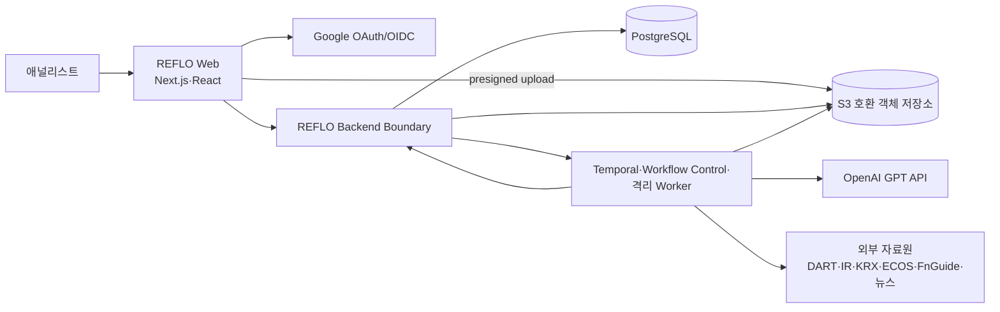
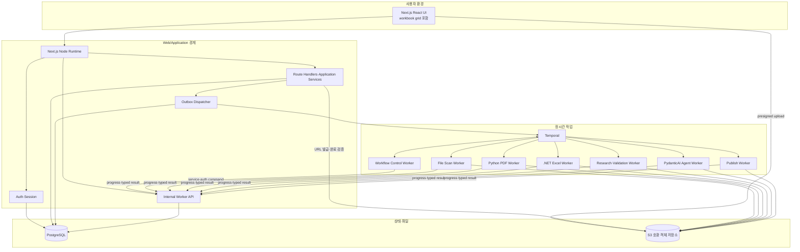
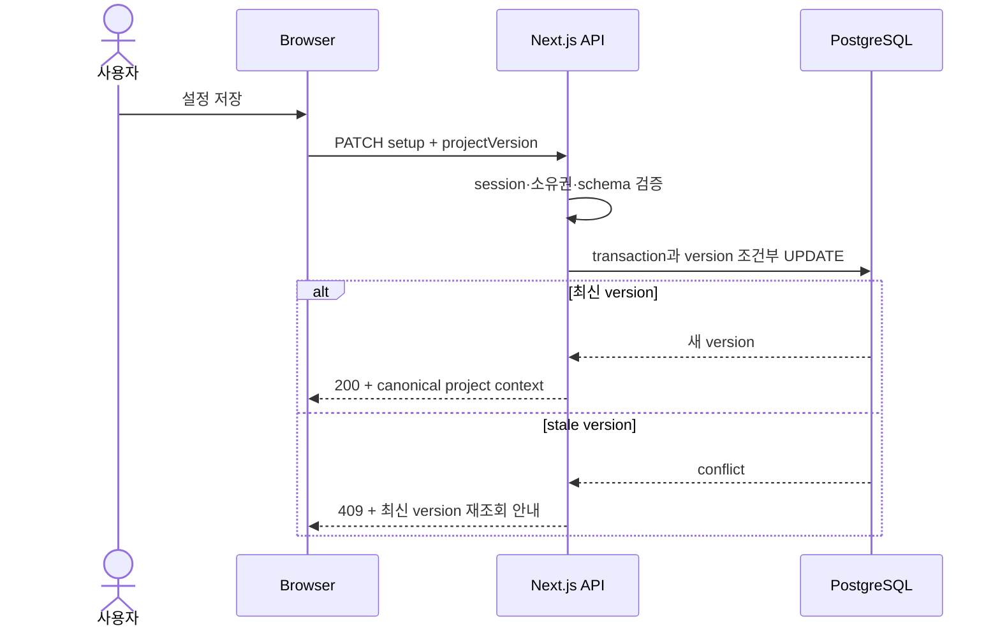
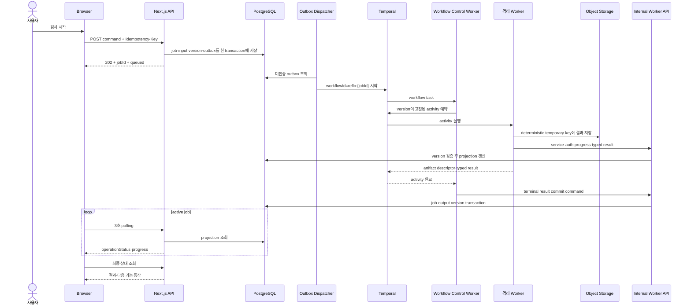
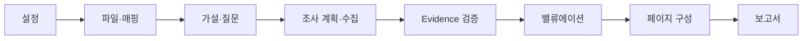

# REFLO 시스템 아키텍처 v1

**문서 상태:** 목표 아키텍처 기준선  
**작성 기준일:** 2026-07-24  
**대상:** 현업 배포용 MVP  
**현재 구현 위치:** `source-react/`  
**관련 문서:**

- [URL별 서비스 동작 명세](./REFLO_URL_SERVICE_BEHAVIOR_v1.md)
- [기술 결정 사항](./REFLO_TECHNICAL_DECISIONS_v1.md)
- [ERD](./REFLO_ERD_v1.md)
- [API 명세](./REFLO_API_SPEC_v1.md)
- [화면 구현 명세 인덱스](./REFLO_SCREEN_IMPLEMENTATION_SPEC_v1.md)
- [작업 로그](./REFLO_WORKLOG.md)

## 1. 문서 목적

이 문서는 REFLO를 어떤 실행 단위로 나누고, 각 단위가 어떤 데이터와 책임을 가지며, 서로 어떻게 통신하는지 정의한다. 세부 table·column은 [ERD](./REFLO_ERD_v1.md), endpoint별 payload는 [API 명세](./REFLO_API_SPEC_v1.md)와 [`contracts/openapi/reflo-v1.yaml`](../contracts/openapi/reflo-v1.yaml)에서 정의한다.

핵심 목표는 다음과 같다.

1. 디자이너가 만든 React UI를 다시 설계하지 않고 실제 데이터와 연결한다.
2. 브라우저·API·장시간 작업·파일 처리·Agent의 책임을 분리한다.
3. PDF·Excel·Evidence·보고서를 특정 입력과 도구 버전으로 재현할 수 있게 한다.
4. 사용자 파일과 프로젝트를 로그인 사용자 단위로 격리한다.
5. 서버나 worker가 재시작되어도 장시간 작업을 안전하게 재개한다.

## 2. 현재 상태와 목표 상태

### 2.1 현재 상태

현재 `source-react/`는 표준 Next.js App Router 프로젝트다.

- `/`와 9개 하위 route 파일은 대부분 `app/page.tsx`를 다시 내보낸다.
- `app/page.tsx`, `app/process.tsx`, `app/globals.css`에 화면과 샘플 데이터가 집중돼 있다.
- route 이동은 브라우저 `pushState`와 로컬 React state로 흉내 낸다.
- Google 인증, PostgreSQL, 객체 저장소, API, Temporal, worker와 PydanticAI는 연결되지 않았다.
- 파일 분석, AI 수정, 저장, 진행률과 다운로드는 실제 작업이 아닌 프로토타입 동작이다.

현재 구조는 디자인 기준선으로는 유효하지만 업무 데이터의 권위 시스템으로 사용할 수 없다.

### 2.2 목표 상태

MVP는 다음 구조를 사용한다.

- **Next.js 웹/API 모듈러 모놀리스:** 화면 렌더링, 인증, 동기 API, 도메인 규칙과 장시간 작업 시작
- **PostgreSQL:** 사용자, session, 프로젝트, workflow 상태, version, Evidence와 작업 projection
- **S3 호환 객체 저장소:** 원본과 파생 PDF·XLSX, 원문 snapshot, page image와 최종 artifact
- **Temporal + Workflow Control Worker:** 장시간·다단계 작업의 workflow 실행, replay, 재시도, 취소와 복구
- **격리 worker:** PDF Python, Excel .NET, Research/Validation Python, PydanticAI Agent
- **React workbook grid:** validation 읽기 전용 workbook과 valuation 허용 셀 편집

MVP에서는 별도 범용 API microservice를 먼저 만들지 않는다. Next.js의 Node.js server runtime이 웹 BFF와 application service 역할을 함께 맡는다. BFF는 브라우저에 맞는 응답을 제공하는 서버 경계다. PDF·Excel·Agent 실행은 이 process 밖의 worker로 분리한다.

## 3. 아키텍처 원칙

### 3.1 서버 권위

- 브라우저 state, 파일명, 사용자 ID, 계산값과 완료 표시는 권위값이 아니다.
- PostgreSQL의 domain version과 작업 projection이 구조화 상태의 권위다.
- S3 호환 저장소의 hash가 고정된 artifact가 파일 byte의 권위다.
- Excel 계산과 최종 XLSX 저장은 ClosedXML 0.105.0이 권위다.
- Agent 출력은 제안이며 Evidence 검증, 결정적 계산과 사용자 승인을 대체하지 않는다.

### 3.2 불변 원본과 새 version

- 업로드 원본은 수정하지 않는다.
- 상위 입력 변경은 기존 결과를 덮어쓰지 않고 새 version을 만든다.
- 모든 하위 산출물은 자신을 만든 상위 version ID를 기록한다.
- 상위 변경의 영향을 받는 하위 결과는 `stale` 또는 `revalidation_required`가 된다.
- 승인·내보낸 보고서는 이후 데이터 변경으로 자동 수정되지 않는다.

### 3.3 무거운 실행의 격리

- Next.js process에서 PDF parser, PDFium, OpenCV, ClosedXML과 업로드 폰트를 실행하지 않는다.
- browser에서 Temporal, 객체 저장소 credential, OpenAI key와 worker 내부 API에 직접 접근하지 않는다.
- 파일 처리 worker는 기본적으로 외부 network를 사용하지 않는다.
- 외부 자료 수집은 allowlist가 적용된 `research-network` worker만 수행한다.

### 3.4 최소 기술

- Vinext, Cloudflare Workers, Wrangler, D1과 OpenAI Sites는 목표 architecture의 구성요소가 아니다.
- Drizzle은 필수 architecture dependency가 아니다. TD-018에 따라 PostgreSQL access는 `pg@8.22.0`, migration은 `node-pg-migrate@9.0.0`으로 고정한다.
- Redis, 별도 message broker와 검색 cluster는 측정된 필요가 생기기 전 추가하지 않는다.
- 초기 작업 상태 전달은 TD-016의 3초 polling을 사용한다.

## 4. 시스템 컨텍스트



신뢰 경계:

1. 브라우저와 모든 외부 provider 입력은 신뢰하지 않는다.
2. Next.js server가 session, project 소유권, 입력 schema와 domain version을 검증한다.
3. worker 결과도 schema, version과 artifact hash 검증을 통과한 뒤에만 domain 상태에 반영한다.

## 5. Container 구조



`Outbox Dispatcher`는 DB transaction에 기록된 작업 시작 명령을 Temporal로 전달하는 구성요소다. 요청 도중 process가 종료돼도 명령이 사라지지 않게 하며, 같은 명령을 다시 전달해도 deterministic workflow ID와 idempotency key로 한 번만 적용한다.

`Workflow Control Worker`는 Temporal Workflow 정의를 등록하고 workflow task를 polling한다. 단계 순서, activity 호출, compensation, cancellation, replay와 workflow versioning을 소유한다. Dispatcher는 workflow를 시작할 뿐 Workflow 코드를 실행하지 않는다.

## 6. 실행 단위와 책임

| 실행 단위 | 주요 책임 | 소유 데이터 | 금지 |
|---|---|---|---|
| Browser UI | 입력, 화면 상태, polling, Evidence 탐색, workbook grid 표시·편집 | 저장 전 draft와 UI state | DB·S3·Temporal·OpenAI 직접 접근 |
| Next.js server | 인증, 소유권, 외부 API, 내부 service command, domain transaction, presigned URL | HTTP session과 domain write boundary | 무거운 파일 parser·Workflow·장시간 Agent 실행 |
| PostgreSQL | 구조화 domain 상태, version, Evidence, 작업 projection, audit metadata | row·transaction | 대형 PDF·XLSX·page image 저장 |
| S3 호환 저장소 | 원본·파생·최종 artifact byte | immutable object | 사용자 권한과 workflow 상태 판정 |
| Temporal | workflow 실행 이력, timer, retry, cancellation | workflow history | 사용자 화면 조회의 직접 권위 |
| Workflow Control worker | Workflow 정의, activity 순서, replay·versioning, reconciliation | workflow code와 execution policy | 사용자 API·domain table 직접 변경 |
| File Scan worker | magic byte, 크기, 암호화, 악성·지원 범위 검사 | 검사 결과 artifact | 외부 internet·PostgreSQL 직접 접근 |
| PDF worker | Template IR, 구조 분석, patch, render, 시각 검증 | PDF 파생 artifact | project 승인 판단·PostgreSQL 직접 접근 |
| Excel worker | workbook 분석, 재계산, 검증, 최종 XLSX 저장 | workbook 파생 artifact | 브라우저 계산값 신뢰·PostgreSQL 직접 접근 |
| Research worker | 허용 출처 수집, 원문 snapshot, 후보 추출 | source artifact·candidate | unrestricted network·PostgreSQL 직접 접근 |
| Validation worker | 원문 재확인, 값·문맥 검증, Evidence 생성 | validation result·Evidence | Research 추론 신뢰·PostgreSQL 직접 접근 |
| Agent worker | PydanticAI structured output 생성 | 검증 전 Agent result | 권위 계산·최종 판단·PostgreSQL 직접 접근 |
| Publish worker | 검증된 artifact의 publish 준비 | final artifact candidate | 검증 실패 결과 게시·PostgreSQL 직접 접근 |

activity worker는 PostgreSQL credential을 갖지 않는다. 진행률과 typed result는 service identity로 Internal Worker API에 제출한다. 이 API가 job·project·input version·artifact hash를 다시 검증하고 application transaction으로 반영한다. 단계 완료, 사용자 승인, project 소유권 변경과 최종 publish 판정도 같은 domain write boundary만 통과한다.

## 7. Web/Application 내부 구조

Next.js 안에서도 route 파일에 SQL과 domain 규칙을 직접 넣지 않는다.

```text
app/
  route·page·layout
    ↓
server/http/
  session·request schema·response mapping
    ↓
server/application/
  use case·transaction·authorization
    ↓
server/domain/
  entity·version·stage transition·invalidation rule
    ↓
server/infrastructure/
  PostgreSQL·S3·Temporal·provider adapter
```

의존 방향은 위에서 아래로만 흐른다.

- `app/`은 application use case를 호출하며 SQL을 알지 않는다.
- `domain/`은 Next.js, PostgreSQL client, S3 SDK와 Temporal SDK를 import하지 않는다.
- `infrastructure/`는 domain interface를 구현한다.
- worker와 공유하는 계약은 TypeScript class가 아니라 version이 있는 JSON Schema·OpenAPI schema로 교환한다.

### 7.1 계약의 단일 원본과 호환성

- 외부·내부 HTTP 계약의 단일 원본은 `contracts/openapi/reflo-v1.yaml`이다.
- activity input·output, artifact descriptor와 worker 오류의 단일 원본은 `contracts/schemas/`의 versioned JSON Schema다.
- TypeScript, Python과 C# type은 계약 파일에서 생성한다. 생성된 type을 직접 수정하지 않는다.
- 모든 worker message와 artifact descriptor는 `schemaVersion`을 포함한다.
- 호환 변경은 기존 field 의미를 바꾸지 않고 optional field만 추가한다.
- breaking change는 새 major schema를 만들고, 기존 major를 사용하는 active workflow가 모두 끝날 때까지 이전 handler를 유지한다.
- CI는 schema validation, 생성 코드 diff와 TypeScript·Python·C# contract fixture의 상호 호환을 검사한다.

### 7.2 Internal Worker API

- activity worker와 Workflow Control Worker만 service identity로 호출할 수 있다.
- browser session cookie와 사용자 입력 service ID는 내부 인증으로 인정하지 않는다.
- progress command는 job ID, input version, monotonic sequence와 idempotency key를 요구한다.
- result command는 temporary artifact descriptor, hash, byte size, schema version과 도구 version을 요구한다.
- API는 job이 해당 project·input version에 속하는지 확인하고 허용된 상태 전이만 transaction으로 적용한다.
- worker credential은 workload별로 분리하고 짧은 수명, TLS, rotation과 최소 권한을 적용한다. production 방식은 hosting provider 결정과 함께 고정한다.

## 8. 동기 요청 흐름

프로젝트 설정 저장처럼 짧은 작업은 한 HTTP 요청 안에서 완료한다.



자동 저장도 같은 use case를 사용한다. 마지막 응답이 이기는 방식으로 덮어쓰지 않고 project 또는 resource version으로 충돌을 검출한다.

## 9. 비동기 작업 흐름

파일 검사, 자료 수집, Agent 생성과 보고서 export처럼 긴 작업은 HTTP 요청과 분리한다.



DB commit은 됐지만 Temporal 시작이 실패한 경우 dispatcher가 재전송한다. `workflowId`는 `reflo:{jobId}`로 고정하고 같은 job ID의 중복 시작을 거부한다. 사용자가 새로 실행한 작업은 항상 새 job ID를 사용한다. Temporal 시작은 됐지만 응답 전 연결이 끊긴 경우 같은 idempotency key가 기존 job을 반환한다.

### 9.1 Outbox 상태

outbox row는 최소 다음 상태를 가진다.

```text
pending → dispatching → dispatched
                    ↘ failed → pending
```

- `commandId`와 `jobId`에는 unique constraint를 적용한다.
- dispatcher는 짧은 lease로 row를 claim하고 lease 만료 뒤 다른 instance가 재처리할 수 있게 한다.
- Temporal의 이미 시작됨 응답은 같은 job ID면 성공으로 처리한다.
- 재시도 횟수와 다음 시각을 기록하고 제한을 넘으면 운영 경고와 수동 재처리 대상으로 전환한다.
- `dispatched`는 Temporal execution 존재를 확인한 뒤에만 기록한다.

### 9.2 Projection reconciliation

PostgreSQL projection과 Temporal history는 한 transaction으로 묶을 수 없으므로 주기적으로 대조한다.

1. Workflow Control Worker가 1분마다 Internal Worker API의 reconciliation query로 active job 목록을 받는다.
2. 각 job의 내부 workflow ID로 Temporal execution 존재와 terminal 상태를 확인한다.
3. Temporal은 terminal인데 projection이 active면 terminal result command를 다시 제출한다.
4. projection은 active인데 execution이 없으면 미전송 outbox를 재처리하거나 `reconciliation_required`로 전환한다.
5. heartbeat가 제한시간을 넘은 job은 사용자에게 `상태 확인 중`으로 표시하고 즉시 실패로 단정하지 않는다.
6. reconciliation 변경도 idempotency key와 audit record를 남긴다.

### 9.3 Artifact commit과 orphan 정리

S3와 PostgreSQL은 하나의 transaction을 공유하지 않으므로 다음 publish protocol을 사용한다.

1. worker가 `temporary/{jobId}/{activityType}/{inputHash}`처럼 deterministic key에 업로드한다.
2. worker가 hash, byte size, media type, tool version과 schema version을 Internal Worker API에 제출한다.
3. API가 object metadata와 checksum을 다시 확인한다.
4. PostgreSQL transaction이 artifact metadata, output version과 job result를 연결한다.
5. publish worker는 연결·검증된 artifact만 immutable final key 또는 final retention class로 승격한다.
6. 재시도는 같은 temporary key와 content hash를 재사용하며 다른 byte면 충돌로 중단한다.
7. DB에 연결되지 않은 temporary object와 중단된 multipart upload는 TTL cleanup이 제거한다.

reconciliation은 terminal job의 output artifact가 실제로 존재하는지, final artifact가 정확한 DB version에 연결됐는지 함께 검사한다.

## 10. 파일 수명주기

```text
upload session 발급
  → quarantine object 직접 업로드
  → server checksum·크기 확인
  → file-scan worker 검사
  → 통과 시 immutable artifact 등록
  → 분석용 working copy 생성
  → 파생 artifact와 입력 version 연결
  → 검증·승인
  → final artifact 게시
```

상태 예:

```text
uploading → quarantined → scanning → accepted | rejected
accepted → processing → ready | failed
ready → superseded
```

- 원본과 승인 artifact는 같은 object key로 덮어쓰지 않는다.
- 임시 object는 최종 결과에 직접 연결할 수 없다.
- browser는 API가 발급한 단일 object용 presigned URL로 S3에 직접 업로드한다. bucket CORS는 허용된 REFLO origin·method·header만 허용한다.
- API는 업로드 완료 command에서 실제 object size, checksum, media type과 upload session 만료를 다시 검증한다.
- 다운로드 URL은 매 요청마다 session과 project 소유권을 확인한 뒤 짧게 발급한다.
- 사용자에게 object key, bucket 이름과 storage credential을 노출하지 않는다.

## 11. URL과 backend 책임 매핑

| URL | 동기 application 책임 | 비동기 책임 | 주요 저장 |
|---|---|---|---|
| `/` | session 조회, 프로젝트 생성 | 없음 | user, session, project |
| `/projects` | 소유 프로젝트 검색·정렬·resume route | active job projection 표시 | project, stage, job projection |
| `process/setup` | 기업·분기·기준일 저장, 단계 완료 | 기업 master 동기화는 별도 운영 작업 | project setup version |
| `process/files` | upload session, 파일 확정, 결과 확인 | scan, PDF·Excel 분석, MappingSet | artifact, Template IR, workbook metadata |
| `process/hypothesis` | 투자의견·가설·질문 편집과 승인 | PydanticAI Hypothesis Agent | hypothesis·question version |
| `process/research-plan` | source·질문·cell 계획 승인 | 자료 수집·후보 추출 | plan, source, collection job |
| `process/validation` | Evidence 선택·반려·재조사·승인 | 원문 독립 검증, workbook read model | Evidence, locator, validation version |
| `process/valuation` | 허용 셀 입력, PER 판단·승인 | ClosedXML 재계산·검증 | workbook calculation, valuation version |
| `process/report-outline` | page·slot 구성과 승인 | Outline·Draft Agent | outline version, generation job |
| `/report` | 편집 operation, 검증 요청, 최종 승인 | PDF patch·render·검증·PDF/XLSX export | report version, render plan, final artifact |

## 12. 데이터 소유권과 일관성

### 12.1 권위 저장소

| 데이터 | 권위 저장소 |
|---|---|
| 사용자·session·project·stage | PostgreSQL |
| 구조화 Evidence·locator·provenance | PostgreSQL |
| 작업의 사용자 표시 상태 | PostgreSQL projection |
| workflow 재시도·timer·실행 history | Temporal |
| PDF·XLSX·원문·image·대형 result | S3 호환 저장소 |
| 브라우저의 workbook 표현 | versioned React workbook read model, 비권위 |

### 12.2 version 고정

장시간 작업을 시작할 때 입력 version 집합을 고정한다.

```text
job.input_versions = {
  setupVersion,
  sourceFileVersionIds,
  hypothesisVersionId,
  researchPlanVersionId,
  evidenceSetVersionId,
  workbookVersionId,
  valuationVersionId,
  outlineVersionId
}
```

작업 완료 시 현재 version과 입력 version이 다르면 결과를 삭제하지 않고 `obsolete`로 저장한다. 사용자는 최신 입력으로 재실행할 수 있고 과거 실행은 감사·비교에 남는다.

### 12.3 단계 무효화



상위 version 변경은 영향을 받는 가장 이른 하위 단계부터 `revalidation_required`로 만든다. 어떤 단계로 복귀할지는 서버가 `resumeRoute`로 계산한다.

## 13. 인증·권한·보안

### 13.1 인증과 session

- TD-014에 따라 Google OAuth/OIDC만 사용한다.
- PostgreSQL에 hash된 불투명 session token을 저장한다.
- cookie는 production에서 `HttpOnly`, `Secure`, `SameSite=Lax`를 적용한다.
- idle 7일, absolute 30일 만료와 즉시 로그아웃 폐기를 적용한다.
- 상태 변경 요청은 same-origin과 CSRF 보호를 사용한다. CSRF는 사용자의 로그인 상태를 악용한 외부 사이트 요청을 차단하는 보호다.

### 13.2 프로젝트 격리

- 모든 query와 command는 session 사용자와 project owner를 server-side 조건으로 포함한다.
- 다른 사용자 소유 project와 존재하지 않는 project는 같은 `404 PROJECT_NOT_FOUND`를 반환한다.
- object key, artifact ID와 project ID를 알고 있어도 권한이 되지 않는다.
- MVP에는 공동 프로젝트와 역할별 권한이 없다.

### 13.3 파일과 network

- upload는 quarantine을 거쳐 검사 통과 후에만 immutable artifact가 된다.
- file worker는 non-root, read-only root filesystem, 제한된 CPU·memory·disk로 실행한다.
- file worker의 internet 접근과 cloud metadata endpoint 접근을 차단한다.
- research worker는 승인 host allowlist와 redirect·private IP 차단을 적용한다.

### 13.4 Agent 보안

- `OPENAI_API_KEY`는 `llm` worker secret으로만 주입한다.
- 사용자 입력과 수집 문서 안의 명령은 data로 취급하고 system instruction으로 실행하지 않는다.
- Agent output은 Pydantic schema와 domain rule을 통과해야 저장된다.
- 원시 reasoning은 화면, Evidence와 일반 로그에 저장하지 않는다.
- model, prompt, schema, tool version과 token usage는 실행 metadata로 남긴다.

### 13.5 Service-to-service 인증

- activity worker와 Workflow Control Worker는 사용자 session이 아니라 workload identity로 Internal Worker API를 호출한다.
- workload마다 별도 identity와 권한을 사용하며 모든 worker가 공유하는 장기 고정 token을 두지 않는다.
- production 통신은 TLS를 사용하고 가능하면 hosting platform의 workload identity 또는 mTLS를 사용한다.
- credential 발급·rotation·폐기와 실패 감사 로그를 secret manager 운영 정책에 포함한다.
- Internal Worker API는 public route와 URL namespace·middleware·rate limit를 분리하고 public internet 노출을 기본값으로 두지 않는다.

## 14. 신뢰성·재시도·취소

- API command는 `Idempotency-Key`를 사용한다. 같은 요청의 재전송은 기존 job 또는 결과를 반환한다.
- Temporal activity는 입력 version hash와 도구 version으로 중복 결과를 검출한다.
- validation 오류와 지원하지 않는 파일은 재시도하지 않는다.
- network timeout, `429`, `5xx`와 worker process 장애만 제한 횟수로 재시도한다.
- 장시간 activity는 phase, 처리 개수와 최근 진전 시각을 heartbeat로 보낸다.
- 취소는 `cancel_requested`를 거쳐 자식 process를 종료하고 `cancelled`로 확정한다.
- partial artifact는 `temporary` 상태로 격리하며 publish worker만 최종 artifact를 게시한다.
- projection·Temporal·artifact 불일치는 reconciliation이 복구하고 자동 복구할 수 없는 상태만 `reconciliation_required`로 사용자와 운영자에게 노출한다.

초기 timeout과 retry 수치는 TD-011을 따르며 실제 표본 p95와 peak resource 측정 후 조정한다.

## 15. 상태 조회와 사용자 경험

- active job은 3초 간격으로 조회한다.
- document가 hidden이면 polling을 중단한다.
- 다시 visible이 되거나 window focus를 얻으면 즉시 조회한다.
- terminal 상태에서 polling을 중단한다.
- 일시적 실패는 마지막 정상 데이터를 유지하고 최대 30초까지 backoff한다.
- 상태 응답은 `operationStatus`, `phase`, `progressPercent`, `heartbeatAt`, `retryable`, 사용자용 error code를 공통으로 사용한다.
- Temporal workflow ID와 내부 activity 이름은 브라우저에 노출하지 않는다.

## 16. 관측성과 감사

### 16.1 공통 식별자

모든 요청과 작업은 다음 식별자를 연결한다.

- `requestId`
- `traceId`
- `userId`
- `projectId`
- domain job ID
- input version ID 집합
- artifact ID
- workflow ID는 내부 로그에서만 사용

### 16.2 주요 metric

- API latency·error rate
- DB connection·slow query·version conflict
- outbox backlog와 dispatch latency
- reconciliation mismatch·repair·manual intervention 수
- orphan object·multipart upload 수와 cleanup 지연
- Temporal queue wait·workflow duration·retry·cancellation
- worker별 p50·p95, CPU, peak RSS와 temporary disk
- source provider latency·rate limit·format change
- Agent schema 실패율, token, latency와 비용
- PDF 구조·시각 검증 실패율
- Excel 재계산·호환성 실패율

### 16.3 로그 금지 정보

- session token·OAuth token·OpenAI key
- presigned URL 전체와 storage credential
- 원문 파일 byte와 사용자 문서 전체
- 원시 model reasoning
- 불필요한 개인정보와 전체 prompt

감사 로그는 누가 어떤 version을 만들고 승인·반려·재실행·내보냈는지 기록한다. 일반 application log와 감사 기록의 보존 정책은 분리한다.

## 17. 배포 단위와 환경

### 17.1 배포 단위

1. `web`: Next.js Node.js runtime
2. `workflow-dispatcher`: outbox 전달과 Temporal workflow 시작
3. `workflow-control-worker`: Workflow 정의·replay·versioning·reconciliation
4. `worker-file-scan`
5. `worker-pdf`
6. `worker-excel`
7. `worker-research-validation`
8. `worker-agent`
9. `worker-publish`
10. PostgreSQL
11. S3 호환 객체 저장소
12. Temporal

web과 worker는 같은 release version을 공유할 수 있지만 독립적으로 배포·확장한다. Next.js Edge runtime에는 DB·Temporal·파일 처리 책임을 넣지 않는다.

### 17.2 환경 분리

| 환경 | 목적 | 데이터 |
|---|---|---|
| local | 개발·단일 사용자 확인 | 합성·비민감 표본 |
| test/CI | unit·integration·contract·E2E | 매 실행 격리 fixture |
| staging | 실제 배포 구조·회귀·부하 검증 | 비식별 표본 |
| production | 사용자 업무 | 암호화·backup·감사 정책 적용 |

환경마다 DB, bucket, Temporal namespace, OAuth client와 OpenAI key를 분리한다. production 원본을 local·CI로 복사하지 않는다.

### 17.3 미확정 infrastructure 선택

다음 provider 선택은 아직 architecture에 고정하지 않는다.

- Next.js·worker container hosting
- managed PostgreSQL provider
- S3 호환 provider와 Object Lock 지원
- Temporal Cloud 또는 self-hosted
- secret manager, log·metric·trace platform

어떤 provider를 선택해도 이 문서의 service·data·trust boundary는 유지해야 한다.

### 17.4 Backup·복구 목표

MVP production provider는 최소 다음 목표를 만족해야 한다.

| 대상 | 목표 RPO | 목표 RTO | 복구 방법 |
|---|---:|---:|---|
| PostgreSQL metadata | 5분 이하 | 60분 이하 | point-in-time recovery와 transaction log |
| committed final artifact | 0 | 4시간 이하 | versioning·cross-zone 내구성과 삭제 보호 |
| temporary·재생성 가능 artifact | 허용 | 24시간 이하 | input version으로 workflow 재실행 |
| Temporal active workflow | 5분 이하 | 60분 이하 | Temporal persistence 복구 후 replay |
| 서비스 전체 | 5분 이하 | 4시간 이하 | 아래 순서의 통합 복구 |

RPO는 장애 시 허용할 수 있는 데이터 손실 구간이고, RTO는 서비스를 다시 사용할 수 있게 만드는 목표 시간이다. 수치는 실제 provider 계약과 부하 시험에서 검증한 뒤 낮출 수 있다.

통합 복구 순서:

1. secret·service identity와 network policy 복구
2. PostgreSQL을 지정 시점으로 복구하고 migration version 확인
3. S3 bucket versioning·object hash와 DB artifact 연결 검사
4. Temporal persistence·namespace와 worker version 복구
5. outbox·active job·workflow·artifact reconciliation 실행
6. Internal Worker API와 web을 열고 read-only smoke test 수행
7. 사용자 command를 다시 허용

production 도입 전 staging에서 전체 복구 훈련을 통과해야 하며 이후 분기마다 restore test를 실행한다. backup 성공 알림만으로 복구 가능성을 판단하지 않는다.

## 18. 목표 repository 구조

실제 directory 생성은 구현 계획에 따라 순차 진행한다.

```text
Reflo_fin/
  source-react/
    app/                       # route·page·route handler
    server/
      http/                    # session·schema·response mapping
      application/             # use case
      domain/                  # stage·version·invalidation rule
      infrastructure/          # PostgreSQL·S3·Temporal adapter
    tests/
    e2e/
  contracts/
    openapi/                   # 외부 HTTP 계약
    schemas/                   # worker·artifact JSON Schema
    generated/                 # CI가 생성한 TS·Python·C# type
  services/
    workflow-dispatcher/       # outbox claim·Temporal start
  workers/
    workflow-control/          # Workflow 정의·versioning·reconciliation
    file-scan/
    pdf/
    research-validation/
    agent/
    excel/
    publish/
  infra/
    local/                     # local service 구성
    migrations/                # PostgreSQL migration
  docs/
```

초기에는 기존 `source-react`를 유지한다. UI를 새 프로젝트로 옮기거나 전체 CSS를 다시 만드는 작업은 하지 않는다.

## 19. 구현 순서

### Phase 0. 계약 완성

- [x] ERD 문서 작성
- [x] API 통합 문서와 기준 OpenAPI 작성
- [x] worker JSON Schema, 오류 code와 TS·Python·C# 생성 규칙 작성
- [x] Google OAuth/OIDC package, PostgreSQL access·migration 도구 확정

### Phase 1. 기반 수직 흐름

1. local PostgreSQL과 migration 실행
2. Google login·server session 구현
3. user·project·setup·stage version 구현
4. `/` → `/projects` → `process/setup` 실제 데이터 연결
5. 새로고침·재로그인·다른 사용자 접근·version conflict 검증

### Phase 2. 파일과 작업 기반

1. 객체 저장소와 upload session
2. artifact·file version과 quarantine
3. outbox dispatcher, Workflow Control Worker와 Temporal 연결
4. job projection·artifact commit·reconciliation 구현
5. file scan·PDF·Excel worker 최소 실행
6. polling·retry·cancel·worker 재시작·orphan cleanup 검증

### Phase 3. 7단계 기능

1. hypothesis와 PydanticAI
2. research plan·수집·validation
3. React workbook grid validation read model
4. React workbook grid valuation edit와 ClosedXML 계산
5. report outline·draft·편집·검증·export

각 phase는 lint, typecheck, unit, integration, build와 브라우저 E2E를 통과한 뒤 다음 phase로 이동한다.

## 20. 아키텍처 검증 기준

- 브라우저 bundle에 DB·S3·Temporal·OpenAI credential과 worker library가 없다.
- 다른 사용자의 project·artifact를 ID 추측으로 조회·수정·다운로드할 수 없다.
- browser의 파일 byte는 web API를 통과하지 않고 제한된 presigned URL로 quarantine object에 직접 업로드된다.
- DB commit 직후 web process가 종료돼도 outbox 작업이 결국 시작된다.
- Workflow Control Worker 재시작과 새 code version 배포 뒤에도 active workflow가 replay된다.
- 같은 command와 activity가 중복 전달돼도 결과가 한 번만 반영된다.
- worker 종료·Temporal 재시작·network 단절 후 완료 지점부터 복구된다.
- activity worker의 PostgreSQL 직접 연결이 network와 credential 수준에서 거부된다.
- Temporal·projection 불일치와 S3·DB orphan을 reconciliation이 탐지·복구한다.
- 상위 version 변경 뒤 과거 결과가 최신 결과처럼 표시되지 않는다.
- 승인되지 않은 Evidence·계산·보고서 artifact를 publish할 수 없다.
- 최종 PDF와 XLSX에서 사용한 모든 입력·Evidence·도구 version을 추적할 수 있다.
- 현재 10개 URL의 핵심 UI 구조가 backend 연결 후에도 유지된다.
- staging restore test에서 PostgreSQL·S3·Temporal과 application을 목표 RPO·RTO 안에 복구한다.

## 21. 남은 결정

Phase 0 공통 구현을 막는 architecture 결정은 없다. 다음 항목은 관련 feature 통합 또는 production 배포 전에 확정한다.

1. production infrastructure provider
2. AGPL-3.0 대응 소스 링크와 third-party license notice 배포 검증
3. worker별 production resource·동시성·autoscaling 값
4. source type별 원문·Evidence·감사 로그의 법적 보존·삭제 정책

Google OIDC와 PostgreSQL 도구·version·구현 경계는 TD-018에서 확정했다.
파일 입력 기본값은 TD-019, Validation 판정은 TD-020, Valuation 수치·React workbook grid integration은 TD-021, Report 편집·preview·lease는 TD-022, Agent 실행 profile은 TD-023에서 확정했다. 위 항목은 provider·AGPL 공개·production sizing·법무 gate이며 application contract 구현을 막지 않는다.

ERD는 이 문서의 소유권·version·artifact·Evidence·job 경계를 table 관계로 구체화한다. API 문서는 application use case, 오류, idempotency와 polling 계약을 endpoint별로 구체화한다.
