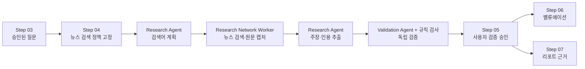

# Phase 04 자율 뉴스 조사 수정 계획

- 문서 상태: 핵심 경로 구현 완료, 운영 검증 진행
- 대상 단계: Step 04 자료 조사
- 연계 단계: Step 03 가설 및 질문, Step 05 검증, Step 06 밸류에이션, Step 07 리포트
- 작성 기준일: 2026-07-25

## 구현 진행 현황

- [x] NEWS 수동 URL 요구 제거 및 신규 수동 NEWS 등록 차단
- [x] 질문별 발행 기간·기준일 정책을 조사 계획 버전에 고정
- [x] PydanticAI/OpenAI 웹 검색을 이용한 Research Agent 뉴스 탐색
- [x] `research-network` 원문 캡처와 `evidence-validation` 독립 검증 분리
- [x] 실제 기사·canonical URL·발행일·기업·기간·본문 판별
- [x] 검색 감사 테이블과 source provenance 확장
- [x] Step 04 검색 기간·진행 상태와 Step 05 Text Fragment 연결
- [x] 뉴스의 Excel 실제값 권위 사용 차단
- [x] TypeScript·Python 계약 테스트, DB 마이그레이션, 프로덕션 빌드 검증
- [ ] 운영 API 키를 사용한 제한된 live-search smoke test
- [ ] shadow mode에서 검색 적격률·날짜 누락률·비용 지표 수집

## 1. 목적

이 문서는 Step 04에서 `NEWS` 출처를 선택했을 때 사용자가 기사 URL을 직접 등록해야 하는 현재 동작을 제거하고, Research Agent가 승인된 조사 질문과 기준일에 따라 인터넷의 뉴스 원문을 스스로 검색하도록 수정하기 위한 구현 계획이다.

이 변경의 핵심은 단순한 검색창 추가가 아니다. 검색 결과가 실제 기사인지, 기준일 이전에 이용 가능했던 정보인지, 대상 기업 및 질문과 관련 있는지, 본문과 인용 위치를 재현할 수 있는지를 서버와 Validation Agent가 독립적으로 검증해야 한다. 검증을 통과한 근거만 Step 05 이후 단계로 전달해야 한다.

## 2. 결론

목표 동작은 다음과 같다.

1. 사용자는 Step 04에서 `뉴스`를 조사 출처로 선택하지만 기사 URL은 입력하지 않는다.
2. 서버는 각 질문별 뉴스 검색 기간과 수집 한도를 승인된 조사 계획에 고정한다.
3. Research Agent는 질문별 검색어를 구조화해 생성한다.
4. 격리된 뉴스 검색 워커가 인터넷 검색, 원문 URL 확인, 기사 본문 캡처를 수행한다.
5. Research Agent는 캡처된 원문에서 주장, 수치, 정확한 인용문과 위치를 추출한다.
6. Validation Agent와 결정론적 검사가 출처, 날짜, 회사, 기간, 인용문을 독립적으로 재검증한다.
7. 검증된 Evidence만 Step 05에 노출하고, 사용자의 검증 승인을 거친 Evidence만 밸류에이션과 리포트에서 사용할 수 있다.

뉴스 수집 기간은 반드시 제한해야 한다. 기간 제한은 검색 품질을 높이기 위한 선택 사항이 아니라 미래정보 유입, 과도한 검색 비용, 결과 비재현성을 막기 위한 필수 통제다. 다만 “분석 대상 실적 기간”과 “기사 발행 기간”은 동일한 개념이 아니므로 별도로 관리한다.

## 3. 서비스 전체 흐름에서의 위치

REFLO의 역할 분리는 다음과 같다.

| 단계 | 시스템이 수행하는 일 | 사용자가 보유하는 최종 권한 |
| --- | --- | --- |
| Step 01 프로젝트 설정 | 기업, 기준일, 분석 기간 확정 | 분석 범위 승인 |
| Step 02 파일 등록 | Excel/PDF 구조 및 출처 탐색 | 사용할 자료 확정 |
| Step 03 가설 및 질문 | 가설·검증 질문 초안 생성 | 질문 편집 및 승인 |
| Step 04 자료 조사 | 코드 수집 및 Research Agent 조사 | 조사 계획 승인, 실행 시작 |
| Step 05 검증 | Validation Agent 및 규칙 기반 검증 | 기각, 재조사, 충돌 해소, 검증 승인 |
| Step 06 밸류에이션 | 승인된 실제값과 모델 계산 연결 | 추정치, Target PER, 목표가 판단 |
| Step 07 리포트 | 승인된 근거로 개요와 본문 생성 | 최종 문구 및 발행 승인 |

뉴스 자동 조사는 Step 04 안에서 완료되지만, 그 결과는 곧바로 사실로 확정되지 않는다. Step 04의 산출물은 `원문 스냅샷 + 미검증 후보 근거`이며, Step 05의 산출물이 `검증 상태가 포함된 Evidence`다.



### 3.1 단계별 책임 경계

- Research Agent는 검색 전략과 의미 판단을 담당한다.
- 네트워크 워커는 실제 인터넷 접근, URL 보안 검사, 다운로드, 해시와 스냅샷 생성을 담당한다.
- Validation Agent는 Research Agent의 추론을 신뢰하지 않고 캡처된 원문을 다시 확인한다.
- 서버는 기준일, 기간, 스키마, 허용 출처, 상태 전이를 강제한다.
- 사용자는 검증 결과를 최종 승인하거나 재조사를 요청한다.

LLM이 반환한 URL, 날짜, 수치, 인용문은 그 자체로 권위 있는 데이터가 아니다. 서버에 등록된 원문과 일치하고 검증을 통과해야만 다음 단계에서 사용할 수 있다.

## 4. 현재 구현과 의도 간 차이

현재 코드에서 `NEWS`는 이름상 `research_agent` 수집 방식으로 분류되지만, 실제 인터넷 뉴스 검색은 수행하지 않는다.

### 4.1 현재 동작

1. `ResearchPlanScreen`에서 사용자가 `뉴스 원문`을 선택한다.
2. 기사 제목, 발행일, URL을 사용자가 직접 입력한다.
3. 도메인 검증은 NEWS가 선택되었는데 등록 자료가 없으면 `SOURCE_MATERIAL_REQUIRED` 오류를 반환한다.
4. `collectResearchSources`는 등록된 URL만 가져온다.
5. LLM Research Agent는 이미 수집된 `sources`만 분석한다.
6. LLM 출력에 입력에 없던 `sourceKey`가 있으면 거부된다.

즉, 현재의 `research_agent`는 “뉴스를 찾는 에이전트”가 아니라 “사용자가 제공한 원문에서 후보를 추출하는 에이전트”다.

### 4.2 확인된 주요 구현 지점

| 영역 | 현재 구현 | 수정 방향 |
| --- | --- | --- |
| `server/domain/research-validation.ts` | NEWS에도 수동 자료를 요구 | NEWS는 자동 검색 정책 유무를 검증 |
| `app/_phase4/ResearchPlanScreen.tsx` | NEWS URL·발행일 입력 UI 제공 | 자동 검색 및 기간 표시로 변경 |
| `server/infrastructure/repositories/phase4-repository.ts` | NEWS 자료 등록과 URL 저장 허용 | 신규 NEWS 수동 등록 차단, 기존 값은 읽기 전용 보존 |
| `server/infrastructure/research-sources/adapters.ts` | 등록된 URL만 fetch | 뉴스 검색과 원문 캡처를 별도 어댑터로 분리 |
| `workers/llm/app.py` | 입력된 스냅샷에서만 후보 추출 | 검색어 계획과 원문 후보 추출 역할을 분리 |
| `workers/control/activities.ts` | 수집·추출·검증을 한 활동에 결합 | 재시도 가능한 세부 활동으로 분할 |
| `workers/control/workflows.ts` | 단일 LLM 큐 중심 실행 | LLM과 네트워크 큐를 분리한 오케스트레이션 |

### 4.3 현재 동작이 만드는 문제

- “뉴스 선택”의 의미가 “에이전트가 조사”가 아니라 “사용자가 URL 제공”으로 바뀌어 있다.
- 사용자가 어떤 기사를 선택하느냐에 따라 조사 범위가 임의로 축소된다.
- HTTP `Date` 또는 `Last-Modified`를 기사 발행일처럼 사용할 수 있어 시점 검증이 부정확하다.
- 원문 본문이 DB/워크플로 payload에 크게 포함될 수 있어 저장 정책과 실행 이력 크기 원칙에 맞지 않는다.
- 뉴스 검색, 다운로드, 추출, 검증이 분리되지 않아 실패 지점별 재시도와 감사 추적이 어렵다.

## 5. 목표 사용자 경험

### 5.1 Step 04 조사 계획 화면

사용자가 질문의 조사 출처로 `뉴스`를 선택하면 다음 정보를 보여준다.

- 설명: `AI가 설정된 기간 안에서 실제 뉴스 원문을 검색합니다.`
- 검색 기간: 서버가 계산한 시작일과 종료일
- 기준일: 프로젝트의 `cutoffAt`
- 상태: 자동 검색
- 선택적으로 표시할 정책 요약: 최대 수집 기사 수, 언어

NEWS에는 기사 제목, 발행일, URL 입력 필드를 표시하지 않는다. `회사 IR`과 `사용자 자료`의 수동 등록은 기존대로 유지한다.

특정 기사를 참고시키고 싶은 사용자는 해당 URL을 `사용자 자료`로 등록할 수 있다. 이 자료는 자동 NEWS 검색 성공을 대신하지 않으며, 별도의 사용자 제공 출처로 표시하고 검증한다.

### 5.2 실행 중 상태

백엔드의 상세 상태는 다음과 같이 분리하되, 화면에는 과도한 기술 용어를 노출하지 않고 기존 Step 04 톤에 맞게 묶어 표시한다.

| 내부 상태 | 화면 표시 예시 |
| --- | --- |
| `planning_news_search` | 뉴스 검색 계획 수립 중 |
| `searching_news` | 뉴스 원문 검색 중 |
| `capturing_news` | 기사 원문 확인 중 |
| `collecting_structured_sources` | 공식 데이터 수집 중 |
| `extracting_candidates` | 근거 후보 정리 중 |
| `validating_evidence` | 출처와 인용 검증 중 |
| `publishing_projection` | 검증 결과 반영 중 |

### 5.3 결과가 없는 경우

기간 안에 검증 가능한 기사가 없으면 임의의 기사나 기준일 이후 기사를 채우지 않는다.

- NEWS가 필수 출처인 질문: `해당 기간에 검증 가능한 뉴스 원문을 찾지 못했습니다.`로 실패 또는 Step 05 진입 차단
- NEWS가 보조 출처인 질문: 경고와 함께 다른 출처의 결과만 유지
- 사용자 행동: 기간 또는 질문 수정, 출처 정책 변경, 재조사

필수와 보조 여부는 문장으로 추론하지 않고 조사 계획의 구조화된 `requirement` 값으로 저장해야 한다.

## 6. 뉴스 기간 정책

### 6.1 두 기간을 구분한다

| 구분 | 의미 | 예시 |
| --- | --- | --- |
| `subjectPeriods` | 기사가 설명해야 하는 실적·사건의 대상 기간 | 2025년 4분기 |
| `publicationWindow` | 수집을 허용하는 기사 발행 시점 | 2025-10-01 ~ 2026-02-15 |

분기 실적을 다루는 기사는 분기 종료 뒤에 발행되는 경우가 많다. 따라서 기사 발행 기간을 분석 대상 분기와 동일하게 제한하면 정작 실적 발표 기사와 시장 반응 기사가 제외된다.

### 6.2 기본 정책

분기 분석의 기본값은 다음으로 고정한다.

- 시작: 대상 분기 시작일 30일 전 00:00:00 KST
- 종료: 프로젝트 기준일 `cutoffAt`
- 경계: 시작과 종료 모두 포함
- 시간대 권위: `Asia/Seoul`
- 최대 기간: 240일
- 최대 기간을 넘기려면 구조화된 사유와 사용자 재승인이 필요

예를 들어 2025년 4분기, 기준일이 2026-02-15라면 기본 기사 발행 기간은 2025-10-01보다 30일 앞선 날짜부터 2026-02-15까지다. 실제 날짜 계산은 달력 함수로 수행하고 하드코딩하지 않는다.

### 6.3 기준일 강제 규칙

- `publishedAt` 또는 보수적으로 계산한 `availableAt`은 반드시 `cutoffAt` 이하여야 한다.
- 검색 공급자가 제공한 날짜는 탐색 힌트일 뿐 최종 권위가 아니다.
- 실제 기사 페이지의 JSON-LD, Open Graph, `<time>`, 본문 메타데이터를 교차 확인한다.
- 날짜만 있고 시간이 없으면 `datePrecision=day`로 기록하고 다음 날 00:00 KST를 보수적 `availableAt`으로 사용한다.
- 기사 발행일을 확인할 수 없으면 검증 가능한 NEWS로 채택하지 않는다.
- `dateModified`가 기준일 이후이고 기준일 당시 원문 스냅샷이 없다면 현재 본문을 기준일 이전 근거로 단정하지 않는다. 해당 후보는 제외하거나 `qualified` 검토 대상으로 보낸다.
- HTTP 응답의 `Date`와 `Last-Modified`는 기사 발행일의 단독 근거로 사용하지 않는다.

### 6.4 과거 비교가 필요한 경우

전년 동기 수치 비교는 DART, 회사 IR, Excel 실제값을 우선 사용한다. 과거 뉴스 정서나 당시 사건을 비교해야 하는 질문에만 별도의 보조 뉴스 기간을 추가한다.

복수 기간은 하나의 넓은 범위로 합치지 않고 다음처럼 각각 저장한다.

```json
{
  "publicationWindows": [
    {
      "purpose": "current_period",
      "startAt": "2025-10-01T00:00:00+09:00",
      "endAt": "2026-02-15T23:59:59+09:00"
    },
    {
      "purpose": "historical_comparison",
      "startAt": "2024-10-01T00:00:00+09:00",
      "endAt": "2025-02-15T23:59:59+09:00"
    }
  ]
}
```

## 7. 목표 아키텍처

### 7.1 에이전트 주도, 서버 강제

PydanticAI와 OpenAI Responses 계열은 내장 웹 검색 도구를 지원한다. 그러나 Research Agent에 제한 없는 브라우징 권한을 주고 최종 URL과 본문을 그대로 신뢰해서는 안 된다.

권장 구조는 다음과 같다.

1. Research Agent가 질문별 검색어와 검색 의도를 계획한다.
2. 서버가 승인된 기간, 언어, 결과 수, 허용 정책을 도구 인자로 덮어쓴다.
3. 뉴스 검색 공급자 어댑터가 검색을 실행한다.
4. 네트워크 워커가 결과 URL을 직접 열어 실제 기사 페이지인지 확인한다.
5. 캡처한 원문에 서버 `sourceKey`를 부여한다.
6. Research Agent는 등록된 `sourceKey`만 사용해 후보를 추출한다.
7. Validation Agent가 동일 스냅샷을 독립적으로 확인한다.

이렇게 하면 “무엇을 찾을지”는 Research Agent가 결정하면서도 “무엇을 근거로 인정할지”는 서버와 검증 단계가 통제한다.

### 7.2 워커와 큐 분리

| 큐 | 허용 작업 | 금지 작업 |
| --- | --- | --- |
| `workflow-control` | 상태 전이, 활동 조합, 체크포인트 | 외부 원문 다운로드 |
| `llm` | 검색어 계획, 후보 추출, 의미 검증 | 임의 URL 직접 fetch |
| `research-network` | 뉴스 검색 API, URL 검사, 원문 캡처 | 근거의 최종 사실 판정 |
| 기존 코드 수집 큐 | DART/KRX/ECOS 등 구조화 수집 | 자유 웹 탐색 |

네트워크 접근을 별도 워커에 격리하면 SSRF 통제, egress 허용 목록, 속도 제한, 장애 재시도를 독립적으로 운영할 수 있다.

### 7.3 Temporal 활동 분할

현재의 단일 `runResearchValidation`은 아래 활동으로 분할한다.

1. `planNewsSearch`
2. `searchNews`
3. `rankNewsResults`
4. `captureNewsSources`
5. `collectStructuredSources`
6. `extractResearchCandidates`
7. `validateResearchCandidates`
8. `publishResearchProjection`

각 활동은 동일 입력에 대해 멱등해야 하며, `projectId + planVersionId + runId + questionId + policyVersion`으로 멱등 키를 구성한다.

긴 기사 본문을 Temporal 입력·출력으로 전달하지 않는다. 네트워크 활동은 원문을 제한된 오브젝트 스토리지에 저장하고, 워크플로에는 해시, 크기, 저장 위치 식별자, 파서 버전이 포함된 작은 manifest만 반환한다.

### 7.4 뉴스 공급자 추상화

구현은 특정 검색 서비스에 직접 결합하지 않고 다음 인터페이스를 둔다.

```ts
interface NewsDiscoveryProvider {
  search(input: {
    query: string;
    startAt: string;
    endAt: string;
    languages: string[];
    limit: number;
  }): Promise<NewsDiscoveryResult[]>;
}
```

초기 공급자는 OpenAI Responses 웹 검색 또는 한국 뉴스 커버리지와 이용 약관을 만족하는 별도 검색 공급자로 구현할 수 있다. 최종 선택 전 다음을 검증한다.

- 한국 상장사 및 한국어 기사 검색 커버리지
- 날짜 필터 정확도
- 실제 원문 canonical URL 제공 여부
- 검색 결과의 안정적 식별자
- API 이용 약관과 기사 저장·인용 허용 범위
- rate limit, 비용, 장애 대응

공급자가 바뀌어도 감사 가능하도록 `providerCode`, `providerResultId`, `providerPolicyVersion`을 저장한다.

## 8. 뉴스 판별 및 수집 규칙

### 8.1 허용 조건

검색 결과는 다음 조건을 모두 만족해야 NEWS 원문 후보가 된다.

- 실제 기사 상세 페이지다.
- canonical URL이 확인된다.
- 매체명, 기사 제목, 발행 시점, 본문을 확인할 수 있다.
- 질문의 대상 기업을 안정적으로 식별할 수 있다.
- 발행 시점이 승인된 `publicationWindow`와 `cutoffAt` 안에 있다.
- 본문에서 정확한 인용문과 위치를 재현할 수 있다.

`NewsArticle` 또는 `Article` JSON-LD는 강한 신호지만 단독 조건은 아니다. Open Graph, 페이지 구조, 본문 길이, 발행자 정보 등을 함께 사용한다.

### 8.2 제외 조건

- 검색 결과 페이지, 뉴스 목록, 포털 홈
- 블로그, 커뮤니티, 포럼, 광고성 랜딩 페이지
- DART 공시, 회사 IR, 보도자료 원문
- 본문 접근 없이 요약문만 제공되는 결과
- 우회 없이는 읽을 수 없는 paywall 기사
- 발행일을 신뢰성 있게 확인할 수 없는 기사
- 기준일 이후 기사 또는 기간 밖 기사
- 대상 기업이 동명이인으로 판단되는 기사
- canonical URL 또는 본문 해시가 중복인 기사

회사 보도자료를 인용하려면 NEWS로 위장하지 않고 `COMPANY_IR` 또는 적절한 공식 출처 유형으로 수집한다.

### 8.3 기본 검색 및 다양성 한도

초기 서버 정책값은 다음으로 시작하고 운영 지표에 따라 버전으로 조정한다.

| 정책 | 기본값 |
| --- | --- |
| 질문별 검색어 | 2~4개 |
| 질문별 발견 결과 | 최대 20개 |
| 원문 fetch | 최대 10개 |
| 최종 보존 기사 | 최대 8개 |
| 동일 매체 보존 | 최대 2개 |
| 목표 매체 다양성 | 가능하면 3개 이상 |
| 기본 언어 | 한국어, 필요 시 영어 |

이 수치는 클라이언트에 하드코딩하지 않고 `news-policy-v1` 같은 서버 정책 버전으로 관리한다.

### 8.4 중복 제거

중복은 다음 순서로 제거한다.

1. 정규화한 canonical URL
2. 리디렉션 최종 URL
3. 본문 content hash
4. 제목·본문 유사도
5. 통신사 전재 기사 또는 거의 동일한 재배포 기사

전재 기사 중 하나만 남기되, 원발행처를 확인할 수 있으면 원발행처를 우선한다. 서로 다른 취재와 관점을 담은 기사는 같은 사건을 다뤄도 중복으로 제거하지 않는다.

## 9. 계약과 데이터 모델 변경

### 9.1 승인된 조사 계획

질문별 출처 배열에 단순한 문자열만 저장하지 말고 역할과 정책을 명시한다.

```ts
type ResearchSourceBinding = {
  sourceType: "DART" | "COMPANY_IR" | "KRX" | "ECOS" | "NEWS" | "USER_MATERIAL";
  requirement: "required" | "supporting";
  collectionMethod: "code" | "research_agent" | "code_then_agent";
  newsSearchPolicy?: NewsSearchPolicy;
};

type NewsSearchPolicy = {
  mode: "agent_web_search";
  publicationWindows: Array<{
    purpose: "current_period" | "historical_comparison";
    startAt: string;
    endAt: string;
  }>;
  subjectPeriods: string[];
  timezone: "Asia/Seoul";
  queryLimit: number;
  discoverLimit: number;
  fetchLimit: number;
  retainLimit: number;
  perPublisherLimit: number;
  languages: string[];
  providerCode: string;
  policyVersion: string;
};
```

승인 이후 이 정책은 해당 `planVersionId`에서 불변이어야 한다. 기간이나 한도를 바꾸면 새 조사 계획 버전을 만든다.

### 9.2 에이전트 검색 계획 계약

Research Agent는 URL이나 사실 후보가 아니라 검색 계획을 구조화해 반환한다.

```ts
type NewsQueryPlan = {
  schemaVersion: "news-query-plan-v1";
  questionId: string;
  queries: Array<{
    queryId: string;
    queryText: string;
    intentCode: "earnings" | "guidance" | "event" | "risk" | "market_reaction";
    keywords: string[];
  }>;
};
```

서버는 질문 ID, 검색어 개수, 허용 문자, 회사 식별자 포함 여부를 검증한다. 기간과 결과 수는 에이전트 출력에서 받지 않고 승인된 정책을 사용한다.

### 9.3 검색 결과 계약

```ts
type NewsDiscoveryResult = {
  queryId: string;
  providerCode: string;
  providerResultId: string | null;
  resultRank: number;
  url: string;
  titleHint: string | null;
  publisherHint: string | null;
  publishedAtHint: string | null;
};
```

이 값들은 발견 기록이며 검증된 출처 메타데이터가 아니다.

### 9.4 캡처 manifest

```ts
type NewsSourceManifest = {
  sourceKey: string;
  canonicalUrl: string;
  publisher: string;
  title: string;
  publishedAt: string;
  modifiedAt: string | null;
  availableAt: string;
  datePrecision: "second" | "minute" | "day";
  capturedAt: string;
  responseHash: string;
  contentHash: string;
  artifactId: string;
  parserVersion: string;
  eligibilityPolicyVersion: string;
  locatorStrategy: "text_fragment" | "paragraph_index";
};
```

Research Agent와 Validation Agent는 서버가 발급한 `sourceKey`만 참조한다. 현재의 “입력에 없는 sourceKey 거부” 규칙은 유지해야 한다.

### 9.5 데이터베이스

다음 테이블 또는 동등한 일반화 구조를 추가한다.

#### `research_news_search`

- `id`
- `project_id`
- `plan_version_id`
- `run_id`
- `question_id`
- `query_id`
- `query_text`
- `publication_window_json`
- `provider_code`
- `provider_policy_version`
- `status`
- `created_at`

#### `research_news_search_result`

- `id`
- `research_news_search_id`
- `provider_result_id`
- `result_rank`
- `discovered_url`
- `canonical_url`
- `title_hint`
- `publisher_hint`
- `published_at_hint`
- `selection_status`
- `rejection_code`
- `research_source_version_id`
- `created_at`

기존 `research_source`/`research_source_version`에는 다음 메타데이터를 보강한다.

- `modified_at`
- `available_at`
- `date_precision`
- `artifact_id`
- `artifact_retention_class`
- `content_hash`
- `parser_version`
- `eligibility_policy_version`

원문 HTML과 대용량 본문은 `snapshot_json`에 넣지 않는다. PostgreSQL에는 메타데이터, 인용 위치, 해시, 오브젝트 스토리지 locator만 저장한다.

### 9.6 기존 수동 NEWS 데이터 호환

- 신규 등록 API는 `sourceType=NEWS`를 거부한다.
- 수동 등록 가능한 유형은 `COMPANY_IR`, `USER_MATERIAL`로 제한한다.
- 기존 NEWS reference는 삭제하거나 덮어쓰지 않는다.
- 기존 승인 계획과 실행 결과에서는 `legacy_manual_news`로 읽기 전용 표시한다.
- 필요하면 신규 계획 생성 시 기존 수동 NEWS URL을 `USER_MATERIAL`로 명시적으로 복사하되 자동 변환 사실을 기록한다.

## 10. API 및 상태 변경

### 10.1 조사 계획 조회

Step 04 조회 응답의 NEWS 질문에는 서버가 계산한 `newsSearchPolicy`를 포함한다. 화면은 이를 표시할 뿐 기간을 자체 계산하지 않는다.

### 10.2 자료 등록 API

- `COMPANY_IR`: URL 또는 허용된 파일
- `USER_MATERIAL`: URL 또는 파일
- `NEWS`: `400 NEWS_MANUAL_MATERIAL_UNSUPPORTED`

현재 구현에는 있지만 OpenAPI에 누락된 자료 등록·삭제 경로도 명세에 추가한다.

### 10.3 내부 워커 API

다음 계약을 버전 관리한다.

- 뉴스 검색어 계획 요청/응답
- 검색 결과 manifest
- 원문 캡처 manifest
- Research Candidate 요청/응답
- Validation 요청/응답

모든 요청에는 최소한 다음을 포함한다.

- `schemaVersion`
- `projectId`
- `planVersionId`
- `runId`
- `questionId`
- `cutoffAt`
- `toolPolicyVersion`
- `agentProfileVersion`

내부 API는 응답을 적용하기 전에 schema, run 상태, plan version, hash를 다시 확인한다.

## 11. Research Agent 수정

Research Agent의 책임을 두 실행으로 분리한다.

### 11.1 검색어 계획 실행

입력:

- 승인된 질문
- 회사명, 종목코드, 시장
- 대상 기간
- 뉴스 검색 정책
- 이미 확보한 출처의 요약 메타데이터

출력:

- 질문별 2~4개의 검색어
- 검색 의도 코드
- 핵심 키워드

금지:

- 검색하지 않은 URL 생성
- 기사 발행일 추측
- 검색 정책의 기간·한도 변경
- 사용자 문서의 민감 내용을 외부 검색어에 포함

### 11.2 후보 근거 추출 실행

입력:

- 캡처와 등록이 끝난 source manifest
- 접근 권한이 있는 원문 본문
- 승인된 질문

출력:

- `sourceKey`
- 주장
- 정확한 인용문
- 인용 위치
- 지지/반박 방향
- 관련 대상 기간

출력 검증:

- 서버에 등록되지 않은 `sourceKey` 거부
- 원문에 존재하지 않는 인용문 거부
- 질문 또는 대상 기업과 무관한 후보 거부
- 기준일 이후 출처 거부
- 수치 후보는 단위와 기간이 모두 있어야 함

## 12. Validation Agent 및 Step 05

### 12.1 독립 검증

Validation Agent에는 Research Agent의 자유 형식 사고 과정이나 검색 이유를 전달하지 않는다. 다음만 제공한다.

- 승인된 질문
- 후보 주장과 인용
- 원문 manifest와 본문
- 정책 버전과 기준일

검증 항목:

- canonical URL과 실제 응답 일치
- 기사 제목, 매체, 발행일
- 대상 기업 식별
- 인용문 원문 일치 및 위치
- 주장과 인용의 의미적 일치
- 기사 발행 기간 및 기준일 준수
- 수정 시점 및 기준일 당시 이용 가능성
- 같은 사건에 대한 독립 출처 수

### 12.2 Step 05 노출 규칙

- `passed` 또는 정책상 허용된 `qualified`만 검증 근거 카드로 표시한다.
- 실패 후보의 본문은 노출하지 않고 실패 사유 요약만 표시한다.
- 뉴스 링크는 실제 외부 canonical URL을 연다.
- 가능하면 Text Fragment를 사용해 인용 위치로 이동한다.
- 기사 본문 전체를 REFLO 화면에 재배포하지 않는다.
- 매체, 발행일, 캡처 시점, 인용문, 검증 상태를 함께 표시한다.

### 12.3 뉴스 근거의 권위

NEWS는 다음에 사용할 수 있다.

- 경영진 발언에 대한 외부 보도
- 사건, 규제, 수주, 사고, 시장 반응
- 가설을 지지하거나 반박하는 정성적 맥락

NEWS는 다음의 최종 권위가 될 수 없다.

- DART/회사 IR로 확인 가능한 재무 실제값
- Excel 실제값 셀
- 사용자 추정치
- Target PER 또는 목표가

단일 뉴스만 있는 중요 주장에는 `qualified`를 부여할 수 있다. `qualified` 근거를 승인하려면 사용자가 사유를 남기게 하고, 중대한 미해결 충돌이 있으면 검증 완료를 차단한다.

### 12.4 재조사

사용자가 기각 또는 재조사를 선택하면 기존 원문과 결정 기록을 수정하지 않는다.

1. 새 조사 실행 버전을 만든다.
2. 필요한 경우 검색 기간, 질문, 출처 requirement를 새 계획 버전에서 변경한다.
3. 새 검색 결과와 Evidence가 기존 버전을 `supersede`한다.
4. 과거 승인과 리포트는 당시 버전으로 계속 재현할 수 있어야 한다.

## 13. 이후 단계 전개

### 13.1 Step 06 밸류에이션

- Step 05 검증 승인이 없으면 밸류에이션으로 진행하지 않는다.
- 뉴스 Evidence는 투자 판단의 맥락과 리스크 설명에만 사용한다.
- 뉴스에서 발견한 숫자를 DART/IR 실제값 셀에 자동 입력하지 않는다.
- 뉴스가 사용자 추정 셀, Target PER, 목표가를 덮어쓰지 않는다.
- 정량 값이 필요하면 공식 구조화 출처로 재수집하거나 사용자 확인 대상으로 보낸다.

### 13.2 Step 07 리포트

- 승인된 `EvidenceId`만 개요와 본문 생성 입력으로 사용한다.
- 지지 뉴스와 반박 뉴스 모두 리스크 및 논거 구성에 사용할 수 있다.
- 각 뉴스 근거에 canonical URL, 매체, 발행일, 인용 locator를 유지한다.
- 원문 전체가 아니라 필요한 최소 인용과 요약만 표시한다.
- 근거 없는 주장, 기준일 이후 기사, 끊어진 source link가 있으면 리포트 검증을 실패시킨다.

### 13.3 상류 변경의 전파

다음 변경은 하류 산출물을 자동으로 `revalidation_required` 상태로 만든다.

- 질문 수정
- 뉴스 검색 기간 수정
- 출처 필수/보조 역할 수정
- 새 조사 실행 승인
- Evidence 승인 취소 또는 충돌 상태 변경

기존 승인본을 덮어쓰지 않고 새 버전을 만든다. 이미 발행된 리포트는 당시 Evidence 버전으로 재현 가능해야 한다.

## 14. 오류 및 재시도 정책

| 오류 코드 | 의미 | 재시도 |
| --- | --- | --- |
| `NEWS_QUERY_PLAN_INVALID` | 검색어 계획 스키마 또는 정책 위반 | 프롬프트 보정 후 제한 재시도 |
| `NEWS_SEARCH_PROVIDER_UNAVAILABLE` | 검색 공급자 장애 | 지수 백오프 |
| `NEWS_SEARCH_RATE_LIMITED` | 공급자 rate limit | `Retry-After` 준수 |
| `NEWS_NO_ELIGIBLE_ARTICLES` | 기간 내 적격 기사 없음 | 자동 반복 금지, 계획 변경 필요 |
| `NEWS_ARTICLE_NOT_NEWS` | 실제 기사 상세 페이지가 아님 | 해당 결과만 제외 |
| `NEWS_ARTICLE_DATE_MISSING` | 발행일 검증 불가 | 해당 결과만 제외 |
| `NEWS_ARTICLE_OUTSIDE_WINDOW` | 승인 기간 밖 기사 | 해당 결과만 제외 |
| `NEWS_CUTOFF_VIOLATION` | 기준일 이후 이용 가능 | 즉시 제외 |
| `NEWS_ARTICLE_MODIFIED_AFTER_CUTOFF` | 본문이 기준일 이후 수정됨 | 스냅샷 유무에 따라 제외/qualified |
| `NEWS_ARTICLE_UNREADABLE` | 본문 또는 인용 위치 확보 불가 | 해당 결과만 제외 |

한 기사 다운로드 실패는 전체 실행을 즉시 실패시키지 않는다. 질문별 최소 적격 기사 수와 `required/supporting` 정책을 평가한 뒤 최종 상태를 결정한다.

취소 시:

- 새 Evidence를 발행하지 않는다.
- 완료된 source manifest는 실행 상태와 함께 감사용으로 남긴다.
- 미완료 임시 원문은 보존 정책에 따라 TTL 후 삭제한다.
- 재시작은 마지막 안전한 체크포인트부터 수행한다.

## 15. 보안, 개인정보, 저작권

### 15.1 검색어 데이터 최소화

외부 검색 공급자에는 다음만 전달한다.

- 공개 회사명
- 종목코드
- 승인된 질문에서 추출한 공개 키워드
- 대상 기간

업로드된 Excel/PDF의 비공개 문장, 사용자 메모, 토큰, 내부 식별자는 검색어에 포함하지 않는다.

### 15.2 네트워크 보안

- 모든 URL과 리디렉션 단계에서 DNS/IP를 재검사한다.
- localhost, 사설 IP, link-local, 메타데이터 주소를 차단한다.
- 허용 protocol은 HTTPS 중심으로 제한한다.
- 응답 크기, timeout, redirect 횟수, content type을 제한한다.
- 첫 구현에서는 JavaScript 실행 브라우저 크롤링을 제외한다.
- 네트워크 워커는 non-root, 제한된 egress와 자격 증명으로 실행한다.

### 15.3 프롬프트 인젝션

기사 본문에 포함된 지시문은 데이터로만 취급한다. 원문은 에이전트의 시스템 지시나 도구 정책을 바꿀 수 없다. 기사 안의 링크를 에이전트가 임의로 추가 탐색하지 못하게 한다.

### 15.4 저작권과 보존

- 검색 및 원문 수집 공급자의 이용 약관을 확인한다.
- 기사 본문 전체를 사용자 화면이나 리포트로 재배포하지 않는다.
- 필요한 최소 인용, 요약, URL, locator만 제품 데이터로 사용한다.
- 원문 artifact는 제한된 접근 권한과 명시된 보존 기간을 적용한다.
- 장기 보존이 허용되지 않는 출처는 해시와 인용 locator 중심으로 정책을 달리한다.

## 16. 관측 지표

운영 전후 다음 지표를 기록한다.

- 질문별 검색어 수와 검색 비용
- 공급자 latency, timeout, 429, 5xx
- 발견 결과 대비 적격 기사 비율
- 발행일 누락률
- 원문 파싱 실패율
- 기준일 이후 거부율
- canonical/content 중복률
- 질문별 매체 다양성
- 질문별 `passed`, `qualified`, `failed` Evidence 수
- Validation Agent 불일치율
- 사용자 기각 및 재조사 비율
- Step 07 리포트에서 실제 사용된 뉴스 Evidence 비율

원문이나 검색어 전체를 일반 로그에 기록하지 않는다. 로그에는 ID, 상태, 코드, 시간, 비용, 해시 등 운영 메타데이터를 우선 기록한다.

## 17. 테스트 계획

### 17.1 도메인 단위 테스트

- NEWS 선택 시 수동 URL 없이 조사 계획 승인 가능
- COMPANY_IR/USER_MATERIAL의 기존 자료 요구 규칙 유지
- NEWS 필수/보조 source binding 검증
- KST 기준 시작·종료 경계 포함
- `cutoffAt` 이후 기사 거부
- 날짜 정밀도가 day인 경우 보수적 `availableAt` 계산
- 기준일 이후 수정 기사 처리
- 과도하게 넓은 검색 기간 거부

### 17.2 공급자 및 캡처 테스트

- 공급자 계약 fixture
- 검색 힌트와 실제 기사 메타데이터 불일치
- canonical URL 및 리디렉션
- JSON-LD/Open Graph/`time` 발행일 추출
- 뉴스 목록·블로그·보도자료 제외
- paywall 또는 본문 없음 처리
- SSRF, DNS rebinding, redirect 공격 차단
- 응답 크기 및 content type 제한
- URL/content/syndication 중복 제거
- 동일 매체 상한과 다양성 정책

### 17.3 에이전트 테스트

- 질문별 검색어 개수와 스키마 준수
- 회사명, 기간, 질문 의도 포함
- 사용자 비공개 문서 내용이 검색어에 유출되지 않음
- 등록되지 않은 `sourceKey` 거부
- 원문에 없는 인용문 거부
- 기사 본문의 프롬프트 인젝션 무시
- 주장, 인용, 대상 기간, 방향 분류 일치

### 17.4 워크플로 테스트

- 활동별 retry와 backoff
- 동일 멱등 키 중복 실행 방지
- 질문 단위 체크포인트와 resume
- 취소 후 Evidence 미발행
- 큰 원문이 Temporal history에 포함되지 않음
- 내부 계약 schema/version 불일치 거부
- 일부 기사 실패 후 나머지 결과로 정책 평가

### 17.5 통합 및 E2E 테스트

1. Step 04에서 NEWS 선택
2. URL 입력 없이 계획 승인
3. 화면에서 검색 기간 확인
4. 조사 작업 시작
5. 실제 뉴스 원문 캡처와 검증
6. Step 05에서 외부 canonical URL 및 인용 확인
7. 기각·재조사 후 새 버전 생성 확인
8. 승인된 Evidence만 Step 06/07에 전달되는지 확인
9. 뉴스 수치가 Excel actual 셀을 변경하지 않는지 확인
10. 기준일 이후 기사가 리포트에 포함되지 않는지 확인

DART, KRX, ECOS, COMPANY_IR, USER_MATERIAL의 기존 수집과 검증 회귀 테스트도 함께 실행한다.

## 18. 구현 순서

### Phase A. 정책 및 계약

- `NewsSearchPolicy`, source `requirement`, 에이전트 계약 정의
- 기간 계산과 기준일 검증을 도메인 함수로 구현
- 오류 코드와 공개 진행 상태 정의
- OpenAPI 및 JSON Schema 갱신

완료 조건: 수동 NEWS reference 없이도 승인 가능한 계획 snapshot이 버전 고정된다.

### Phase B. 저장소와 마이그레이션

- 뉴스 검색·결과 감사 테이블 추가
- source version 메타데이터 확장
- 대용량 artifact 저장 위치 도입
- 기존 수동 NEWS 데이터 호환 계층 추가

완료 조건: 검색부터 원문, 후보, 검증까지 ID와 hash로 추적 가능하다.

### Phase C. 네트워크 수집 계층

- `NewsDiscoveryProvider` 구현
- `research-network` 큐와 워커 추가
- URL 보안 검사, 기사 판별, 메타데이터 파서 구현
- 중복 제거와 다양성 정책 구현

완료 조건: 승인된 기간 안의 실제 기사만 source manifest로 등록된다.

### Phase D. 에이전트와 워크플로

- Research Agent 검색어 계획 실행 추가
- 기존 후보 추출을 등록 source 기반으로 유지·보강
- Validation Agent 입력을 독립 검증 구조로 정리
- 단일 활동을 세부 Temporal 활동으로 분할
- retry, checkpoint, cancel, idempotency 구현

완료 조건: 외부 장애와 개별 기사 실패를 격리하면서 검증 결과를 재현할 수 있다.

### Phase E. Step 04 UI

- NEWS 수동 URL 입력 제거
- 자동 검색 설명과 서버 계산 기간 표시
- 상세 진행 상태 연결
- 적격 기사 없음, 공급자 장애의 사용자 복구 행동 제공
- 기존 수동 NEWS는 legacy 읽기 전용으로 표시

완료 조건: 사용자가 NEWS를 선택하고 URL을 입력하지 않아도 작업을 시작할 수 있다.

### Phase F. Step 05 이후 연결

- Step 05 뉴스 카드에 canonical URL, 매체, 발행일, 인용 locator 표시
- 필수/보조 및 qualified 승인 규칙 연결
- Step 06 숫자 권위 차단 회귀 검사
- Step 07 Evidence allow-list와 기준일 검사 연결
- 상류 변경 시 `revalidation_required` 전파

완료 조건: 승인된 뉴스 Evidence만 하류에 전달되고 기존 승인본이 보존된다.

### Phase G. 점진 배포

- `news_auto_discovery_v1` feature flag 추가
- 초기에는 shadow mode로 검색 품질과 날짜 판별률 측정
- 내부 프로젝트에서 매체 다양성, 실패율, 비용 확인
- 신규 프로젝트부터 자동 NEWS 활성화
- 기존 프로젝트는 승인된 계획을 유지하고 새 계획 버전에서만 전환

## 19. 파일별 예상 변경 범위

| 파일/영역 | 변경 내용 |
| --- | --- |
| `source-react/server/domain/research-validation.ts` | NEWS 수동 자료 요구 제거, 검색 정책·기간·requirement 검증 |
| `source-react/app/_phase4/ResearchPlanScreen.tsx` | NEWS URL 입력 제거, 자동 검색 기간·상태 UI |
| `source-react/app/_phase4/types.ts` 또는 관련 타입 | NewsSearchPolicy와 진행 상태 추가 |
| `source-react/server/infrastructure/repositories/phase4-repository.ts` | 정책 snapshot, 수동 NEWS 차단, legacy 읽기 |
| `source-react/server/infrastructure/research-sources/` | 뉴스 검색 공급자, 캡처, 판별, artifact 저장 어댑터 추가 |
| `source-react/workers/control/activities.ts` | 단일 조사 활동 분할 |
| `source-react/workers/control/workflows.ts` | 분할 활동 오케스트레이션 및 체크포인트 |
| `source-react/workers/control/run.ts` | `research-network` 큐 등록 |
| `workers/llm/app.py` | 검색어 계획 endpoint/agent, 추출 계약 보강 |
| `workers/llm/test_app.py` | 검색 계획·인용·sourceKey 검증 테스트 |
| `contracts/schemas/v1/` | 뉴스 검색 계획, 발견 결과, manifest schema |
| `openapi/` 또는 API 명세 | 자료 등록 제한, 조사 정책, 내부 워커 계약 |
| `source-react/server/infrastructure/db/migrations/` | 뉴스 검색 감사 및 source metadata 마이그레이션 |
| Step 05 repository/UI | 뉴스 검증 결과와 외부 원문 locator 표시 |
| Step 06/07 repository | Evidence 권위 및 cutoff allow-list 강제 |
| `.env.example` | 공급자, 한도, artifact 보존 설정 |

실제 구현 전 현재 변경 중인 파일과 충돌 여부를 다시 확인하고, 다른 작업의 수정 내용을 덮어쓰지 않는다.

## 20. 완료 기준

다음 조건을 모두 만족해야 수정 완료로 본다.

- NEWS 선택 시 사용자 기사 URL이 요구되지 않는다.
- Research Agent가 승인된 질문을 바탕으로 검색어를 자동 생성한다.
- 인터넷 검색은 승인된 기간과 기준일 안에서만 실행된다.
- 실제 기사 원문 URL, 발행일, 매체, 본문, 인용 위치가 확인된다.
- 검색 결과 힌트를 그대로 믿지 않고 원문을 서버가 재검증한다.
- 등록되지 않은 출처와 원문에 없는 인용은 거부된다.
- 검증되지 않은 후보가 Step 05 Evidence로 노출되지 않는다.
- 적격 기사가 없을 때 기준일 이후 기사로 보충하지 않는다.
- Step 05에서 실제 외부 기사 URL을 열 수 있다.
- 뉴스는 Excel actual 값이나 사용자 추정치의 권위가 되지 않는다.
- 승인된 Evidence만 밸류에이션과 리포트에 전달된다.
- 질문·기간·Evidence 변경 시 하류가 재검증 상태가 된다.
- 기존 승인 계획과 legacy 수동 NEWS 결과는 재현 가능하다.
- retry, cancel, idempotency, 보안, 저작권 정책 테스트가 통과한다.

## 21. 범위에서 제외하는 항목

- 사용자가 임의 검색 엔진을 선택하는 기능
- LLM에 제한 없는 브라우저·네트워크 권한 제공
- 뉴스 본문 전체의 화면 또는 리포트 재배포
- paywall 우회
- 뉴스 수치를 공식 재무 실제값으로 자동 확정
- JavaScript 실행이 필요한 범용 브라우저 크롤러
- 실시간 뉴스 스트리밍
- 이번 변경만을 위한 벡터 데이터베이스 도입

## 22. 구현 의사결정 요약

| 질문 | 결정 |
| --- | --- |
| NEWS에 사용자 URL이 필요한가? | 아니다. Research Agent가 자동 조사한다. |
| 특정 기간만 수집해야 하는가? | 그렇다. 기간과 기준일은 서버가 강제하는 필수 정책이다. |
| 분석 대상 기간과 기사 발행 기간은 같은가? | 아니다. 별도로 저장하고 검증한다. |
| LLM이 직접 찾은 URL을 믿는가? | 아니다. 네트워크 워커가 실제 원문을 캡처·검증한다. |
| 뉴스가 재무 실제값의 권위가 되는가? | 아니다. 공식 출처와 Excel provenance가 우선한다. |
| 검증 전 결과를 다음 단계에 쓰는가? | 아니다. Step 05 승인 이후에만 사용한다. |
| 기존 수동 NEWS 데이터는 삭제하는가? | 아니다. legacy 읽기 전용으로 보존한다. |
| 공급자에 종속되는가? | 아니다. `NewsDiscoveryProvider` 뒤에 격리한다. |

이 계획의 최종 목표는 “AI가 뉴스를 찾아준다”가 아니라, “AI가 기간 안의 실제 뉴스 원문을 찾아도 REFLO의 기준일, 출처 추적, 독립 검증, 사용자 승인 원칙이 끝까지 유지되는 조사 파이프라인”을 만드는 것이다.
