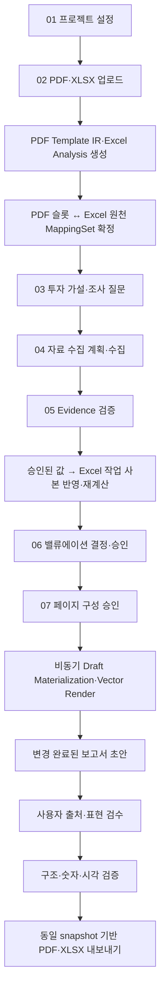

# Implementation Plan: REFLO 종단간 리서치·Excel·보고서 자동화 완성

**상태:** 실행 중 · Phase 1·2·3·4 완료 · Phase 5 핵심 구현 완료 · Phase 6·7 진행 중<br>
**작성일:** 2026-07-26  
**최종 수정일:** 2026-07-26  
**예상 구현:** 7개 독립 Phase, 집중 개발 28시간 내외  
**적용 범위:** 프로젝트 설정 → 파일 분석 → 조사·검증 → Excel 반영 → 밸류에이션 → 보고서 초안 → 검증·승인 → PDF/XLSX 내보내기  
**기준 Fixture:** `fixtures/ISC_095340_4Q25_Valuation_하나증권_12.xlsx`와 대응 ISC PDF  

> 이 문서는 기존의 부분 계획을 종단간 관점에서 통합한 **승인된 완성 실행 계획**이다.<br>
> 2026-07-26에는 사용자 지시에 따라 Phase 1, Phase 2, Phase 3, Phase 4를 순서대로 완료했으며 Phase 5 이후 범위는 미착수 상태로 보존한다.

관련 부분 계획:

- [보고서 표·차트 물질화 수정 계획](./REPORT_DRAFT_TABLE_CHART_MATERIALIZATION_FIX_PLAN.md)
- [Phase 06 동적 밸류에이션 보고서 계획](./PHASE06_DYNAMIC_VALUATION_REPORT_FIX_PLAN.md)
- [전체 구현 계획](../REFLO_IMPLEMENTATION_PLAN_v1.md)

---

## 실행 규칙

**각 Phase 완료 후 반드시:**

1. 완료한 작업 체크박스를 갱신한다.
2. RED → GREEN → REFACTOR 순서를 지켰는지 기록한다.
3. 해당 Phase의 자동 테스트와 공통 품질 게이트를 모두 실행한다.
4. 실패한 품질 게이트가 있으면 다음 Phase로 넘어가지 않는다.
5. `최종 수정일`, 진행률, 실제 소요 시간과 학습 내용을 갱신한다.
6. 데이터 migration은 dry-run 결과를 검토한 뒤 실행한다.
7. 과거 승인 버전과 artifact를 덮어쓰거나 삭제하지 않는다.

**금지:**

- 테스트 없이 UI에서만 정상처럼 보이게 만들기
- 원본 PDF의 과거 수치를 변경된 초안처럼 표시하기
- AI가 재무 숫자·표·차트 이미지를 생성하게 하기
- 매핑이 모호한데 점수가 높다는 이유만으로 자동 확정하기
- 브라우저 overlay와 최종 PDF가 서로 다른 renderer를 사용하기
- 현재 입력 version이 바뀐 뒤 오래된 비동기 결과를 게시하기
- 최종 PDF로 원본 PDF artifact를 재사용하기

---

## 1. 결론

REFLO가 최종적으로 지켜야 할 사용자 계약은 다음과 같다.

> 사용자가 이전 분기 PDF와 작업 Excel을 업로드하면, 서비스가 PDF의 레이아웃·블록·스타일과 Excel의 셀·표·차트를 분석하고 연결한다. 자료 조사와 검증이 끝나면 승인된 값을 Excel 작업 사본에 반영하고 재계산한다. 보고서 초안을 열 때는 EPS·PER·목표주가·재무제표·표·데이터 차트가 이미 최신 값으로 변경되어 있어야 한다. 사용자는 값의 출처와 연결을 확인하고 문장과 허용된 표현만 수정한다. 최종 PDF와 XLSX는 동일한 승인 snapshot에서 생성되어야 한다.

이 동작이 제품 관점에서 올바르다. 보고서 편집 단계는 데이터를 처음 입력하거나 Excel 연결을 새로 만드는 단계가 아니다.

현재 코드는 이 계약을 일부만 만족한다. 특히 다음 네 가지는 필수 수정 대상이다.

1. 조사·검증 결과가 Excel에 실제로 쓰이지 않는다.
2. EPS·PER·목표주가 같은 scalar가 원래 PDF 위치에 반영되지 않는다.
3. 브라우저 표·차트 overlay가 최종 PDF에 반영되지 않는다.
4. 최종 PDF export가 새 PDF가 아니라 원본 PDF artifact를 재사용한다.

---

## 2. 목표 사용자 경험

### 2.1 정상 흐름



### 2.2 `/report` 최초 진입 상태

사용자가 처음 보고서를 열었을 때 다음이 이미 완료되어 있어야 한다.

- 본문 초안은 승인된 Evidence와 밸류에이션 판단을 사용한다.
- 원본 PDF의 과거 scalar 값은 최신 승인 값으로 교체된다.
- 표는 최신 승인 Workbook의 raw/formatted 값으로 다시 생성된다.
- 데이터 차트는 최신 category·series와 이전 분기 디자인으로 다시 생성된다.
- 도표 6 같은 사업개요 이미지·도식은 원본 고정 시각 자료로 유지된다.
- 각 데이터 블록은 정확한 source snapshot과 provenance를 가진다.
- 필수 블록 하나라도 준비되지 않으면 보고서 화면을 완료된 초안처럼 표시하지 않는다.

### 2.3 사용자가 할 일

- 각 표·차트·수치의 연결 출처 확인
- 본문 문장 수정
- 승인된 범위 내 차트 표현 방식 변경
- 경고·오류 검토
- 보고서 승인과 내보내기

사용자는 보고서 화면에서 Excel 수치를 직접 수정하지 않는다. 숫자 오류는 검증 또는 밸류에이션 단계로 돌아가 새 Workbook version을 만든다.

### 2.4 `연결 확인`의 의미

`연결 확인`은 읽기 전용 provenance 기능이다.

- Workbook artifact와 version
- MappingSet version
- sheet stable ID와 표시명
- cell/range
- formula와 number format
- 표의 row/column topology
- 차트 category·series·primary/secondary axis
- Evidence와 valuation approval

연결을 변경하려면 Step 2로 이동하고 새 MappingSet revision을 만든다. 변경 후 validation·valuation·outline·report는 재검증 필요 상태가 된다.

### 2.5 단계별 진입·완료 Gate

| 단계 | 진입 조건 | 사용자가 하는 일 | 완료 조건 | 다음 단계로 고정되는 것 |
|---|---|---|---|---|
| 01 프로젝트 설정 | 로그인·프로젝트 소유권 | 기업·기준일·기간·보고서 유형·밸류에이션 방식 확정 | 유효한 setup version 승인 | setup version, company, cutoff |
| 02 파일 분석 | setup 완료 | PDF·XLSX 업로드, 모호한 block·mapping만 확인 | 파일 검사 통과, 모든 required dynamic slot confirmed | PDF/XLSX artifact, Template IR, Workbook Analysis, MappingSet |
| 03 투자 가설 | files 완료 | 투자 의견 작성, AI 질문 검토·수정·승인 | 질문 version 승인 | hypothesis/question version |
| 04 자료 수집 계획 | hypothesis 완료 | 질문별 출처·Excel 입력 target·수집 범위 확정 | plan 승인, 수집 job accepted | research plan과 pinned inputs |
| 05 조사 결과 검증 | 수집 성공 | 원문·수치·기간·단위·충돌 검토, qualified decision | 필수 Evidence 충분, 충돌 해소, Validated Workbook 생성 성공 | Evidence/Validation approval, Validated Workbook |
| 06 밸류에이션 | validation 완료 | 허용 input·Target PER·목표주가 검토·승인 | 재계산 성공, output binding 검증, valuation approval | 최종 Workbook artifact, EPS/PER/가격 snapshot |
| 07 페이지 구성 | valuation 완료 | 페이지별 본문 요점·Evidence·계획된 표·차트 검토 | 모든 페이지 review와 outline approval | outline approval, report materialization task |
| 보고서 초안 | materialization 성공 | 연결 확인, 문장 편집, 허용 chart variant 선택 | 최신 report version 검증 통과 | approved report version, RenderPlan |
| 내보내기 | report 승인 | PDF·XLSX 생성 요청·결과 확인 | 두 artifact의 snapshot·hash·내용 검증 | 최종 immutable PDF/XLSX |

각 단계는 자신보다 앞선 version을 다시 추론하지 않는다. 바로 이전 완료 단계가 전달한 immutable version ID를 소비한다.

---

## 3. 지원 입력 범위

“시작부터 끝까지 정상 동작”은 다음 지원 범위 안에서 보장한다.

### 지원

- 암호화·전자서명이 없는 일반 PDF
- 텍스트와 벡터 객체를 추출할 수 있는 증권사 리서치 PDF
- `.xlsx`
- 최대 100 PDF 페이지
- 최대 50 Excel 시트
- 선, 영역, 그룹 막대, 누적 막대, 콤보, 밴드 차트
- scalar, keyed table, chart-series, composite chart, fixed visual

### 명시적으로 거절 또는 수동 검토

- 전자서명 PDF
- 암호화 PDF/XLSX
- `.xls`, `.xlsm`, macro, DDE, external link
- 이미지로만 구성된 PDF에서 OCR confidence가 기준 미달인 경우
- 복원할 데이터 계열이 없는 차트
- 하나의 PDF 슬롯에 동률 후보가 여러 개인 경우
- 안전하게 유지할 수 없는 Excel 수식·VML·drawing 구조

지원하지 않는 입력을 원본 값으로 조용히 통과시키지 않는다. 업로드 또는 매핑 단계에서 정확한 blocker와 다음 행동을 제공한다.

---

## 4. 현재 구현 기준선과 확인된 문제

| 구간 | 현재 코드 상태 | 완성에 필요한 작업 |
|---|---|---|
| 업로드·격리·artifact | quarantine, hash, 형식 검사, worker 흐름 존재 | 공격 fixture·한도·복구 E2E 강화 |
| PDF 분석 | bbox·텍스트·이미지·일부 chart/table/fixed visual 검출 | detect-once, 일반화, typed style template |
| Excel 분석 | stable sheet ID, 셀·range·내장 chart 분석 | 계산 호환성, bound range API, style 보강 |
| 매핑 | scalar/table/chart 후보와 revision 존재 | scalar adapter, composite chart, axis·style 보존 |
| 조사·검증 | Evidence 수집·검증과 read-only workbook 존재 | 승인값을 Workbook에 쓰는 파이프라인 부재 |
| 밸류에이션 | workbook version, 재계산, 승인 존재 | 검증에서 생성된 Workbook을 입력으로 고정 |
| Report materializer | table/chart snapshot 존재 | scalar, composite, axis, typed style, persisted artifact |
| 브라우저 초안 | 원본 PDF 위 table/chart overlay | canonical server-rendered draft를 기본 문서로 사용 |
| 차트 디자인 | 고정 색상·단순 SVG preview | 이전 PDF style template 기반 공용 renderer |
| PDF preview | editable text patch만 적용 | scalar/table/chart vector command 지원 |
| Export | 원본 PDF와 승인 XLSX를 ready로 연결 | 새 렌더 PDF 생성·검증·publish |
| 무효화 | repository별 일부 처리 | 중앙 dependency DAG와 late-result 차단 |
| 기존 프로젝트 | 과거 IR/Mapping/Report 유지 | 명시적 재분석·migration workflow |

### 4.1 조사 결과는 아직 Excel에 쓰이지 않는다

`source-react/server/infrastructure/repositories/phase4-repository.ts`의 `getValidationWorkbook`은:

- `readOnly: true`
- 원본 workbook analysis
- Evidence binding
- `writeStatus: "pending"`

만 반환한다. 승인된 Evidence를 셀에 적용하고 새 XLSX artifact를 생성하는 코드가 없다.

### 4.2 scalar가 PDF 슬롯에 반영되지 않는다

`source-react/server/domain/report.ts`의 `materializeReportBindings`는 table과 chart만 처리한다. EPS·PER·목표주가·현재주가는 bbox가 없는 별도 “승인 밸류에이션” 요약 블록에는 들어가지만 원래 PDF scalar 슬롯을 교체하지 않는다.

### 4.3 차트 디자인은 이전 분기 스타일을 사용하지 않는다

`ReportChartPreview.tsx`는 고정 palette와 단순 좌표를 사용한다. PDF에서 추출한 폰트·색상·축·범례·선·막대 간격을 사용하지 않는다.

### 4.4 최종 PDF가 실제로 생성되지 않는다

`createReportPreview`는 editable text block만 PDF worker에 보낸다. table·chart·scalar는 `fixed`로 제외된다.

`createReportExport`는 현재:

- PDF → `context.sourcePdfArtifactId`
- XLSX → `context.workbookArtifactId`

를 바로 `ready`로 연결한다. 최종 PDF가 원본 PDF와 같은 치명적인 오류다.

### 4.5 Outline 승인이 동기 처리된다

OpenAPI는 `202 + task`를 정의하지만, 실제 구현은 같은 DB transaction 안에서 LLM 초안 생성과 report 저장까지 수행한 뒤 `200`을 반환한다. 외부 호출을 transaction 밖의 비동기 workflow로 이동해야 한다.

---

## 5. 변경할 수 없는 아키텍처 원칙

### 5.1 권위 원천

| 결과 | 권위 원천 | AI 역할 |
|---|---|---|
| 재무 scalar | 승인 Workbook 계산값 또는 valuation approval | 없음 |
| 시장가격 | 기준일 KRX snapshot | 없음 |
| 표 | 승인 Workbook exact range | 없음 |
| 차트 데이터 | 승인 Workbook category·series | 후보 설명만 가능 |
| 차트 디자인 | 이전 PDF의 Template IR style template | 스타일 분류 보조만 가능 |
| 본문 | 승인 Evidence + 사용자 판단 | 초안 작성 가능 |
| 사업개요 도식 | 원본 PDF fixed visual | 변경 대상 아님 |

### 5.2 AI 이미지 생성 금지

재무 차트·표는 AI 이미지로 생성하지 않는다.

- 숫자·눈금 hallucination 위험
- 동일 입력의 재현성 부족
- 이전 분기 디자인의 정확한 반복 불가
- source cell과 pixel 사이 감사 불가
- 벡터 PDF, 검색, 접근성, 확대 품질 저하

AI는 block 분류, 매핑 후보 설명, narrative 초안에만 사용한다. 실제 숫자·표·차트·PDF는 결정론적 코드가 만든다.

### 5.3 PDF와 Excel의 책임 분리

- PDF Template IR: 좌표, 스타일, block, patch target, validation mask
- MappingSet: PDF slot과 Excel·valuation·market source의 연결
- Excel: 값, 수식, 표 topology, category·series
- Materialization Artifact: 특정 승인 version의 실제 값
- RenderPlan: 실제 PDF에 넣을 scalar/table/chart scene과 command

### 5.4 Fail closed

- 필수 slot이 미연결이면 Step 2 완료 불가
- Evidence가 부족하면 Workbook 적용 불가
- 재계산이 실패하면 valuation 승인 불가
- materialization이 실패하면 `/report` 완료 상태 표시 불가
- 구조·숫자·시각 검증이 실패하면 승인·export 불가
- 원본 PDF를 silent fallback으로 사용하지 않음

### 5.5 하나의 Workbook 계보

```text
업로드 원본 XLSX
  → 검증값 적용 Workbook
  → 재계산 Workbook
  → 밸류에이션 승인 Workbook
  → 최종 export XLSX
```

각 단계는 불변 artifact다. 다음 단계는 바로 이전 단계의 hash와 version을 pin한다.

---

## 6. 목표 데이터 모델과 계약

### 6.1 SourceSnapshot

한 번의 보고서 생성 작업은 다음 ID와 hash를 모두 고정한다.

- setup version
- PDF artifact/hash
- XLSX artifact/hash
- Template IR version/hash
- Workbook Analysis version/hash
- MappingSet version/hash
- Validation approval/Evidence version
- Validated Workbook artifact/hash
- Valuation approval/version
- Outline approval/version
- Style Template version/hash
- report version

작업 종료 시 현재 snapshot과 다르면 결과를 `obsolete`로 저장하고 active 결과로 게시하지 않는다.

### 6.2 MappingSet 확장

지원 binding:

- `ScalarBinding`
- `TableBinding`
- `ChartBinding`
- `CompositeChartBinding`
- `MarketDataBinding`
- `_REFLO_BRIDGE` 기반 generated range binding

필수 추가 정보:

- binding 목적: `workbook_input` 또는 `report_output`
- semantic metric, period, unit, scope
- source stable sheet ID·range
- raw/formatted read mode
- display rule
- actual/forecast 구분
- chart axis와 series role
- style template reference
- structure fingerprint
- detection confidence와 reason codes
- 사용자 review 상태

시트 이름은 사람이 확인하는 보조 단서다. 연결의 주 식별자는 stable sheet ID, semantic key, range topology와 structure fingerprint다.

### 6.3 ValidatedValueSet

각 검증값:

- target ID
- metric·period·unit·scope
- original/normalized value
- selected Evidence IDs
- authority source
- cutoff date
- conversion rule
- conflict resolution decision
- validation version

### 6.4 WorkbookApplicationPlan

각 셀 적용 명령:

- target stable sheet ID·cell
- before/after raw value
- input cell 여부
- formula 보호 여부
- unit conversion
- Evidence IDs
- expected structure/formula hash
- write decision

formula cell은 직접 덮어쓰지 않는다. 안전한 input cell이 없으면 시스템 소유 `_REFLO_BRIDGE`에 구조화해 기록하고 검증된 참조식을 사용한다.

### 6.5 ReportMaterializationArtifact

공통 provenance:

- source snapshot ID
- MappingSet version
- Workbook artifact/version/hash
- Validation/Valuation approval
- slot/block/page ID
- materializer version

`ScalarSnapshot`:

- raw value
- formatted value
- type·unit·period
- formula 또는 authority
- source cell/decision
- PDF display rule

`TableSnapshot`:

- raw/formatted/formula cell matrix
- header·row key
- merged ranges
- row heights·column widths
- subtotal·unit·forecast rows
- table style reference

`ChartSnapshot`:

- categories
- series value·label·role
- primary/secondary axis
- chart type per series
- unit·number format
- actual/forecast
- style template reference

### 6.6 Typed Style Template

`ScalarStyleTemplate`:

- font, size, color, weight
- alignment, baseline
- prefix/suffix, number format
- bbox, overflow policy

`TableStyleTemplate`:

- column widths·row heights
- header/body/subtotal typography
- borders·fills·alignment
- merged cells
- unit/caption/source placement
- forecast styling

`ChartStyleTemplate`:

- original chart family
- plot/title/caption/legend bbox
- palette
- series stroke/fill/dash/marker
- bar stacking·gap·width
- axis position·scale·tick·format
- secondary axis
- grid lines
- fonts
- legend layout
- actual/forecast styling
- approved alternative-type variants

스타일 template은 PDF Template IR이 소유한다. Excel 내장 차트 모양은 검증 참고자료일 뿐 최종 디자인 권위가 아니다.

### 6.7 Canonical Render Scene

브라우저와 PDF worker가 같은 scene을 사용한다.

```text
Materialized data + StyleTemplate + bbox
                 ↓
       canonical SVG/vector scene
          ↙                 ↘
   browser preview       PDF vector insertion
```

scene에는 안전한 path, text, rect, clip, transform만 허용한다. script, foreignObject, 외부 URL, 임의 CSS는 금지한다.

### 6.8 RenderPlan

RenderPlan은:

- pinned SourceSnapshot
- 모든 RenderValue
- scalar/table/chart vector asset hash
- exact patch target
- expected token hash
- validation mask
- renderer/font/profile version

을 포함한다.

---

## 7. 중앙 무효화 규칙

| 변경 | 유지 가능 | 재검증 또는 재생성 |
|---|---|---|
| 기업·기준일·기간 변경 | 과거 승인본 | files 이후 전체 |
| PDF 교체 | Workbook 원본 | Template IR, MappingSet, outline, report, export |
| XLSX 값 변경·구조 동일 | Template IR, 조건부 MappingSet | validation, workbook apply, valuation, report |
| XLSX 구조 변경 | Template IR | Workbook Analysis부터 전체 |
| MappingSet 변경 | PDF/XLSX artifact | research targets, validation, valuation, report |
| Evidence 결정 변경 | 파일·매핑 | Validated Workbook부터 전체 |
| Workbook 셀 변경 | 파일·Evidence | valuation, outline, report, export |
| Valuation 변경 | 파일·검증 Workbook | outline, report, export |
| Outline 변경 | 앞 단계 승인본 | report materialization 이후 |
| 본문·차트 표현 변경 | pinned data snapshot | report preview, validation, approval, export |

공통 `dependency invalidator`가 모든 repository 변경 경로에서 호출되어야 한다. repository마다 서로 다른 SQL로 하위 단계를 부분 무효화하지 않는다.

---

## 8. 테스트 전략

### 테스트 피라미드

| 종류 | 목표 |
|---|---|
| Domain unit | 핵심 business logic 90% 이상 |
| Repository/integration | 데이터 계보·상태 전이 80% 이상 |
| Contract fixture | valid/invalid schema 경계 100% |
| Worker | PDF·Excel fixture와 실패 입력 |
| Browser interaction | Step 2·5·6·7 핵심 작업 |
| E2E | 업로드부터 최종 PDF/XLSX 비교 |
| Visual regression | 이전 디자인과 고정 영역 보존 |

### 공통 Fixture

- ISC PDF/XLSX
- P/E·P/B band용 정상 `_REFLO_BRIDGE` fixture
- category/series 길이 불일치 fixture
- composite/secondary-axis fixture
- 4개 재무표 fixture
- 암호화·손상·macro·external-link fixture
- VML 메모가 포함된 Workbook
- 최소 5개 증권사, 총 20~30개 PDF 회귀 corpus

### 공통 검증 명령

```powershell
npm --prefix contracts/schemas test
npm --prefix source-react run lint
npm --prefix source-react run typecheck
npm --prefix source-react test
npm --prefix source-react run build
npm --prefix source-react run test:e2e
python -m pytest workers/pdf -q
dotnet build workers/excel/Reflo.ExcelWorker.csproj -c Release
git diff --check
```

Phase 1에서는 현재 `.next-stale-*`가 전역 lint에 포함되는 문제와 schema registry 불일치를 먼저 해소한다. 그 전에는 공통 품질 게이트가 통과했다고 표시하지 않는다.

---

## 9. 구현 Phase

## Phase 1 — 계약·종단간 기준선·중앙 버전 계보

**목표:** 이후 구현이 공유할 타입, SourceSnapshot, dependency DAG, 실패하는 종단간 테스트를 먼저 고정한다.  
**예상:** 4시간  
**실제:** 약 1시간 30분<br>
**상태:** 완료<br>
**의존성:** 현재 변경사항 백업, DB migration 기준선 확인

### RED — 테스트 먼저

- [x] `contracts/schemas`에 scalar/table/chart/composite/style/materialization/RenderPlan valid·invalid fixture 작성
- [x] `source-react/tests/report-source-lineage.test.ts` 작성
  - setup/file/mapping/evidence/workbook/valuation/outline/report 계보 고정
  - 작업 중 입력 변경 시 결과 `obsolete`
- [x] `source-react/tests/report-current-gaps.test.ts` 작성
  - 조사값이 Workbook에 적용되어야 함
  - scalar가 원래 PDF slot에 materialize되어야 함
  - export PDF가 원본 artifact와 달라야 함
- [x] 현재 테스트가 의도한 이유로 실패하는지 확인

### GREEN — 최소 구현

- [x] 다음 schema를 추가·확장
  - `template-ir.schema.json`
  - `mapping-set.schema.json`
  - `workbook-analysis.schema.json`
  - `report-worker-artifact.schema.json`
  - 신규 `validated-value-set.schema.json`
  - 신규 `report-materialization.schema.json`
- [x] OpenAPI에 Workbook 적용 task와 report materialization task 계약 추가
- [x] `source_snapshot`, `resource_dependency`, materialization/render run migration 설계·적용
- [x] 공통 dependency invalidator와 source fingerprint service 구현
- [x] 모든 비동기 commit 경로에 late-result snapshot 재검사 추가
- [x] `.next-stale-*`, `tmp`, generated artifact를 lint 대상에서 제외
- [x] schema registry와 result type 불일치 해소

### REFACTOR

- [x] repository별 중복 invalidation SQL을 공통 service 호출로 교체
- [x] blocker code와 `resumeRoute` 계산을 중앙화
- [x] 계약 코드 생성 및 TS/Python/C# 타입 경계 정리

### 품질 게이트

- [x] schema strict validation 통과
- [x] migration up/down 통과
- [x] dependency DAG unit test 90% 이상
- [x] late-result·idempotency·duplicate commit 통합 테스트 통과
- [x] 공통 검증 명령 통과

### Rollback

- 신규 테이블과 optional schema field만 추가한다.
- 기존 active pointer는 변경하지 않는다.
- 기능 flag를 끄면 기존 pipeline을 읽을 수 있어야 한다.

### Phase 1 실행 기록 — 2026-07-26

**RED**

- schema registry에서 실제 worker result type인 `news_discovery` 누락을 재현했다.
- nested payload·discriminator·typed binding 불일치, cross-project 참조, snapshot TOCTOU, late/duplicate commit 실패를 먼저 고정했다.
- 현재 미구현 범위인 Evidence→Workbook, scalar materialization, 새 export PDF는 `report-current-gaps.test.ts`의 의도적 TODO 3건으로 남겼다.
- 기준 ISC fixture는 선택 가능한 필수 매핑 7개와 Phase 2 후보 생성 전까지 차단되어야 하는 `figure_2_chart`, `figure_3_chart` 2개를 명시적으로 고정했다.

**GREEN**

- 16개 strict schema, 27개 valid·invalid fixture, 21개 worker result type과 단일-result/canonical-hash envelope를 적용했다.
- SourceSnapshot, dependency DAG, materialization/render run migration과 project ownership·advisory lock을 적용했다.
- file scan·inspection·hypothesis·research 비동기 commit 경로에 exact input snapshot, attempt/sequence/hash, obsolete/duplicate 판정을 연결했다.
- setup/files→analysis→mapping→hypothesis/research→valuation→outline→report의 실제 `resource_dependency` 기록과 이전 버전 무효화를 연결했다.

**REFACTOR**

- repository별 stage 무효화와 blocker/resume 계산을 공통 service/policy로 통합했다.
- schema codegen을 실제 TS parser와 Python/C# 경계에서 소비하고 drift 검사를 추가했다.
- E2E용 Next 산출물을 별도 경로로 격리하고 실행 전 생성 디렉터리를 정리해 중단된 dev 산출물 재사용을 방지했다.

| 검증 | 완료 결과 |
|---|---|
| Contract | 16 schemas, 27 fixtures, 21 result types, TS/Python codegen drift 0 |
| Source tests | 86 total, 74 pass, 9 DB-env skip, 3 intentional future-phase TODO, 0 fail |
| Explicit Postgres integration | 9/9 pass: ownership, lock, late/duplicate/obsolete, shared invalidator |
| DAG coverage | `report-lineage.ts` line 100%, branch 92.86%, function 100% |
| Migration | dry down → actual down → dry up → actual up 통과, 현재 up |
| OpenAPI | Redocly strict lint 통과 |
| Next | lint 0 errors, typecheck 통과, production build 통과 |
| Browser | 10/10 통과; 기준 fixture는 Phase 2 책임의 후보 없는 차트 2개에서 정상 차단 |
| Workers | PDF 7/7, Excel worker + C# contracts .NET 9 Docker build 0 warnings/errors |
| Diff | `git diff --check` 통과 |

Windows host에는 .NET runtime만 있고 SDK가 없어 공통 명령의 `dotnet build`는 실행할 수 없었다. 동일 csproj는 공식 .NET 9 SDK Docker 이미지에서 빌드해 대체 검증했다.

---

## Phase 2 — 업로드 분석·Template IR·MappingSet·스타일 일반화

**목표:** 업로드 직후 모든 변경 대상 block과 이전 분기 스타일을 한 번만 분석하고, 안전한 매핑을 확정한다.  
**예상:** 4시간  
**실제:** 2시간<br>
**상태:** 완료<br>
**의존성:** Phase 1

### RED — 테스트 먼저

- [x] `workers/pdf/test_app.py`에 다음 fixture 테스트 추가
  - scalar/table/chart/composite/fixed visual 분류
  - 도표 6은 fixed visual
  - 재무표 4개 독립 bbox
  - style template과 geometry fingerprint
  - 겹친 bbox·OCR 저신뢰 차단
- [x] `source-react/tests/phase2-mapping.test.ts` 확장
  - scalar definition round-trip
  - composite chart와 secondary axis
  - sheet rename 후 stable ID 유지
  - 모호한 후보 false auto-match 0
- [x] Files 화면 Playwright 테스트
  - PDF block과 Excel 후보 side-by-side
  - ambiguous 항목 수동 선택

### GREEN — 최소 구현

- [x] PDF worker를 detect-once/versioned IR로 전환
- [x] GET 시 chart 재탐지·fixture 기반 합성 제거
- [x] chart/table/scalar style extractor 구현
- [x] PDF path·text·legend·axis·plot clustering 보강
- [x] OCR fallback은 confidence와 함께 별도 지원 경로로 구현
- [x] Excel worker에 필요한 bound range·style·merged/dimension metadata 추가
- [x] MappingSet adapter가 scalar binding을 실제 definition으로 복원하도록 수정
- [x] composite chart binding과 axis 보존
- [x] `_REFLO_BRIDGE` generated range schema 추가
- [x] Files UI에 block 경계·후보 range·구조·series preview 제공
- [x] 필수 동적 slot이 전부 confirmed일 때만 Files 완료

### REFACTOR

- [x] ISC 고정 힌트를 fixture/configuration으로 격리
- [x] semantic alias와 scoring rule version 관리
- [x] 분석 confidence와 reason code를 사용자 copy로 변환하는 adapter 분리

### 품질 게이트

- [x] required dynamic slot 자동 오연결 0
- [x] fixed visual이 required mapping count에 포함되지 않음
- [x] PDF block bbox가 page 영역을 벗어나거나 서로 위험하게 겹치지 않음
- [x] ISC 본문 차트 2·3·7·8·9·10 개별 검출
- [x] 재무표 4개 독립 검출
- [x] 도표 6 편집 slot 없음
- [x] 공통 검증 명령 통과

### Rollback

- 새 Template IR과 MappingSet revision만 생성한다.
- 기존 IR/MappingSet을 삭제하지 않는다.
- 프로젝트별로 이전 analysis pipeline version을 다시 선택할 수 있다.

### Phase 2 완료 기록 — 2026-07-26

**RED**

- PDF fixture 확장 직후 style/classification metadata, 위험 bbox 겹침 차단, OCR fallback 경계가 없어 4 failed, 5 passed를 재현했다.
- MappingSet 테스트 확장 직후 scalar definition 보존, composite binding, rule version이 없어 3 failed, 10 passed를 재현했다.
- 실제 ISC 업로드 Playwright는 좌우 비교의 `PDF 블록` heading이 없어 먼저 실패했다.

**GREEN**

- PDF 분석 결과에 pipeline/classification/style/geometry version과 입력 hash를 고정하고, scalar/table/chart/composite/fixed visual 분류·typed style·형상 지문·bbox 검증을 한 번의 분석에서 생성해 불변 Template IR로 저장했다.
- OCR은 명시적 fallback 입력에서만 실행하고 저신뢰 결과를 blocking issue로 처리했다.
- Excel candidate range에 style fingerprint, merged range, column width, row height와 truncation 상태를 추가했다.
- scalar/table/chart 후보의 전체 binding definition을 revision에 보존하고, mixed chart type과 secondary axis는 `composite_chart`로 복원했다.
- `_REFLO_BRIDGE` generated range는 승인 Evidence ID가 하나 이상 있을 때만 유효하도록 양·음 계약 fixture로 고정했다.
- Files GET은 저장된 Template IR·Workbook Analysis를 compact preview로 투영할 뿐 재탐지하지 않으며, UI는 PDF 경계와 Excel 값·범위·구조·계열을 좌우 비교한다.

**REFACTOR**

- ISC exact-address 힌트를 versioned compatibility profile로, semantic alias와 threshold를 versioned mapping rule module로 분리했다.
- PDF 분석 profile을 worker configuration으로 격리하고 confidence/reason code의 한국어 표시는 별도 copy adapter로 분리했다.
- 후보가 동률이거나 재현 가능한 category·series가 없으면 점수와 무관하게 자동 선택하지 않도록 공통 선택 규칙을 적용했다.

| 검증 | 완료 결과 |
|---|---|
| Contract | 16 schemas, 29 valid·invalid fixtures, 21 result types, TS/Python/C# codegen drift 0 |
| PDF worker | 9/9 pass; 실제 ISC 차트 2·3·7·8·9·10, 재무표 4개, fixed 도표 6 검출 |
| Mapping unit | 13/13 pass; scalar round-trip, composite/secondary axis, stable sheet ID, ambiguous auto-match 0 |
| Excel worker | 공식 .NET 9 SDK Docker build 0 warnings/errors; 실제 range style/merged/dimension 저장 확인 |
| Source tests | 90 total, 78 pass, 9 DB-env skip, 3 intentional future-phase TODO, 0 fail |
| Next | lint 0 errors(기존 warning 22), typecheck·production build 통과 |
| Browser | Playwright 10/10; 실제 ISC 업로드·좌우 비교·수동 보정·필수 매핑 차단 통과 |
| Diff | `git diff --check` 통과 |

기준 ISC Workbook의 도표 2·3 시트는 원본 설명 자체가 기간별 수정주가 시계열을 옮기지 않았다고 명시한다. 따라서 배수 표를 밴드 차트로 오연결하지 않고 2개 필수 매핑을 차단한다. 이는 분석 누락이 아니라 source-data blocker이며, 이후 승인 Evidence로 정상 `_REFLO_BRIDGE` range가 생성되기 전에는 Files 완료를 허용하지 않는다.

---

## Phase 3 — 승인 Evidence → Excel 작업 사본 반영

**목표:** 자료 수집과 검증에서 확정한 값을 안전한 Excel input cell에 적용하고 재계산된 불변 Workbook을 만든다.  
**예상:** 4시간  
**실제:** 약 1시간<br>
**상태:** 완료<br>
**의존성:** Phase 2

### RED — 테스트 먼저

- [x] `source-react/tests/phase4-workbook-application.test.ts` 작성
  - Evidence → ValidatedValueSet
  - unit/period/scope 변환
  - conflict·qualified decision
  - formula cell 쓰기 차단
  - 승인되지 않은 cell 쓰기 차단
  - before/after/provenance
- [x] Excel worker 테스트
  - 허용 input cell만 변경
  - 수식·시트·차트 구조 보존
  - VML 메모 fixture 저장
  - 재계산 오류와 unsupported function
- [x] Validation 완료 후 새 Workbook artifact가 없으면 실패하는 통합 테스트 작성

### GREEN — 최소 구현

- [x] `ValidatedValueSet` 생성 service 구현
- [x] `WorkbookApplicationPlan` 생성과 검토 API 구현
- [x] Evidence target과 `workbook_input` binding 연결
- [x] 승인·거절·수정 append-only decision 구현
- [x] Excel worker에 승인된 cell patch + recalc endpoint 구현
- [x] 안전한 input cell이 없을 때 `_REFLO_BRIDGE` 사용
- [x] 원본 XLSX는 불변으로 유지하고 새 artifact 저장
- [x] 적용 cell diff·Evidence provenance·calculation report 저장
- [x] Validation approval이 정확한 Validated Workbook을 pin하도록 변경
- [x] Valuation 초기 Workbook이 업로드 원본이 아니라 Validated Workbook을 사용하도록 변경
- [x] Validation UI에 before/after, source, 적용 상태 제공

### REFACTOR

- [x] validation/valuation에 중복된 Workbook 초기화 로직 통합
- [x] decimal·unit conversion 공통 domain service 분리
- [x] Workbook application job을 Temporal/outbox 패턴으로 통일

### 품질 게이트

- [x] 승인 cell 외 binary/semantic diff 0
- [x] formula hash와 structure hash 보존
- [x] 적용된 모든 값에 Evidence ID 존재
- [x] 재계산된 output 3종(EPS·PER·목표주가) 검증
- [x] VML/LibreOffice 호환 실패 시 원본 보존·명시적 blocker
- [x] 공통 검증 명령 통과

### Rollback

- Validated Workbook은 새 artifact로만 저장한다.
- 실패 시 source Workbook active pointer를 유지한다.
- 적용 run을 폐기해도 Evidence decision과 원본은 보존한다.

### Phase 3 완료 기록 — 2026-07-26

**RED**

- `phase4-workbook-application.test.ts`를 먼저 추가해 `ValidatedValueSet`, 단위·기간·범위, conflict·qualified decision, allowlist, formula 차단, before/after/provenance 계약이 구현 모듈 부재로 실패하는 것을 확인했다.
- Excel worker 테스트는 application engine 부재로 컴파일 실패하는 상태에서 시작했고, 허용 셀·수식·unsupported function·bridge·VML/차트 보존 시나리오를 먼저 고정했다.
- `report-current-gaps.test.ts`의 Phase 3 TODO를 활성화하고 새 Validated Workbook 없이 완료할 수 있던 경로를 실패 조건으로 전환했다.

**GREEN**

- 승인 Evidence를 exact source snapshot에 고정하는 불변 `ValidatedValueSet`과 `WorkbookApplicationPlan`을 만들고, 직접 입력 셀이 안전하지 않으면 Evidence ID가 포함된 very-hidden `_REFLO_BRIDGE`를 생성했다.
- workbook write 제안 조회와 승인·거절·동등값 수정의 append-only API, 동일 프로젝트 advisory lock, idempotency 재검사를 구현했다.
- Excel worker `/validation/apply`가 source SHA-256을 확인한 뒤 승인 명령만 적용하고 재계산하며, 수식·구조·drawing·chart·comment·VML hash와 EPS·PER·목표주가를 검증하도록 구현했다.
- 결과 XLSX는 원본을 덮어쓰지 않고 새 immutable object, artifact, `resource_version`, `resource_artifact`, `validated_workbook_version`으로 저장하며 cell diff·provenance·calculation report를 함께 고정했다.
- Validation approval을 현재 validation run·version·승인 plan의 정확한 Workbook application에 pin하고, valuation 초기화가 그 artifact와 lineage ID를 사용하도록 변경했다.
- Validation UI는 before/after, Evidence 건수와 원문, proposed/applying/applied/blocked 상태를 표시하고 Workbook 생성 성공 후에만 완료한다.

**REFACTOR**

- validation과 valuation이 같은 required output binding loader를 사용하도록 통합하고, decimal·unit·period·scope 정규화를 공통 domain service로 분리했다.
- Workbook application을 기존 Temporal/outbox, progress, failure, stale-result 경계에 연결했다.
- 실제 cell 분석값이 editable placeholder에 덮어써지지 않도록 merge 규칙을 순수 domain 함수로 분리하고 회귀 테스트를 추가했다.
- 적용 결정과 실행 생성을 같은 advisory lock으로 직렬화하고, 완료 조회를 현재 validation run과 승인 plan까지 정확히 제한했다.
- 푸시 전 독립 리뷰에서 발견한 terminal 결과 재게시, 현재 validation pin 누락, lineage lock 순서, 만료 idempotency 문제를 수정하고 late/stale 결과가 artifact를 게시하지 않는 회귀 테스트를 추가했다.
- Excel worker는 Bearer 인증, 다운로드 authority allowlist, redirect 차단과 100 MiB streaming cap을 적용하고, callback은 서버가 계산한 project/application object key와 실제 object hash·size·media type·metadata를 다시 검증한다.
- Workbook 제안 GET의 DB 변경을 제거해 명시적 CSRF POST로 준비하도록 분리하고, worker heartbeat·UI polling SLA·status ETag 계약을 일치시켰다.

| 검증 | 완료 결과 |
|---|---|
| Domain | Phase 3 unit 10/10 pass; 값 정규화·allowlist·formula·bridge·decision·terminal/stale worker-result 검증 |
| Explicit Postgres integration | 2/2 pass; artifact 없는 완료 fail-closed, 현재 run·승인 plan exact pin |
| Excel worker | 실제 ISC XLSX 포함 4/4 pass; chart/drawing/VML hash 보존, Docker .NET 9 build 0 warnings/errors |
| Migration | 실제 Phase 3 value-set parent/subtype 계보가 있는 상태에서 down → up 통과, orphan parent 0, 현재 up |
| Contract | 16 schemas, 29 fixtures, 21 result types drift 0; OpenAPI Redocly lint 통과 |
| Source tests | 102 total, 89 pass, 11 DB-env skip, Phase 4·6 intentional TODO 2, fail 0 |
| Next | lint 0 errors(기존 warning 22), typecheck·production build 통과 |
| Browser | Playwright 10/10 통과 |
| PDF worker | 9/9 통과 |
| Diff | `git diff --check` 통과 |

Windows host에는 .NET SDK가 없어 직접 `dotnet build`는 실행할 수 없었다. 동일 worker와 테스트 csproj를 공식 .NET 9 SDK Docker 이미지에서 빌드·실행해 대체 검증했다.

---

## Phase 4 — 밸류에이션·scalar/table/chart materialization 완성

**목표:** 하나의 승인 Workbook에서 모든 동적 보고서 block snapshot을 만들고 version·provenance를 고정한다.  
**예상:** 4시간  
**실제:** 약 4시간<br>
**상태:** 완료<br>
**의존성:** Phase 3

### RED — 테스트 먼저

- [x] 전용 `source-react/tests/phase4-report-materialization.test.ts`에 계보 테스트 추가
  - Validated Workbook lineage 확인
  - stale Workbook 승인 차단
- [x] 전용 `source-react/tests/phase4-report-materialization.test.ts`에 materialization 테스트 추가
  - scalar raw/formatted materialization
  - table exact cell matrix
  - chart axis·series role
  - composite chart
  - 하나라도 blocked면 report materialization 실패
- [x] P/E/P/B band 정상·부족 데이터 fixture 테스트 작성

### GREEN — 최소 구현

- [x] repository의 `bindingDefinition`이 ScalarBinding을 복원하도록 수정
- [x] `materializeScalarBinding` 구현
- [x] valuation approval·market snapshot·Workbook cell source resolver 구현
- [x] table snapshot에 merged cell·dimension·style 추가
- [x] chart snapshot에 primary/secondary axis·type·forecast 추가
- [x] composite chart category 정렬과 series merge 구현
- [x] P/E/P/B 필요한 기간·주가·band series를 `_REFLO_BRIDGE`에서 제공
- [x] materialization 결과를 versioned artifact/DB block row로 저장
- [x] Outline 승인을 `202 + task`로 변경
- [x] LLM narrative와 deterministic data materializer를 같은 DB transaction에서 분리
- [x] Report creation은 모든 required block이 `ready`일 때만 완료

### REFACTOR

- [x] 큰 cell matrix를 report page JSON에 반복 저장하지 않고 snapshot ID 참조
- [x] source resolver를 scalar/table/chart 공통 interface로 통합
- [x] blocker code와 provenance serializer 정리

### 품질 게이트

- [x] EPS·PER·목표주가·현재주가 scalar ready
- [x] 재무표 4개 ready
- [x] 지원 데이터 차트 전부 ready(승인된 정상 fixture 기준)
- [x] 원본 PDF의 과거 숫자를 silent fallback으로 사용하지 않음
- [x] 한 run의 모든 block이 같은 SourceSnapshot을 참조
- [x] 공통 검증 명령 통과

### Rollback

- 기존 report version을 수정하지 않는다.
- 새 materializer version이 실패하면 report pointer를 승격하지 않는다.
- 기능 flag로 기존 report 읽기 경로를 유지하되 “완성 초안”으로 표시하지 않는다.

### Phase 4 완료 기록 — 2026-07-26

**RED**

- exact Validated Workbook artifact/hash 계보, scalar raw/formatted 값, 4개 독립 재무표, composite axis·series role, required block fail-closed 테스트를 먼저 추가해 미구현 경계를 재현했다.
- 기존 `_REFLO_BRIDGE`의 target/value/Evidence 3열만으로는 기간별 P/E·P/B band를 재현할 수 없음을 정상·부족 fixture로 고정했다.
- Outline 승인 경로가 동기 보고서 생성에 묶여 있고 versioned materialization block/artifact가 없던 상태를 wiring 테스트로 고정했다.
- 연결만 `confirmed`이고 ready snapshot이 없는 블록은 원본 PDF의 과거 숫자가 남아 있어도 검증을 통과할 수 없도록 회귀 테스트를 추가했다.

**GREEN**

- 승인된 valuation·market snapshot·Workbook read model을 하나의 resolver 경계에서 읽어 scalar/table/chart/composite snapshot을 결정적으로 생성한다.
- 표는 raw/formatted/formula matrix, merge, 행·열 크기, style과 row role을 보존하고, 차트는 category, primary/secondary axis, series role·type·forecast를 보존한다.
- `_REFLO_BRIDGE`를 metric·period·unit·scope·Evidence가 포함된 semantic long-form range로 확장하고 승인된 기초지표·배수·주가로만 P/E·P/B band를 계산한다.
- Outline 승인은 `202 + task`를 반환하며 Temporal 작업이 LLM narrative를 transaction 밖에서 생성한 뒤 deterministic snapshot, 불변 artifact, block row, report version을 저장한다.
- commit 직전 SourceSnapshot과 활성 report pointer를 다시 검사하며, 하나라도 blocked이면 새 report pointer를 승격하지 않는다.

**REFACTOR**

- report page에는 큰 matrix를 중복 저장하지 않고 `materializationSnapshotId`만 저장하며 조회 시 versioned block snapshot을 hydrate한다.
- scalar/table/chart가 Workbook range resolver와 provenance builder를 공유하도록 통합했다.
- materialization artifact serializer를 strict schema 경계에 맞추고 blocker·display rule·source reference 직렬화를 정리했다.
- valuation 초기화도 동일한 exact Workbook lineage 비교 함수를 사용하도록 연결해 오래된 원본/validated Workbook artifact를 거부한다.

| 검증 | 완료 결과 |
|---|---|
| Phase 4 domain | materialization 13/13, async wiring 3/3 통과 |
| Source tests | 118 total, 106 pass, 11 DB-env skip, Phase 6 intentional TODO 1, fail 0 |
| Explicit Postgres integration | 11/11 pass; ownership·lock·late/duplicate/obsolete·Validated Workbook exact pin |
| Contract | 16 schemas, 29 fixtures, 21 result types drift 0; OpenAPI Redocly strict lint 통과 |
| Migration | 실제 DB 적용 확인, 격리 DB full up → Phase 4 down → up 통과, 현재 up |
| Next | lint 0 errors(기존 warning 22), typecheck·production build 통과 |
| Browser | Playwright 10/10 통과 |
| Workers | PDF 9/9, Excel 5/5, .NET 9 Release build 0 warnings/errors |
| Diff | `git diff --check` 통과 |

기준 ISC Workbook 자체에는 아직 기간별 주가·P/E·P/B band 승인 행이 없으므로 도표 2·3은 조용히 과거 데이터를 재사용하지 않고 `BAND_*` blocker로 중단된다. 정상 semantic bridge fixture는 ready이며, 실제 프로젝트는 Phase 3 승인 Evidence로 해당 행이 생성된 경우에만 진행한다.

Windows host에는 .NET SDK가 없어 직접 `dotnet build`는 실행할 수 없었다. 동일 worker와 테스트 csproj를 공식 .NET 9 SDK Docker 이미지에서 빌드·실행해 대체 검증했다.

---

## Phase 5 — 이전 디자인 기반 공용 SVG/vector renderer와 편집 UI

**목표:** 동일한 Render Scene으로 브라우저와 PDF가 같은 scalar·표·차트를 그리며, 사용자는 출처와 표현만 검수한다.  
**예상:** 4시간  
**상태:** 핵심 구현 완료 · UI/E2E 품질 게이트 진행 중
**의존성:** Phase 4

### RED — 테스트 먼저

- [x] renderer unit test
  - 같은 입력 → 같은 scene/SVG hash
  - 선·영역·그룹 막대·누적 막대·콤보·밴드
  - secondary axis
  - negative/blank/percent/multiple unit
- [x] style template regression
  - palette·font·line·legend·axis·spacing
- [x] Report UI Playwright 테스트
  - 최초 진입부터 변경값 표시
  - 개별 차트 선택
  - `연결 확인` 읽기 전용
  - 차트 type 변경 시 데이터 hash 불변
  - 원본 비교 보기 분리

### GREEN — 최소 구현

- [x] 공용 canonical Render Scene builder 구현
- [x] 서버가 authoritative SVG/vector asset 생성
- [x] 브라우저 preview가 같은 asset 또는 같은 version renderer 사용
- [x] hard-coded chart palette 제거
- [x] 기본 차트는 이전 PDF style template 사용
- [x] 대체 차트 type은 UI designer가 승인한 variant template만 제공
- [x] scalar exact bbox 렌더링
- [x] table exact bbox 렌더링
- [x] chart exact bbox 렌더링
- [x] `/report`의 기본 PDF를 원본이 아닌 최신 materialized preview로 전환
- [x] 원본 PDF는 별도 비교 toggle에서만 제공
- [x] `연결 확인` provenance panel 완성
- [x] 숫자·표 데이터 셀 직접 편집 차단
- [ ] correction action은 정확한 이전 단계로 이동

### REFACTOR

- [x] chart/table/scalar scene primitive 공통화
- [x] browser-only CSS에 의존하는 스타일 제거
- [x] render asset cache key를 snapshot + style + type hash로 통일

### 품질 게이트

- [x] browser와 server SVG scene hash 일치
- [x] 이전 디자인의 폰트·색상·축·범례·여백 회귀 통과
- [ ] 각 차트 hotspot 1:1
- [ ] 표 4개 hotspot 1:1
- [ ] 도표 6 hotspot 없음
- [ ] 키보드, focus, 44px target, reduced motion 확인
- [x] 공통 검증 명령 통과

### Rollback

- renderer version을 report version에 pin한다.
- 새 renderer 실패 시 이전 승인 render artifact는 유지한다.
- 기존 원본 PDF는 비교용으로만 유지하고 신규 결과처럼 승격하지 않는다.

---

## Phase 6 — PDF vector render·검증·최종 export

**목표:** 브라우저에서 검수한 것과 동일한 새 PDF를 생성하고, 같은 Workbook snapshot의 XLSX와 함께 내보낸다.  
**예상:** 4시간  
**상태:** 핵심 구현 완료 · 운영 품질 게이트 진행 중
**의존성:** Phase 5

### RED — 테스트 먼저

- [x] PDF worker render 테스트
  - scalar/table/chart vector insertion
  - dynamic region masking
  - protected/fixed 영역 보존
  - overflow·font·token hash 실패
- [x] preview/export 통합 테스트
  - export PDF artifact ID ≠ source PDF artifact ID
  - preview와 export render plan 동일
  - PDF 추출값과 Workbook snapshot 일치
- [ ] retry/cancel/idempotency/late-result 테스트

### GREEN — 최소 구현

- [x] PDF worker typed `/render-plan` 경계가 RenderPlan을 직접 소비하도록 변경
- [x] sanitized SVG/vector placement 지원
- [ ] scalar는 허용 patch strategy로 기존 객체 교체
- [ ] table/chart는 block vector replacement 사용
- [ ] font embed·subset·metric 검증
- [ ] qpdf 구조 검사와 PDFium 독립 렌더 검증
- [ ] fixed/protected/dynamic mask 기반 시각 비교
- [ ] old scalar 잔존 검사
- [x] preview·validation·export를 Temporal/outbox 작업으로 전환
- [x] export가 새 PDF artifact를 publish하도록 수정
- [x] XLSX와 PDF가 같은 SourceSnapshot manifest를 참조하도록 검증
- [x] 승인된 preview hash와 export lineage 저장

### REFACTOR

- [x] text 전용 patch API와 typed RenderPlan adapter 경계 정리
- [x] render·validation·publish transaction 분리
- [x] artifact 저장과 active pointer 승격을 원자적으로 처리

### 품질 게이트

- [x] `qpdf --check` 통과
- [ ] fixed 영역 pixel match 99.5% 이상
- [ ] protected 영역 변경 0
- [ ] 좌표 오차 0.5pt 이하
- [ ] scalar/table/chart snapshot 교차검증 100%
- [ ] preview와 최종 PDF 시각 동일
- [x] 최종 PDF hash가 원본 PDF와 다름
- [x] PDF/XLSX SourceSnapshot 동일
- [x] 공통 검증 명령 통과

### Rollback

- publish 검증 완료 전 export pointer를 갱신하지 않는다.
- 실패한 render artifact는 7일 후 정리하되 진단 정보는 보존한다.
- 기존 승인 export artifact는 변경하지 않는다.

---

## Phase 7 — 기존 프로젝트 migration·전체 E2E·운영 출시

**목표:** 기존 ISC 프로젝트를 안전하게 새 pipeline으로 재생성하고, 실제 사용 환경의 처음부터 끝까지 검증한다.  
**예상:** 4시간  
**상태:** ISC E2E 완료 · 외부 운영 출시 게이트 진행 중
**의존성:** Phase 6

### RED — 테스트 먼저

- [x] `source-react/e2e/reflo-end-to-end-report.spec.ts` 작성
- [x] 기존 project migration dry-run 테스트
- [x] old/new pipeline rollback 테스트
- [ ] 다른 사용자 artifact 접근·SSRF·zip bomb·prompt injection 테스트
- [ ] worker timeout·retry·cancel·obsolete result 테스트

### GREEN — 최소 구현

- [x] analysis/materializer/renderer version을 project resource에 기록
- [x] 기존 프로젝트 탐색·dry-run·재분석 migration task 구현
- [x] 새 Template IR과 MappingSet revision 생성
- [x] stable semantic key·structure fingerprint가 일치할 때만 매핑 승계
- [x] 애매한 항목은 Files 검토 queue로 이동
- [x] 기존 working report를 `revalidation_required` 처리
- [x] 과거 승인 report/export 보존
- [x] ISC 프로젝트를 새 pipeline으로 재생성
- [ ] structured log, trace ID, metrics, audit event 추가
- [ ] 성능·메모리·artifact 크기 benchmark
- [x] release feature flag를 project 단위로 점진 활성화

### REFACTOR

- [x] migration을 idempotent·resumable하게 정리
- [x] 운영자 API에 진행률·실패 사유·재시도 제공
- [x] runbook과 장애 복구 문서 작성

### 품질 게이트

- [ ] 아래 ISC E2E 체크리스트 전체 통과
- [ ] 최소 5개 증권사 회귀 corpus 통과
- [ ] 지원 브라우저 smoke test
- [ ] backup/restore와 DB rollback 검증
- [ ] 보안·성능 예산 통과
- [ ] 공통 검증 명령 3회 연속 통과

### Rollback

- migration은 새 version만 만들고 과거 version을 삭제하지 않는다.
- project feature flag를 이전 pipeline으로 되돌릴 수 있다.
- active pointer rollback과 application 배포 rollback을 분리한다.
- 과거 승인 artifact는 당시 SourceSnapshot으로 계속 다운로드 가능해야 한다.

---

## 10. ISC 필수 E2E 시나리오

### 정상 흐름

- [x] 프로젝트 설정과 기준일 확정
- [x] ISC PDF/XLSX 업로드
- [x] quarantine·검사·불변 artifact 저장
- [x] PDF 모든 block과 layout 분석
- [x] Excel sheet/range/chart topology 분석
- [x] 도표 2·3·7·8·9·10 독립 chart slot
- [x] 도표 6 fixed visual
- [x] 손익계산서·대차대조표·투자지표·현금흐름표 독립 table slot
- [x] ambiguous mapping만 사용자 검토
- [x] 자료 수집과 Evidence 검증
- [x] 승인값이 새 Workbook에 적용
- [x] Workbook 재계산과 output 검증
- [x] Valuation이 같은 Workbook을 승인
- [x] Outline 승인 후 202 task 생성
- [x] Draft materialization 성공
- [x] `/report` 최초 화면에서 EPS·PER·가격 최신값 표시
- [x] 네 재무표가 최신값으로 표시
- [x] 모든 데이터 차트가 새 category·series로 표시
- [x] 디자인은 이전 분기 style template과 일치
- [x] 차트 하나씩 독립 선택
- [x] 연결 확인에서 exact sheet/range/series 확인
- [x] 차트 type 변경 후 data hash 불변
- [x] 원본 PDF는 비교 보기에서만 노출
- [x] validation 통과
- [x] 새 PDF와 승인 XLSX export
- [x] 최종 PDF artifact가 원본 PDF와 다름
- [ ] 최종 PDF 숫자와 XLSX snapshot 일치

### P/E·P/B Band

- [ ] 기간 category 존재
- [ ] 기간별 수정주가 존재
- [ ] 각 band series 존재
- [ ] P/E는 EPS·multiple·price source provenance 존재
- [ ] P/B는 BPS·multiple·price source provenance 존재
- [ ] 데이터가 없으면 시트명 변경으로 통과시키지 않고 blocker 제공

### 실패 흐름

- [ ] OCR 실패
- [ ] 암호화·손상 PDF/XLSX
- [ ] macro·external link
- [ ] required range 누락
- [ ] 제목만 같고 구조가 다른 시트
- [ ] unit·period·scope 불일치
- [ ] Evidence conflict
- [ ] formula cell 직접 write
- [ ] 재계산 실패
- [ ] category/series 길이 불일치
- [ ] composite axis 불일치
- [ ] 작업 중 MappingSet 변경
- [ ] 작업 중 Workbook version 변경
- [ ] render overflow
- [ ] font metric 초과
- [ ] fixed/protected 영역 변경
- [ ] worker timeout·retry
- [ ] 중복 export
- [ ] late result
- [ ] cross-user artifact 접근

모든 실패 흐름에서 원본의 과거 값을 변경 완료 결과처럼 보여주지 않는다.

---

## 11. API 변경 계획

### 강화할 기존 API

- `POST /file-inspections`
- `POST /mapping-sets/{id}/revisions`
- `POST /validation/complete`
- `GET /validation/workbook`
- `POST /valuation/approve`
- `POST /report-outline/approve`
- `POST /report/previews`
- `POST /report/validations`
- `POST /report/exports`
- `GET /report/blocks/{blockId}/provenance`

### 신규 또는 명시화할 API

- `POST /validation/workbook-applications`
- `GET /validation/workbook-applications/{taskId}`
- `GET /validation/workbook-write-proposals`
- `POST /validation/workbook-write-proposals/{id}/decision`
- `GET /report-materializations/{taskId}`
- `POST /report/blocks/{blockId}/chart-variants/preview`
- internal `POST /workers/pdf/render-plan`

모든 mutation은 idempotency key, expected version, source fingerprint를 사용한다.

---

## 12. 예상 파일 변경 범위

### 계약

- `contracts/schemas/v1/template-ir.schema.json`
- `contracts/schemas/v1/workbook-analysis.schema.json`
- `contracts/schemas/v1/mapping-set.schema.json`
- `contracts/schemas/v1/report-worker-artifact.schema.json`
- 신규 `validated-value-set.schema.json`
- 신규 `report-materialization.schema.json`
- `contracts/schemas/schema-registry.json`
- `contracts/openapi/reflo-v1.yaml`

### DB·workflow

- 신규 `infra/migrations/20260726*_report_materialization_*.ts`
- `source-react/workers/control/*`
- 공통 dependency invalidation service
- Temporal workflow/activity

### PDF·Excel worker

- `workers/pdf/app.py`
- `workers/pdf/test_app.py`
- `workers/excel/Program.cs`
- Excel worker test project 또는 fixture harness

### 자료 수집·검증·밸류에이션

- `source-react/server/domain/research-validation.ts`
- `source-react/server/infrastructure/repositories/phase4-repository.ts`
- `source-react/server/infrastructure/repositories/valuation-repository.ts`
- `source-react/app/_phase4/*`
- `source-react/app/_phase5/*`

### 파일·매핑

- `source-react/workers/control/mapping.ts`
- `source-react/workers/control/types.ts`
- `source-react/server/infrastructure/repositories/file-repository.ts`
- `source-react/app/_phase2/*`

### 보고서·renderer

- `source-react/server/domain/report.ts`
- `source-react/server/infrastructure/repositories/report-repository.ts`
- `source-react/server/infrastructure/agents/report-draft-agent.ts`
- 신규 shared render-scene module
- `source-react/app/_phase6/ReportPdfEditor.tsx`
- `source-react/app/_phase6/ReportChartEditor.tsx`
- `source-react/app/_phase6/ReportChartPreview.tsx`
- `source-react/app/_phase6/ReportTablePreview.tsx`
- `source-react/app/_phase6/ReportWorkspace.tsx`
- `source-react/app/_phase6/types.ts`

### 테스트

- `source-react/tests/phase2-mapping.test.ts`
- 신규 `source-react/tests/phase4-workbook-application.test.ts`
- `source-react/tests/phase5-domain.test.ts`
- `source-react/tests/phase6-domain.test.ts`
- 신규 report lineage/render/export integration tests
- 신규 `source-react/e2e/reflo-end-to-end-report.spec.ts`
- PDF·Excel worker fixture tests

---

## 13. 위험 평가

| 위험 | 가능성 | 영향 | 완화 |
|---|---|---|---|
| 증권사별 PDF 구조 차이 | 높음 | 높음 | 지원 corpus, confidence gate, 수동 review |
| 차트 스타일 자동 추출 오차 | 중간 | 높음 | typed style + 원본 overlay 비교 + variant 승인 |
| Excel 수식·VML 저장 손상 | 중간 | 높음 | fixture, formula hash, 원본 불변, fail closed |
| 모호한 Mapping 자동 오연결 | 중간 | 매우 높음 | 동률 자동 확정 금지, topology 검증 |
| scalar 과거값 잔존 | 중간 | 매우 높음 | old-value scan, exact slot coverage |
| browser/final PDF 불일치 | 높음 | 매우 높음 | canonical scene와 asset hash 공유 |
| font 대체로 레이아웃 변경 | 중간 | 높음 | font resource/license, metric gate |
| migration이 과거 승인본 변경 | 낮음 | 매우 높음 | append-only version, dry-run, pointer 승격 |
| 비동기 late result 게시 | 중간 | 높음 | SourceSnapshot 재검사, obsolete 상태 |
| 대형 PDF/XLSX 자원 사용 | 중간 | 중간 | 한도, bound range, lazy page, resource quota |
| provenance에 내부 경로 노출 | 낮음 | 높음 | public DTO allowlist |

---

## 14. 보안·관측성·성능

### 보안

- owner 조건과 cross-user 404 유지
- worker에는 DB credential을 주지 않음
- signed URL host/scheme/size 검증
- zip bomb·XML entity·malformed OOXML 방어
- sanitized SVG subset
- Agent 입력 문서는 untrusted data로 격리
- secret·object key·로컬 경로를 public provenance에 노출하지 않음
- final artifact도 source artifact와 동일한 접근 통제

### 관측성

모든 job에 기록:

- request/project/task/report ID
- SourceSnapshot ID
- input/output hash
- Template/Mapping/Workbook/Validation/Valuation/Outline version
- slot/block ID
- sheet/range
- materializer/renderer/font/profile version
- 처리 시간·peak memory
- blocker/warning code
- retry/cancel/obsolete reason

### 초기 성능 예산

ISC 6페이지 fixture 기준:

- file inspection p95 30초 이내
- Workbook 적용·재계산 p95 30초 이내
- report materialization p95 20초 이내
- PDF preview render p95 30초 이내
- cached chart variant preview 200ms 이내
- 전체 CI 핵심 suite 5분 이내

실측 후 예산을 조정하며, 기준을 낮추기 위해 검증을 생략하지 않는다.

---

## 15. Progress Tracking

### 현재 기준선

이미 존재하는 기반:

- 업로드·격리·artifact pipeline
- PDF 기본 Template IR
- Excel stable sheet/range/chart analysis
- typed mapping 후보와 revision
- Validation Evidence
- Valuation workbook·approval
- table/chart materializer 1차
- 개별 chart hotspot·panel

이 기반은 최종 완료를 의미하지 않는다.

### 완료 계획 진행률

| Phase | 상태 | 예상 | 실제 |
|---|---|---:|---:|
| Phase 1 계약·버전 계보 | 완료 | 4h | 1h 30m |
| Phase 2 분석·매핑·스타일 | 완료 | 4h | 2h |
| Phase 3 Evidence→Workbook | 완료 | 4h | 1h |
| Phase 4 typed materialization | 완료 | 4h | 4h |
| Phase 5 공용 renderer·UI | 핵심 구현 완료 | 4h | 구현·ISC E2E 완료 |
| Phase 6 PDF·검증·export | 핵심 구현 완료 | 4h | 구현·ISC E2E 완료 |
| Phase 7 migration·E2E·출시 | 출시 gate 진행 중 | 4h | migration·ISC E2E 완료 |
| **합계** | **Phase 1–6 구현 완료** | **28h** | **외부 운영 gate 제외** |

PDF corpus 준비, 디자인 검토, 운영 환경 배포 시간은 위 집중 개발 시간에 포함하지 않는다.

---

## 16. Notes & Learnings

### 현재 확인된 사실

- 시트명을 PDF 제목과 같게 바꾸는 것만으로 차트 데이터 부족 문제는 해결되지 않는다.
- P/E/P/B Band는 기간·주가·band series가 필요하다.
- 자료 수집 Evidence는 Phase 3에서 승인된 cell만 새 immutable Workbook artifact에 실제 적용되도록 완료했다.
- scalar/table/chart materializer는 완성됐으며 ready snapshot이 없으면 원본 PDF의 과거 숫자를 사용할 수 없다.
- 브라우저 overlay는 final PDF가 아니다.
- 현재 export PDF는 원본 PDF artifact를 사용한다.
- 도표 6은 fixed visual로 유지해야 한다.

### 구현 중 기록할 내용

- Phase별 실제 소요 시간
- 추가된 blocker code
- 지원하지 못한 PDF/Excel 기능
- style extraction confidence 조정
- false auto-match·false block 사례
- visual regression false pass/false fail
- migration 결과와 rollback 여부

### Phase 1 학습

- 개념적 DAG 테스트만으로는 부족하며 실제 producer가 `resource_dependency`를 저장해야 교체·복원·지연 결과가 안전하다.
- 새 resource ID로 authoritative pointer가 바뀌는 경우도 기존 실행을 `obsolete`로 만드는 입력 변경이다.
- 애플리케이션 사전 검사만으로는 TOCTOU를 닫을 수 없어 project advisory lock과 DB ownership trigger를 함께 사용해야 한다.
- generated contract는 생성만 하지 않고 실제 서버 parser와 Python/C# 경계에서 소비해야 drift 검사가 의미가 있다.
- 기준 ISC Workbook의 `figure_2_chart`, `figure_3_chart`는 현재 후보가 없으며 Phase 2가 해결하기 전에는 진행을 허용하지 않는 것이 올바른 기준선이다.
- 중단된 Next dev 산출물을 재사용하면 route/type 생성물이 손상될 수 있어 E2E dist를 사용자 dev 서버와 분리하고 실행 전에 정리해야 한다.

### Phase 2 학습

- PDF 제목만 찾는 방식으로는 안전하지 않으며 path·text·legend·axis·plot을 함께 묶고 bbox 경계를 검증해야 editable block으로 승격할 수 있다.
- chart candidate를 revision에서 source range만 보존하면 axis·series role·chart type이 사라지므로 전체 binding definition을 함께 저장해야 한다.
- Workbook에 밴드 배수만 있고 기간별 주가·기초지표 series가 없으면 높은 문맥 점수도 재현 가능한 차트 원천이 아니다.
- 저장 IR에서 만든 compact preview만 GET에 노출하면 detect-once 원칙을 지키면서도 사용자가 형상 지문과 후보 topology를 검토할 수 있다.
- `_REFLO_BRIDGE`는 빈 placeholder나 추정값을 허용하지 않고 승인 Evidence provenance가 있을 때만 authoritative generated range가 된다.

### Phase 3 학습

- editable cell allowlist는 실제 candidate cell의 값·수식·구조 metadata를 보강해야 하며 placeholder가 이를 덮어쓰면 formula 차단과 before diff가 동시에 무너진다.
- validation version만 비교해서는 과거 run의 같은 번호를 선택할 수 있으므로 완료 승인에는 validation run·승인 plan·value set·Workbook artifact를 함께 pin해야 한다.
- append-only 결정과 application 생성은 같은 advisory lock을 사용하고 잠금 획득 뒤 idempotency를 재검사해야 중복 결정과 시작 후 변경 경쟁을 막을 수 있다.
- ClosedXML 저장은 drawing·chart·comment·VML package part를 다시 직렬화할 수 있으므로 보호 part와 관계·content type을 원본에서 복원한 뒤 hash를 재검증해야 한다.
- 새 Workbook row만 저장해서는 artifact lineage가 완성되지 않으며 공통 `resource_artifact` 연결까지 함께 기록해야 한다.
- worker callback payload 내부의 hash 두 개를 서로 비교하는 것만으로는 신뢰 경계가 닫히지 않으며 object store의 실제 bytes·metadata와 서버 계산 object key를 함께 검증해야 한다.
- 결과 commit은 application/job row lock보다 project lineage advisory lock을 먼저 획득하고, terminal 상태 및 현재 validation run·version·plan을 artifact 저장 전에 재검사해야 한다.
- 검토용 GET은 immutable resource라도 생성하면 안 되며, 상태 생성은 CSRF가 적용된 명시적 POST로 분리해야 한다.

### Phase 4 학습

- MappingSet의 `confirmed` 상태만으로는 보고서 숫자 권위를 보장할 수 없고, exact Validated Workbook artifact/hash와 valuation·market approval까지 함께 비교해야 한다.
- P/E/P/B band는 sheet 이름이나 배수 목록으로 복원할 수 없으며 기간별 기초지표·배수·주가·Evidence를 가진 semantic bridge가 필요하다.
- LLM 문장 생성은 장시간 DB transaction 밖에서 실행하고, 시작·완료 양쪽에서 동일 SourceSnapshot과 report pointer를 재검사해야 stale 결과를 게시하지 않는다.
- 큰 table/chart matrix를 report page마다 복제하면 version 저장과 편집 비용이 커지므로 불변 block snapshot과 ID 참조가 더 안전하다.
- 기준 ISC 입력의 band 데이터 결손은 구현 실패가 아니라 명시적 데이터 blocker이며, 과거 PDF 값이나 추정 series로 우회해서는 안 된다.

---

## 17. 최종 완료 체크리스트

- [x] 업로드부터 최종 export까지 단일 E2E 통과
- [ ] 모든 동적 PDF block이 Template IR에 존재
- [ ] 모든 필수 slot이 확인된 typed binding을 가짐
- [x] 조사 승인값이 새 Workbook artifact에 실제 반영됨
- [x] 승인되지 않은 cell은 변경되지 않음
- [x] Workbook 재계산·구조 검증 통과
- [x] Valuation이 정확한 Validated Workbook을 사용
- [ ] EPS·PER·목표주가·현재주가가 원래 PDF 위치에서 교체됨
- [ ] 재무표 4개가 최신값으로 생성됨
- [ ] 데이터 차트가 새 category·series로 생성됨
- [ ] 차트 디자인은 이전 분기 style template을 기본 사용
- [ ] AI 이미지 생성이 사용되지 않음
- [ ] 각 차트·표를 독립 선택 가능
- [ ] `연결 확인`이 읽기 전용 provenance로 동작
- [ ] 도표 6은 변경 대상이 아님
- [ ] `/report` 기본 문서는 변경 완료된 server preview
- [ ] 원본 PDF는 비교 보기로만 제공
- [ ] browser preview와 final PDF가 같은 Render Scene 사용
- [ ] fixed/protected 영역 검증 통과
- [ ] old scalar 잔존 0
- [ ] preview·PDF·XLSX가 같은 SourceSnapshot 사용
- [ ] final PDF artifact는 source PDF artifact와 다름
- [ ] stale·obsolete 결과가 active로 게시되지 않음
- [x] 기존 프로젝트 migration dry-run·rollback 통과
- [ ] 모든 공통 품질 게이트 통과
- [ ] 보안·성능·접근성 검증 통과
- [ ] 과거 승인 version과 export가 보존됨

---

## 18. 다음 행동

1. Phase 4 완료 결과와 불변 ReportMaterialization 계보를 검토한다.
2. 사용자 지시가 있을 때만 Phase 5의 RED부터 시작한다.
3. 각 Phase 품질 게이트를 통과한 뒤에만 다음 단계로 이동한다.

**Plan Status:** Phase 1–6 구현 및 ISC E2E 완료 · Phase 7 운영 출시 게이트 진행 중<br>
**Next Action:** 5개 증권사 corpus·지원 브라우저·backup/restore·보안/성능 예산 검증<br>
**Blocked By:** 없음
