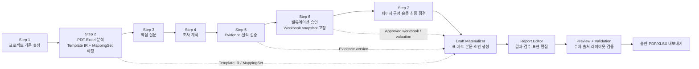

# 보고서 초안 표·차트 물질화 및 연결 검증 수정 계획

> 작성일: 2026-07-26  
> 상태: 구현 진행 중 — Template IR·Excel read model·MappingSet·초안 materializer·편집 UI 1차 반영  
> 적용 범위: Step 2 파일 분석·매핑부터 Step 7 보고서 구성, 보고서 초안 편집·검증·내보내기까지  
> 기준 Fixture: `fixtures/ISC_095340_4Q25_Valuation_하나증권_12.xlsx`와 현재 ISC 보고서 프로젝트

## 0. 결론

이 수정은 보고서 편집 화면만 변경해서는 정상 동작을 만들 수 없다. **이전 단계도 함께 수정해야 한다.**

정상 흐름은 다음과 같아야 한다.

1. Step 2에서 PDF의 동적 표·차트를 각각 독립된 의미 슬롯으로 검출한다.
2. 같은 단계에서 각 슬롯을 Excel의 정확한 시트·범위·차트 계열에 연결하고 MappingSet으로 확정한다.
3. Step 5와 Step 6에서 검증·계산이 끝난 최신 승인 Excel 버전을 숫자의 권위 원본으로 고정한다.
4. Step 7 승인 후 보고서 초안을 생성할 때 표·차트의 변경된 수치를 실제 렌더 데이터로 만든다.
5. `/report`는 원본 PDF가 아니라 **변경 결과가 반영된 초안**을 기본으로 보여준다.
6. 사용자는 이 단계에서 결과가 올바른지 확인하고, 허용된 범위에서 문장·표 표현·차트 형태를 편집한다.
7. `연결 확인`은 처음 연결하는 기능이 아니라, 현재 보이는 결과가 어느 Excel 버전·시트·범위에서 왔는지 검증하는 기능이다.

`도표 6. 아이세미/테크드림 사업개요 및 시너지 효과`처럼 Excel 수치로 다시 그릴 대상이 아닌 사업개요 이미지·도식은 이 작업의 변경 대상에서 제외한다. 해당 영역은 `fixed_visual`로 분류하여 원본 시각 요소를 유지하고, Excel 연결이나 차트 형태 변경 UI를 제공하지 않는다.

---

## 0.1 2026-07-26 구현 진행 기록

이번 구현에서 다음 기반을 실제 코드와 회귀 테스트에 반영했다.

- PDF Template IR이 본문 도표 2·3·7·8·9·10을 각각 독립 `chart` 슬롯으로 생성한다.
- 도표 6은 slot이 없는 `fixed_design`/`fixed_visual`로 유지한다.
- 5페이지 재무제표를 손익계산서·대차대조표·투자지표·현금흐름표의 4개 독립 `table` 슬롯으로 분리한다.
- Excel worker가 안정적인 OOXML sheet ID, 표 topology, embedded chart의 category·series·axis를 읽는다.
- MappingSet이 후보별 `chartDefinition`을 저장하고 revision 이후에도 category·series 연결을 보존한다.
- 승인 workbook read model과 확정 MappingSet으로 표·차트의 불변 snapshot을 생성한다.
- 보고서 편집 화면은 ready 상태인 표·차트를 원본 PDF 영역 위에 기본 초안으로 렌더한다.
- 각 차트는 독립 hotspot과 그래프 형태 패널을 가지며, `연결 확인`에서 workbook version·sheet·range·series를 읽기 전용으로 확인한다.
- 연결이 불확실하거나 snapshot이 없으면 그래프 변경 적용을 차단한다.
- 도표 의미에 따라 허용 그래프 유형을 제한한다.

실제 ISC PDF/XLSX 통합 분석 결과는 다음과 같다.

| 블록 | 1차 구현 결과 |
|---|---|
| 도표 2 P/E Band | Excel 시트에 기간별 주가·밴드 시계열이 없어 자동 연결 차단 |
| 도표 3 P/B Band | Excel 시트에 기간별 주가·밴드 시계열이 없어 자동 연결 차단 |
| 도표 7 | embedded chart 후보 3개가 분리되어 있어 사용자 확인 또는 composite binding 필요 |
| 도표 8 | `12_도표8_어플리케이션별_매출`의 매출 비중 chart로 자동 연결 가능 |
| 도표 9 | 매출·영업이익과 OPM chart가 분리되어 있어 사용자 확인 또는 composite binding 필요 |
| 도표 10 | 분기·연간 chart가 모두 가능해 사용자 확인 필요 |
| 손익계산서 | `15_p5_손익계산서!A4:G35` 자동 연결 |
| 대차대조표 | `16_p5_대차대조표!A4:G37` 자동 연결 |
| 투자지표 | `17_p5_투자지표!A4:G25` 자동 연결 |
| 현금흐름표 | `18_p5_현금흐름표!A4:G25` 자동 연결 |

시트 이름을 PDF 제목과 같게 바꾸는 것은 필요하지 않다. 다만 **시트 이름이 맞는 것과 그래프를 재구성할 데이터가 충분한 것은 별개의 문제**다. P/E·P/B Band는 시트명 변경이 아니라 기간 category, 수정주가, 각 band series가 추가되어야 한다.

아직 남은 구현 범위:

- 도표 7·9처럼 여러 Excel chart를 한 보고서 차트로 합치는 composite binding
- chart series의 primary/secondary axis를 report snapshot과 렌더러까지 전달
- `202 + task` 기반 비동기 초안 materialization
- materialized 표·차트를 server-rendered PDF와 최종 PDF/XLSX export에 반영
- 기존 프로젝트를 새 Template IR/MappingSet revision으로 재분석하는 마이그레이션 흐름
- LibreOffice VML 메모가 포함된 workbook의 안전한 계산·저장 호환

---

## 1. 사용자 관점의 목표 동작

### 1.1 `/report` 진입 시

사용자가 보고서 초안 편집 화면에 들어왔을 때 다음 상태가 이미 완성되어 있어야 한다.

- 본문은 승인된 Evidence와 밸류에이션을 사용해 작성된 초안이다.
- 숫자, 표, 차트는 최신 승인 Excel snapshot의 값으로 갱신되어 있다.
- 기존 PDF는 레이아웃·스타일·고정 이미지의 템플릿으로만 사용된다.
- 동적 영역에는 원본 PDF의 과거 수치가 아니라 새로 물질화한 결과가 보인다.
- 필수 표·차트 연결이 없거나 오래된 경우 정상 편집 화면으로 진입시키지 않고 재연결 필요 상태를 명확히 보여준다.

### 1.2 차트 클릭 시

각 데이터 차트는 하나의 독립된 클릭 영역이어야 한다.

- 차트 제목, 차트 본문, 출처 문구를 포함한 정확한 경계가 하나의 블록으로 선택된다.
- 클릭하면 기존 디자이너 의도와 같은 ChartStudio 패널이 열린다.
- 패널 상단에는 `연결됨`, `재확인 필요`, `연결 오류` 중 하나의 상태가 표시된다.
- `연결 확인`에서 Excel 버전, 시트, 범위, 계열, 카테고리, 단위, 기간을 읽기 전용으로 확인할 수 있다.
- 차트 형태는 해당 데이터 구조와 의미를 훼손하지 않는 호환 유형만 선택할 수 있다.
- 차트 형태 변경은 표시 방식만 바꾸며 원본 숫자, 카테고리, 계열, 실제/추정 구분, 단위를 변경하지 않는다.
- 적용 전 미리보기를 제공하고, 적용 후에는 새 report version을 저장한다.

### 1.3 표 클릭 시

독립적으로 수정하거나 연결을 검증해야 하는 표는 각각 별도 블록이어야 한다.

ISC 보고서 5페이지의 `추정 재무제표`는 시각적으로 다음 4개 표이므로 4개 슬롯으로 분리한다.

1. 손익계산서
2. 대차대조표
3. 투자지표
4. 현금흐름표

각 표는 별도의 경계, 연결 상태, provenance, 표시 설정을 가져야 한다. 네 표가 같은 Excel 시트에 있더라도 하나의 거대한 범위로 묶지 않는다.

### 1.4 연결 확인의 의미

`연결 확인`은 아래 질문에 답하는 검증 도구다.

- 이 표 또는 차트가 어떤 승인 Excel 파일 버전을 사용했는가?
- 어떤 시트의 어느 범위가 연결되었는가?
- 차트의 X축 카테고리와 각 계열은 어디에서 왔는가?
- 표시 중인 단위·기간·실적/추정 구분이 원본과 일치하는가?
- 현재 연결이 초안 생성 이후 변경되거나 오래되지 않았는가?

보고서 편집 단계에서 사용자가 Excel 연결을 처음 만들어야 하는 구조는 허용하지 않는다. 연결 수정이 필요하면 Step 2의 매핑 검토로 돌아가 새 MappingSet version을 만들고, 하위 결과를 다시 생성한다.

---

## 2. 현재 구현 상태와 문제

### 2.1 현재 구조

현재 저장소 구현은 다음과 같이 동작한다.

- PDF worker가 모든 의미 있는 표·차트를 안정적으로 Template IR 슬롯으로 만들지 못한다.
- 일부 차트는 `/report`를 불러올 때 `attachTemplateGeometry()`가 제목 패턴을 이용해 뒤늦게 합성한다.
- 뒤늦게 생성된 차트 슬롯은 Step 2의 MappingSet 생성 시점에 존재하지 않으므로 연결 후보와 확정 binding을 가질 수 없다.
- 보고서 구성 승인 시 `suggestReportDraft()`는 주로 본문 문장을 만들고, `buildReportDocument()`는 Excel 표·차트 값을 실제 렌더 데이터로 만들지 않는다.
- `/report`는 원본 PDF를 중심으로 표시하고 그 위에 편집 hotspot을 얹는다.
- 차트 hotspot은 매핑 상태와 무관하게 `그래프 변경`으로 표시되며, 연결되지 않은 차트도 형태 변경을 시도할 수 있다.
- 보고서 구성 승인 API 계약은 비동기 `202`지만 현재 구현은 같은 트랜잭션 안에서 초안을 만들고 `200/succeeded`를 반환한다.

결과적으로 지금 화면은 “변경 완료된 초안 검수”가 아니라 “과거 원본 PDF 위에 일부 편집점만 표시한 중간 상태”에 가깝다.

### 2.2 현재 ISC 프로젝트 감사 결과

현재 저장된 프로젝트 상태를 기준으로 확인한 연결은 다음과 같다.

| 보고서 요소 | 현재 상태 | 목표 상태 |
|---|---|---|
| Key Data 표 | 미연결 | 독립 table binding |
| Consensus Data 표 | 미연결 | 독립 table binding |
| Stock Price 차트 | 미연결 | 독립 chart-series binding |
| Financial Data 표 | 미연결 | 독립 table binding |
| 투자의견 | 제안 상태 | 승인된 scalar binding |
| 목표주가·현재주가 | 연결 확정 | 유지, 버전 고정 |
| Forward EPS·Target PER | 연결 확정 | 유지, 버전 고정 |
| 분기 실적 표 | `01_실적추이!A5:L25` 연결 확정 | 물질화 및 검증 추가 |
| 도표 2 P/E Band | 미연결 | `06_도표2_PER_Band` 후보를 구조 검증 후 연결 |
| 도표 3 P/B Band | 미연결 | 해당 시트의 category/series 연결 |
| 도표 6 사업개요 도식 | 미연결 차트로 오검출 | `fixed_visual`, 변경·연결 대상 제외 |
| 도표 7~10 | 모두 미연결 | 각각 독립 chart-series binding |
| 추정 재무제표 | `06_재무요약!A5:M45` 하나로 연결 | 4개 표 슬롯과 4개 독립 범위로 분리 |

화면에서 도표 7 또는 도표 9 근처에 보이는 검은 `연결 확인` 표시는 차트 자체의 연결 표시가 아니라, 영업이익·매출액 scalar hotspot이 차트 위에 겹친 것이다. 따라서 현재 데이터 차트들은 실제로 모두 미연결 상태다.

### 2.3 근본 원인

근본 원인은 세 가지다.

1. **검출 시점 문제**  
   동적 블록이 Template IR 생성 시점이 아니라 보고서 조회 시점에 합성된다.

2. **물질화 부재**  
   MappingSet과 Excel snapshot이 있더라도 표·차트 렌더 데이터로 변환하는 단계가 없다.

3. **UI 역할 혼합**  
   연결 확정, provenance 확인, 표현 편집이 하나의 보고서 화면에 섞여 있다.

---

## 3. 목표 아키텍처와 전체 흐름



초안 생성은 다음 네 종류의 데이터를 다르게 취급한다.

| 블록 종류 | 권위 원본 | 초안 생성 방식 | 편집 정책 |
|---|---|---|---|
| Narrative text | 승인 Evidence·밸류에이션 | 제한된 LLM 초안 | 문장 편집 가능, 숫자·Evidence 보존 |
| Scalar | 승인 workbook/valuation | 정확한 값과 표시 형식 물질화 | 값 직접 편집 금지 |
| Table | 승인 workbook + table binding | 행·열·단위·기간 물질화 | 표시 형식만 편집 |
| Data chart | 승인 workbook + chart-series binding | category·series로 재렌더 | 호환 차트 형태만 변경 |
| Fixed visual | Template PDF/IR | 원본 시각 요소 유지 | 이번 범위에서 편집 불가 |

---

## 4. 단계별 수정 계획

### 4.1 Step 1 — 프로젝트 설정

큰 UI 변경은 필요하지 않다. 다만 아래 값이 downstream fingerprint에 포함되는지 보장한다.

- 대상 회사·종목
- 기준일
- 목표 연도·분기
- 보고서 유형
- 밸류에이션 방식

이 값이 바뀌면 기존 workbook snapshot, outline, report draft를 `stale`로 만들어야 한다.

### 4.2 Step 2 — 파일 분석과 매핑

가장 큰 선행 수정이 필요한 단계다.

#### PDF 분석

PDF worker가 페이지의 영역을 다음 타입으로 명확히 분류하도록 한다.

- `narrative`
- `scalar`
- `table`
- `data_chart`
- `fixed_visual`
- `fixed_decoration`

검출 결과는 보고서 조회 때 재추정하지 않고 versioned Template IR에 저장한다.

필수 규칙:

- `도표`라는 문구만으로 모두 차트로 분류하지 않는다.
- 축, 눈금, 범례, plot area, 반복되는 데이터 mark 등 데이터 차트 특징을 함께 사용한다.
- 사진, 사업개요, 조직도, 프로세스 도식은 `fixed_visual`로 분류한다.
- ISC 도표 6은 `fixed_visual` 회귀 fixture로 고정한다.
- ISC 도표 2, 3, 7, 8, 9, 10은 각각 독립 `data_chart` 블록이어야 한다.
- ISC 5페이지 재무제표는 4개 `table` 블록이어야 한다.
- 각 동적 블록은 제목·본문·출처를 포함하는 안정적인 bbox와 영속적인 `blockId`/`slotId`를 가져야 한다.

#### Excel 분석

Excel worker는 단순 used range와 차트 개수만 반환하지 말고 다음 read model을 생성한다.

- 안정적인 sheet ID와 표시 이름
- named range와 Excel table
- 후보 표의 header, row key, 기간 열, 단위, subtotal 구조
- 차트 category range
- 각 series의 이름, 값 range, 축 배정
- 실제/추정 구간
- 빈 셀, 오류 셀, 병합 셀
- formula와 recalculated value
- workbook/sheet/range structure hash

시트 이름은 사람이 읽을 수 있는 보조 단서다. 연결의 주 식별자는 안정적인 sheet ID, 구조 fingerprint, 범위와 의미 검증이어야 한다. 따라서 `06_도표2_PER_Band`를 PDF 제목과 완전히 같은 이름으로 바꿀 필요는 없다.

권장 매칭 순서는 다음과 같다.

1. 안정적인 sheet ID 또는 명시적 bridge metadata
2. 표·차트 구조 fingerprint
3. 정규화한 시트명과 PDF 제목의 의미 유사도
4. 기간·단위·series 이름의 일치
5. 사용자 확인

#### MappingSet 생성과 검토

모든 필수 동적 슬롯이 존재한 뒤에만 MappingSet을 생성한다.

- scalar는 `ScalarBinding`
- 표는 `TableBinding`
- 차트는 `ChartBinding`
- fixed visual은 MappingSet 대상이 아니다.

`ChartBinding`에는 최소한 category source와 series별 source가 있어야 한다. 차트 전체를 하나의 사각형 범위로만 저장하지 않는다.

Step 2 완료 조건:

- 필수 동적 슬롯 수와 mapping entry 수가 일치한다.
- 모든 필수 entry가 `confirmed`다.
- category와 모든 series 길이가 일치한다.
- 표의 행·열 topology가 binding 기대값과 일치한다.
- `unmappedRequiredCount = 0`이다.
- `fixed_visual`은 미연결 수에 포함되지 않는다.

사용자가 이 단계에서 잘못된 후보를 수정하면 기존 MappingSet을 덮어쓰지 않고 새 revision을 만든다.

### 4.3 Step 3 — 핵심 질문

표·차트 매핑 자체를 수정하지 않는다. 다만 질문이 참조하는 지표는 Step 2의 semantic metric/slot과 연결되어야 한다.

- 질문의 지표가 어느 workbook slot에 해당하는지 기록한다.
- 매핑이 stale이면 질문 생성·승인을 막는다.
- 차트 표시 형태나 PDF 위치는 이 단계의 관심사가 아니다.

### 4.4 Step 4 — 조사 계획

외부 조사가 필요한 서술·비재무 사실과, Excel에서 이미 검증할 정량 항목을 분리한다.

- Excel 정량 항목은 MappingSet slot을 참조한다.
- 외부 근거가 필요한 항목은 Evidence 요구사항을 가진다.
- fixed visual의 설명에 외부 사실이 포함되더라도 이미지 자체를 Excel 데이터 차트로 취급하지 않는다.

### 4.5 Step 5 — 검증

이 단계는 보고서에 들어갈 사실과 actual 값을 검증한다.

- 승인되지 않은 Evidence는 보고서 본문 생성에 사용하지 않는다.
- workbook 업데이트가 발생하면 새 workbook version과 계산 결과를 만든다.
- 변경된 sheet 구조가 MappingSet fingerprint와 다르면 재연결을 요구한다.
- 값만 바뀌고 구조가 동일하면 binding은 유지할 수 있지만 새 snapshot version을 고정한다.
- 검증 완료 시 보고서에 사용할 Evidence version과 workbook version을 명시한다.

### 4.6 Step 6 — 밸류에이션

밸류에이션 승인 결과는 보고서 숫자의 일부 권위 원본이 된다.

- 목표주가, Target PER, Forward EPS, 현재주가, 상승여력의 exact source를 고정한다.
- 밸류에이션 변경 시 outline과 report draft를 stale 처리한다.
- 보고서 표·차트는 임의로 재계산하지 않고 승인 workbook의 recalculated value를 사용한다.
- PDF와 XLSX 내보내기는 동일한 workbook/valuation version을 참조해야 한다.

### 4.7 Step 7 — 보고서 구성

이 단계는 초안 생성 전 최종 gate다.

각 동적 블록을 페이지별 목록으로 보여주고 다음 정보를 제공한다.

- 블록 유형
- 제목
- 페이지와 위치
- 연결 상태
- Excel 시트·범위 요약
- 데이터 미리보기
- 단위·기간
- 실제/추정 구분

정책:

- 연결을 새로 만드는 주 화면은 Step 2다.
- Step 7에서는 확정된 연결을 최종 점검한다.
- 오류 발견 시 `연결 수정`으로 Step 2 매핑 검토에 이동한다.
- 필수 표·차트 하나라도 미연결·invalid·stale이면 outline 승인을 막는다.
- 도표 6은 `고정 시각 자료`로 표시하고 연결 상태나 차트 편집 항목을 노출하지 않는다.
- 재무제표 4개 표는 각각 별도 검토 상태를 가진다.

승인 요청은 API 계약대로 `202 Accepted`를 반환하고 비동기 draft materialization task를 시작한다.

### 4.8 Draft Materializer

새 초안 생성 파이프라인의 핵심이다.

입력 버전을 정확히 고정한다.

- Template IR version
- MappingSet version
- approved workbook version
- valuation version
- Evidence version
- approved outline version

처리 순서:

1. 각 slot의 binding을 읽는다.
2. 승인 workbook read model에서 값을 조회한다.
3. scalar, table, chart snapshot을 생성한다.
4. 단위·반올림·표시 형식을 적용하되 raw decimal을 함께 보존한다.
5. narrative block만 Evidence 제약을 둔 초안 생성기에 전달한다.
6. 동적 영역별 RenderPlan을 만든다.
7. 원본 PDF의 동적 영역을 대체하고 fixed block만 유지한 초안 preview를 생성한다.
8. 수치·구조·overflow 사전 검증을 통과한 report version만 편집기에 공개한다.

초안 생성 실패 시 원본 PDF 편집 화면으로 조용히 fallback하지 않는다. 실패 원인과 재시도 또는 upstream 이동 경로를 보여준다.

### 4.9 보고서 초안 편집

#### 캔버스

- 기본 화면은 materialized draft다.
- 원본 PDF는 비교 보기에서만 별도로 열 수 있다.
- 각 동적 블록은 정확히 하나씩 선택할 수 있다.
- 선택 영역이 겹칠 때는 블록 우선순위와 z-index가 결정적이어야 한다.
- scalar hotspot이 차트 위에 잘못 겹치지 않도록 Template IR bbox를 정정한다.

#### ChartStudio

패널 구성:

1. 현재 차트와 변경 미리보기
2. 허용된 차트 유형
3. 제목·범례·축·색상·실적/추정 스타일
4. 데이터 연결 확인
5. 적용·취소

차트 유형은 데이터 의미별 allowlist를 사용한다.

- Band 차트: 다중 line/area 계열 중 의미를 보존하는 유형
- 구성비 추이: stacked column, 100% stacked column 등
- 단일 시계열: line, area, column 등
- 이중 축 실적/비율: 축 배정을 유지하는 combo 계열

원형 차트처럼 시계열 의미를 없애거나, 누적 차트처럼 값의 의미를 바꾸는 유형은 단순히 “지원되는 라이브러리 차트”라는 이유로 노출하지 않는다.

연결 상태가 `confirmed/current`가 아니면 차트 유형 적용을 막고 연결 수정 경로를 제공한다.

#### TableStudio

- 행/열 표시, 강조, 너비, 정렬, 표시 단위 등 표현만 편집한다.
- 원시 숫자와 수식 결과를 직접 수정하지 않는다.
- 값 변경 요청은 Step 5 또는 Step 6으로 이동시킨다.
- 네 개 재무제표 표는 각각 독립 패널로 열린다.

#### 연결 확인 패널

읽기 전용으로 다음을 제공한다.

- workbook 파일명과 resource version
- sheet 표시 이름과 stable sheet ID
- 범위
- chart category와 series별 범위
- table header/row key/기간 열
- 단위와 number format
- mapping version과 확정 시각
- 초안 materialization 시각
- 구조 hash 일치 여부

`연결 확인`과 `그래프 변경`은 서로 다른 역할이지만, 같은 차트 선택 패널 안에서 모두 접근할 수 있어야 한다.

### 4.10 미리보기·검증·승인·내보내기

미리보기는 브라우저 캔버스를 캡처한 이미지가 아니라 server-rendered PDF artifact여야 한다.

검증 항목:

- report snapshot 값과 approved workbook 값의 exact decimal 일치
- 표의 행·열 수와 key 일치
- 차트 category/series 길이와 값 일치
- 목표주가·PER·EPS·상승여력 계산 일치
- 단위·반올림·음수·빈 값 표시 일치
- 실제/추정 구분과 범례 일치
- 모든 narrative claim의 Evidence 연결
- overflow, clipping, font fallback, 페이지 수
- 원본 대비 fixed visual 유지
- 도표 6에 차트 편집 hotspot이 없는지 확인

승인은 exact report version과 exact validation run이 일치하고 blocking issue가 0개일 때만 가능하다.

PDF와 XLSX export manifest에는 같은 버전 참조를 기록한다. 내보내기 시 최신 데이터를 다시 읽어 결과가 달라지는 동작은 금지한다.

---

## 5. 목표 데이터 모델

기존 `ReportBlock`의 단순 텍스트/placeholder 구조를 typed materialized content로 확장한다.

```ts
type MaterializedReportBlock =
  | NarrativeBlock
  | ScalarBlock
  | TableBlock
  | ChartBlock
  | FixedVisualBlock;
```

### 5.1 공통 source snapshot

```ts
interface BindingSnapshot {
  mappingSetVersionId: string;
  mappingEntryId: string;
  bindingId: string;
  workbookVersionId: string;
  workbookArtifactHash: string;
  sheetId: string;
  sheetName: string;
  structureHash: string;
  materializedAt: string;
}
```

### 5.2 표 snapshot

```ts
interface TableDataSnapshot {
  columns: Array<{
    key: string;
    label: string;
    period?: string;
  }>;
  rows: Array<{
    key: string;
    label: string;
    cells: Array<{
      rawDecimal: string | null;
      formattedValue: string;
      formula?: string;
      sourceAddress: string;
    }>;
  }>;
  unit?: string;
  sourceRange: string;
}
```

### 5.3 차트 snapshot

```ts
interface ChartDataSnapshot {
  category: {
    values: Array<string | number>;
    sourceRange: string;
  };
  series: Array<{
    key: string;
    name: string;
    values: Array<string | null>;
    sourceRange: string;
    axis: "primary" | "secondary";
    role?: "actual" | "forecast" | "band" | "total";
  }>;
  unit?: string;
  supportedChartTypes: string[];
  selectedChartType: string;
}
```

`report_version.content_json`에는 재현 가능한 materialized snapshot과 source reference를 함께 저장한다. 다만 숫자의 권위 원본은 계속 승인 workbook이며, snapshot은 특정 보고서 버전을 재현하기 위한 불변 결과물이다.

Template IR은 위치와 스타일을, MappingSet은 Excel 물리 연결을, report version은 해당 입력 버전에서 물질화된 결과와 사용자 표현 변경을 소유한다. 세 역할을 섞지 않는다.

---

## 6. API·계약 변경

### 기존 API를 유지하며 강화

- `POST /api/projects/{projectId}/mapping-sets/{mappingSetId}/revisions`
  - 표·차트의 typed selection을 저장할 수 있도록 한다.
  - chart category와 series별 source를 검증한다.
- `POST /api/projects/{projectId}/process/files/complete`
  - 필수 mapping이 모두 confirmed일 때만 성공한다.
- `GET /api/projects/{projectId}/report-outline`
  - 모든 동적 slot의 binding summary와 데이터 preview를 반환한다.
- `POST /api/projects/{projectId}/report-outline/approve`
  - 실제로 `202`와 draft task를 반환한다.
- `GET /api/projects/{projectId}/tasks/{taskId}`
  - materialization, render, preflight 상태와 실패 원인을 반환한다.
- `GET /api/projects/{projectId}/report`
  - materialized block과 현재 binding health를 반환한다.
- `GET /api/projects/{projectId}/report/blocks/{blockId}/provenance`
  - 표·차트의 상세 source snapshot을 반환한다.
- `PATCH /api/projects/{projectId}/report/versions/{versionId}`
  - `set_chart_presentation`, `set_table_presentation`과 같은 명시적 operation을 받는다.
  - 숫자 값 자체를 변경하는 operation은 거부한다.

### 권장 오류 코드

- `REQUIRED_MAPPING_MISSING`
- `MAPPING_STRUCTURE_STALE`
- `CHART_SERIES_SHAPE_MISMATCH`
- `TABLE_TOPOLOGY_MISMATCH`
- `REPORT_MATERIALIZATION_FAILED`
- `REPORT_MATERIALIZATION_STALE`
- `UNSUPPORTED_CHART_PRESENTATION`
- `NUMERIC_VALUE_READ_ONLY`

계약 변경은 OpenAPI, JSON Schema, TypeScript, Python, C# 모델을 같은 변경 단위로 갱신한다.

---

## 7. 무효화와 버전 정책

| 변경 원인 | MappingSet | Outline | Report draft | Validation |
|---|---|---|---|---|
| Excel 값만 변경, 구조 동일 | 유지 가능 | stale | 재생성 | 재실행 |
| 시트명만 변경, stable ID/구조 동일 | 자동 재확인 가능 | 영향 없음 또는 경고 | source label 갱신 | 경량 검증 |
| 시트 삭제·범위 구조 변경 | invalid | stale | 편집 차단 | 무효 |
| MappingSet revision | 새 version | stale | 재생성 | 재실행 |
| Valuation 승인 변경 | 유지 | stale | 재생성 | 재실행 |
| Evidence 승인 변경 | 유지 | stale | narrative 재생성 | 재실행 |
| 차트 형태만 변경 | 유지 | 유지 | 새 report version | report validation 재실행 |
| 표 표시 형식만 변경 | 유지 | 유지 | 새 report version | report validation 재실행 |

과거 승인 버전은 수정하거나 삭제하지 않는다. 새로운 입력은 새로운 working report version을 만든다.

---

## 8. 구현 순서와 품질 게이트

### Phase 0 — 계약과 회귀 Fixture 고정

작업:

- 현재 ISC PDF·Excel을 회귀 fixture로 등록한다.
- 기대 동적 블록 목록을 fixture manifest로 작성한다.
- `도표 6 = fixed_visual`, `재무제표 = 4 tables`를 계약 테스트로 고정한다.
- schema와 OpenAPI 변경을 먼저 확정한다.

완료 조건:

- TS/Python/C# contract fixture가 모두 같은 payload를 통과한다.
- 검출 기대값이 자동 테스트에 고정된다.

### Phase 1 — PDF Template IR 정정

작업:

- PDF worker의 block classifier와 bbox 계산을 수정한다.
- late synthetic chart 생성 의존을 제거한다.
- 기존 `attachTemplateGeometry()`는 저장된 Template IR을 hydrate하는 역할만 갖게 한다.
- 겹치는 scalar/chart hotspot을 제거한다.

완료 조건:

- 도표 2, 3, 7, 8, 9, 10이 각각 한 번만 검출된다.
- 도표 6은 차트 목록에 나타나지 않는다.
- 재무제표 4개 표가 독립 bbox를 가진다.

### Phase 2 — Excel read model 확장

작업:

- chart category/series/axis metadata를 OOXML에서 추출한다.
- 표 topology와 의미 후보를 추출한다.
- stable sheet ID와 구조 hash를 생성한다.
- formula 재계산 결과와 raw decimal을 보존한다.

완료 조건:

- `06_도표2_PER_Band`에서 P/E Band의 category와 모든 series를 재구성할 수 있다.
- 재무요약 시트에서 네 개 표 후보를 구분할 수 있다.
- 값만 변경한 workbook은 같은 구조로, 행·열을 변경한 workbook은 다른 구조로 판정된다.

### Phase 3 — MappingSet 완성

작업:

- 모든 Template IR 필수 슬롯에 mapping entry를 만든다.
- chart-series와 table binding revision을 저장한다.
- Step 2 매핑 검토 UI를 확장한다.
- Step 2/Step 7 gate를 강화한다.

완료 조건:

- ISC 데이터 차트 6개가 모두 confirmed다.
- 재무제표 4개 표가 각각 confirmed다.
- fixed visual은 required mapping count에 포함되지 않는다.
- 미연결 상태로 Step 2 또는 Step 7을 완료할 수 없다.

### Phase 4 — Draft Materializer 구현

작업:

- 승인된 입력 버전을 pin하는 비동기 job을 추가한다.
- typed scalar/table/chart snapshot을 생성한다.
- 본문 생성과 데이터 물질화를 분리한다.
- materialized RenderPlan과 draft preview artifact를 저장한다.
- outline approval 구현을 API 계약의 `202 + task` 흐름과 일치시킨다.

완료 조건:

- `/report` 최초 진입 전에 materialization task가 성공한다.
- 원본 PDF 숫자가 아니라 Excel snapshot 숫자가 보인다.
- 실패 시 원본 PDF가 정상 초안처럼 표시되지 않는다.

### Phase 5 — 보고서 편집 UI

작업:

- materialized draft를 기본 캔버스로 전환한다.
- 모든 데이터 차트의 독립 hotspot과 ChartStudio를 연결한다.
- 모든 표의 독립 hotspot과 TableStudio를 연결한다.
- 연결 확인을 provenance 패널과 통합한다.
- stale/invalid 상태에서 편집 적용을 차단한다.
- 원본 비교 보기를 별도 기능으로 제공한다.

완료 조건:

- 차트 하나를 클릭하면 다른 차트가 선택되지 않는다.
- 호환 차트 형태를 미리보고 적용할 수 있다.
- 모든 표·차트에서 연결 출처를 확인할 수 있다.
- 도표 6에는 클릭 hotspot이나 차트 패널이 없다.

### Phase 6 — 렌더·검증·내보내기

작업:

- PDF worker가 RenderPlan으로 실제 PDF를 만든다.
- 표·차트 snapshot과 workbook의 값 일치 검사를 추가한다.
- 시각 회귀와 구조 검증을 추가한다.
- PDF/XLSX export가 동일한 pinned versions를 사용하도록 한다.

완료 조건:

- 편집 화면, PDF 미리보기, 최종 PDF의 표·차트가 일치한다.
- 내보낸 XLSX와 PDF의 숫자가 같은 snapshot을 참조한다.
- blocking issue가 있는 report는 승인할 수 없다.

### Phase 7 — 기존 프로젝트 마이그레이션

기존 프로젝트를 조용히 현재 구조에 맞춰 덮어쓰지 않는다.

1. 기존 Template IR과 MappingSet은 과거 version으로 보존한다.
2. PDF를 새 classifier로 재분석해 새 Template IR version을 만든다.
3. 새 슬롯 기준으로 MappingSet 후보를 다시 만든다.
4. 사용자가 연결을 확인해 새 MappingSet version을 승인한다.
5. 기존 working report를 stale 처리한다.
6. 새 outline 승인과 draft materialization을 실행한다.

ISC 프로젝트도 이 절차로 재생성한다.

---

## 9. 테스트 계획

### 단위 테스트

- PDF block 분류: data chart와 fixed visual 구분
- table split: 4개 표 경계
- sheet name normalization
- stable sheet ID와 structure hash
- chart series shape 검증
- table topology 검증
- supported chart type 계산
- invalidation matrix

### 계약 테스트

- `template-ir.schema.json`
- `workbook-analysis.schema.json`
- `mapping-set.schema.json`
- `report-worker-artifact.schema.json`
- OpenAPI request/response
- TS/Python/C# fixture parity

### 통합 테스트

- file inspection → mapping confirm → files complete
- outline approve → `202` → task succeeded → report load
- workbook 값 변경 → report stale → 재생성
- workbook 구조 변경 → mapping invalid
- chart type 변경 → 데이터 불변, report version 증가
- provenance 응답과 실제 snapshot 일치

### ISC E2E 핵심 시나리오

- [ ] 도표 2가 `06_도표2_PER_Band`의 실제 category/series로 렌더된다.
- [ ] 시트 이름을 PDF 제목과 같게 바꾸지 않아도 올바르게 연결된다.
- [ ] 도표 2, 3, 7, 8, 9, 10을 각각 선택할 수 있다.
- [ ] 각 차트에서 연결 출처를 확인할 수 있다.
- [ ] 각 차트에서 허용된 다른 형태를 미리보고 적용할 수 있다.
- [ ] 도표 6은 고정 시각 자료이며 차트 편집 대상이 아니다.
- [ ] 손익계산서, 대차대조표, 투자지표, 현금흐름표를 각각 선택할 수 있다.
- [ ] 네 표가 동일 시트를 쓰더라도 각 source range가 따로 표시된다.
- [ ] `/report` 첫 화면부터 변경된 값이 보인다.
- [ ] 원본 PDF는 비교 보기에서만 별도로 확인한다.
- [ ] 최종 PDF와 XLSX 숫자·버전이 일치한다.

### 실패·경계 테스트

- category와 series 길이 불일치
- 병합 셀 때문에 표 header를 찾지 못함
- sheet 삭제 또는 stable ID 변경
- 동일한 제목의 차트가 여러 개 존재
- 차트 bbox와 scalar bbox가 겹침
- 빈 값, `#N/A`, 음수, 퍼센트, 배수 단위
- 실제/추정 경계가 없는 데이터
- 초안 생성 중 workbook version 변경
- old report version 복원 후 최신 mapping과 불일치

---

## 10. 관측성과 운영

각 materialization/validation job에 다음 정보를 기록한다.

- project/report/task ID
- pinned input version IDs
- block/slot/mapping entry ID
- workbook/sheet/range
- source와 output hash
- 처리 시간
- 경고와 실패 코드

사용자 화면에는 내부 stack trace 대신 다음 행동을 안내한다.

- `연결 수정`
- `최신 데이터로 초안 다시 만들기`
- `검증 다시 실행`
- `이전 승인 버전 보기`

민감한 object key, credential, 로컬 파일 시스템 경로는 provenance와 로그 응답에 노출하지 않는다.

---

## 11. 파일별 예상 변경 범위

### 계약

- `contracts/schemas/v1/template-ir.schema.json`
- `contracts/schemas/v1/workbook-analysis.schema.json`
- `contracts/schemas/v1/mapping-set.schema.json`
- `contracts/schemas/v1/report-worker-artifact.schema.json`
- `contracts/openapi/reflo-v1.yaml`

### PDF·Excel worker

- `workers/pdf/app.py`
- `workers/excel/Program.cs`
- 관련 worker contract fixture와 테스트

### 서버

- `source-react/server/domain/report.ts`
- `source-react/server/infrastructure/repositories/file-repository.ts`
- `source-react/server/infrastructure/repositories/report-repository.ts`
- `source-react/server/infrastructure/agents/report-draft-agent.ts`

`report-draft-agent.ts`는 narrative 생성만 담당하도록 경계를 좁힌다. Excel 표·차트 데이터 생성은 deterministic materializer가 담당한다.

### 클라이언트

- `source-react/app/_phase2/*`의 매핑 검토 화면
- `source-react/app/_phase6/ReportOutlineScreen.tsx`
- `source-react/app/_phase6/ReportWorkspace.tsx`
- `source-react/app/_phase6/ReportPdfEditor.tsx`
- `source-react/app/_phase6/ReportChartEditor.tsx`
- `source-react/app/_phase6/ReportChartPreview.tsx`
- 신규 또는 기존 TableStudio/Provenance panel
- `source-react/app/_phase6/types.ts`
- `source-react/app/_phase6/phase6.module.css`

### 테스트

- `source-react/tests/phase6-domain.test.ts`
- file/mapping/report repository 통합 테스트
- worker schema fixture 테스트
- Playwright `/report` E2E와 시각 회귀 테스트

현재 “도표 6도 차트로 검출된다”고 기대하는 테스트는 목표 정책에 맞게 반대로 수정해야 한다.

---

## 12. 비범위

이번 수정에서 제외한다.

- 도표 6 같은 사업개요 이미지·도식의 내용 재작성
- 이미지 안의 텍스트 OCR 편집
- Excel 값을 보고서 화면에서 직접 수정
- 임의의 차트 라이브러리 기능 전체 노출
- 사용자가 업로드한 모든 비정형 PDF에 대한 무오류 자동 매핑
- 과거 승인 report version의 소급 변경

---

## 13. 최종 완료 조건

- [ ] 보고서 편집 화면은 원본 PDF가 아니라 물질화된 최신 초안을 기본 표시한다.
- [ ] 모든 필수 숫자·표·데이터 차트는 승인된 같은 workbook snapshot에서 생성된다.
- [ ] 연결은 Step 2에서 확정되고 Step 7에서 최종 점검된다.
- [ ] `/report`의 `연결 확인`은 읽기 전용 provenance 기능으로 동작한다.
- [ ] 연결 수정은 새 MappingSet revision과 downstream 재생성을 유발한다.
- [ ] 데이터 차트는 각각 독립 선택과 ChartStudio 편집이 가능하다.
- [ ] 표는 각각 독립 선택과 TableStudio 편집이 가능하다.
- [ ] ISC 5페이지 재무제표는 4개 표로 분리된다.
- [ ] 도표 6은 `fixed_visual`이며 연결·차트 변경 대상에서 제외된다.
- [ ] 원본 숫자를 그대로 보여주는 silent fallback이 없다.
- [ ] preview, 승인 PDF, XLSX가 같은 pinned versions와 숫자를 사용한다.
- [ ] 값·출처·레이아웃 검증을 통과한 exact report version만 승인할 수 있다.

---

## 14. 관련 설계 문서

- [전체 구현 계획](../REFLO_IMPLEMENTATION_PLAN_v1.md)
- [기술 결정 — typed mapping, Template IR, RenderPlan](../REFLO_TECHNICAL_DECISIONS_v1.md)
- [API 명세](../REFLO_API_SPEC_v1.md)
- [Step 7 보고서 구성 화면 명세](../screens/09-report-outline.md)
- [보고서 편집 화면 명세](../screens/10-report.md)
- [기존 Phase 06 동적 보고서 수정 계획](./PHASE06_DYNAMIC_VALUATION_REPORT_FIX_PLAN.md)

이 문서는 기존 Phase 06 계획을 대체하기보다, **표·차트의 선행 매핑, 초안 물질화, 편집 단계의 연결 검증 역할**을 구현 가능한 순서로 구체화한 보완 계획이다.
